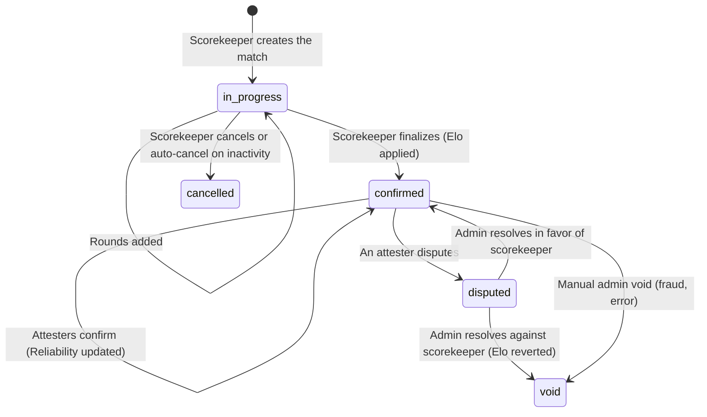
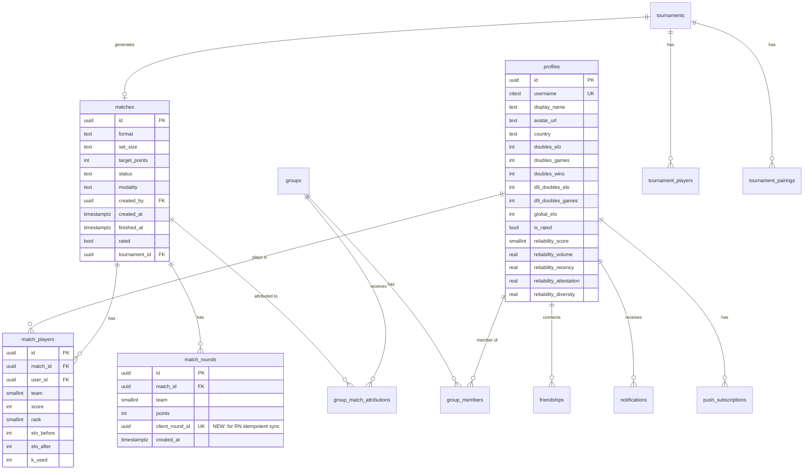
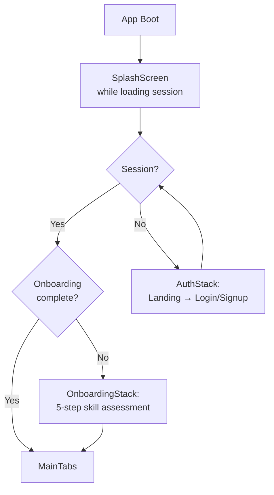
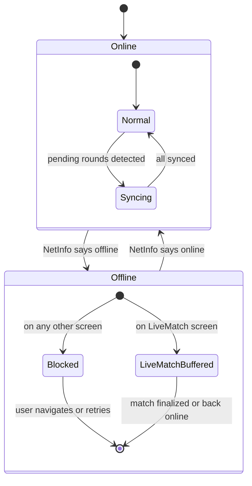

# DomiRank Mobile — Software Design System

**Version:** 1.0
**Date:** 2026-08-27
**Author:** Carlos Alberto Martínez (product owner) + directed interview
**Audience:** React Native developer who will build the mobile app
**Status:** Definitive contract. Decisions here are agreed and **must** be honored. Items explicitly marked *"open decision"* at the end of the doc are discussable.

**Note on language:** This is the English mirror of `MOBILE_DESIGN_SYSTEM.es.md`. Domino-specific Spanish terms (`capicúa`, `tranca`, `partida`, `ronda`, `atestación`) are kept in the original where they name domain concepts, with an English gloss. UI copy examples are shown in English here; the app itself ships in Spanish only for MVP.

---

## Table of Contents

1. [Executive summary](#1-executive-summary)
2. [Foundational decisions](#2-foundational-decisions)
3. [Domain and game rules](#3-domain-and-game-rules)
4. [Rating system (Elo + MoV + Reliability)](#4-rating-system-elo--mov--reliability)
5. [Backend shared with the PWA](#5-backend-shared-with-the-pwa)
6. [React Native app architecture](#6-react-native-app-architecture)
7. [Visual Design System](#7-visual-design-system)
8. [Primitive components](#8-primitive-components)
9. [Navigation](#9-navigation)
10. [Screens and flows (MVP spec)](#10-screens-and-flows-mvp-spec)
11. [Analytics and observability](#11-analytics-and-observability)
12. [Testing strategy](#12-testing-strategy)
13. [Build, release, and deployment](#13-build-release-and-deployment)
14. [Roadmap by phases](#14-roadmap-by-phases)
15. [Appendices: glossary, references, open decisions](#15-appendices)

---

## 1. Executive summary

### What is DomiRank?

DomiRank is a competitive rating platform for domino play across the Caribbean and Latin America. Players record real-life matches (played at clubs, at friends' homes, in tournaments); the system computes an Elo-style rating — with a margin-of-victory multiplier — and publishes rankings, with cross-verification between players (**atestación** / attestation) and a **Reliability Score** that measures how trustworthy each rating is.

Today it exists as a **PWA** (Progressive Web App) built with Next.js 14 + Supabase, with real users, live ratings, and ~100 database migrations. The mobile strategy is **not** to replace the PWA — it is to add a **native app (React Native)** that consumes the same backend, delivering the best possible experience during the critical moment: **when you are sitting at the table scoring points**.

### What is this document?

It is the complete contract between the product owner and the React Native developer. It covers:

- All **product decisions** already made (auth, offline, push, tabs, monetization).
- The mandatory **technical stack** (Expo + EAS + TypeScript + NativeWind + TanStack Query).
- The **game domain** (domino rules, match lifecycle, roles).
- The full **rating system** (Elo, K-factor, buckets, Reliability Score).
- The **shared backend** with the PWA (tables, RLS, RPCs, triggers, edge functions).
- The **app architecture** (data layer, offline, realtime, push, deep links).
- The **visual design system** (semantic tokens, two palettes, typography, motion).
- **Primitive components** and **navigation**.
- The **screen-by-screen spec** for MVP.
- **Observability, testing, release**.

It is written so a dev can pick it up and start building without needing to ask questions constantly. Anything not here is **in the PWA code**, whose references are enumerated in Section 15.

### High-level roadmap

| Phase | Duration | Contents |
|---|---|---|
| **1 — MVP** | ~6 weeks | Auth, onboarding, dashboard, create match, live scoring (with offline), attestation, leaderboard, friends, profile, push notifications, basic settings |
| **2 — Community** | ~4–6 weeks post-launch | Groups (join/create/view leaderboard), Tournaments read-only (join, view standings, view next round), full Reliability Score UI, share cards (match result, achievements), weekly digest |
| **3 — Depth** | 3+ months post-launch | Player Pro subscription via RevenueCat (if demand proven), in-app tournament creation with mobile-friendly wizard, advanced features (head-to-head, rating-over-time charts) |

### Contract status

- Backend: **shared** with the PWA (existing Supabase project).
- Platforms: **iOS + Android** from day one, Android-first for release order.
- Stack: **Expo SDK (managed) + EAS Build + EAS Update + TypeScript strict**.
- Monetization: **zero in-app**. No ads, ever. No IAP. Club Pro is billed via Stripe on the web. Player Pro subscription reserved for Phase 3+.
- Scope: **player-facing only**. Admin (`/admin`), organization management (`/admin/org/...`), and TV display (`/t/[slug]`) **stay on the PWA**.

---

## 2. Foundational decisions

Each decision here is closed. They were discussed and agreed during the grilling session that produced this doc. They are enumerated so future discussions do not reopen them without explicit justification.

### 2.1 Shared backend, not forked

- The RN app consumes the **same Supabase project** as the PWA (same URL, same DB, same RLS policies, same auth).
- A single user `distinctId` bridges both clients (`profiles.id` = `auth.users.id`).
- **Only schema change required:** a new migration adding `client_round_id uuid unique` to `match_rounds` (for offline sync idempotency). The PWA continues to work without sending it (nullable column).
- The RN app **must not** create its own tables in the `public` schema. If mobile-only metadata is needed (e.g. `push_platform`), it goes in new columns of existing tables or in a separate `mobile_` schema.

### 2.2 Scope: player-facing only

- **In the app:** signup/login, onboarding, dashboard, create/score/finalize matches, attestation, leaderboard, friends, profile, notifications, settings, groups (Phase 2), tournaments read-only (Phase 2).
- **NOT in the app:** dispute admin panel, organization/Club Pro management, tournament TV display, static content pages (How it works, FAQ, terms, privacy — these link to web from Settings).
- If a "mobile organizer mode" is needed later (e.g., start a round from your phone), that's Phase 3+ and specified in a separate doc.

### 2.3 Technical stack

| Layer | Tool | Reason |
|---|---|---|
| Framework | **Expo SDK (managed workflow)** | Single toolchain, EAS builds, OTA updates, Supabase JS works out of the box |
| Language | **TypeScript strict** | Parity with the PWA, type safety in the data layer |
| Build/deploy | **EAS Build + EAS Update + EAS Submit** | Removes Xcode/Gradle/cert friction |
| Styling | **NativeWind** (Tailwind for RN) | Same syntax and tokens as the PWA, zero learning curve |
| Navigation | **React Navigation v7 (native stack + bottom tabs)** | Native gestures, better performance, huge community |
| Server state | **TanStack Query (React Query) v5** | Cache, dedupe, refetch on focus, optimistic mutations |
| Cache persistence | **`@tanstack/query-async-storage-persister` + MMKV** | Instant cold start |
| Client state | **Zustand** (2 stores: `useAuthStore`, `useLiveMatchStore`) | No boilerplate, no needless re-renders |
| Local storage | **MMKV** (`react-native-mmkv`) | ~30x faster than AsyncStorage, sync |
| Secure storage | **`expo-secure-store`** | iOS Keychain / Android Keystore |
| Push notif | **`expo-notifications` + Expo Push Service** | APNs + FCM abstracted |
| Realtime | **`@supabase/supabase-js` realtime channels** | Already used in the PWA |
| Haptics | **`expo-haptics`** | Native feel |
| Analytics | **`posthog-react-native`** | Same PostHog project as the PWA |
| Crashes/perf | **`@sentry/react-native`** | Native + JS, source maps via EAS |
| Icons | **`lucide-react-native`** | Consistent, lightweight set |
| Motion | **`react-native-reanimated` v3** | Runs on the UI thread |
| Bottom sheets | **`@gorhom/bottom-sheet`** | Ecosystem standard |
| Image | **`expo-image`** | Automatic cache, better placeholders |
| Unit testing | **Jest** | RN ecosystem standard |
| E2E testing | **Maestro** | Simple YAML config, works with Expo dev builds |

**Explicitly forbidden in this codebase:**
- Redux / Redux Toolkit
- AsyncStorage as primary cache (use MMKV)
- Any ads SDK (AdMob, Meta Audience, Unity Ads, etc.)
- Any direct IAP SDK (use RevenueCat when Phase 3 arrives)
- Emojis in code identifiers (fine in UI text at designer discretion)

### 2.4 Platforms and release order

- **iOS + Android from day one**. Single codebase.
- **Android first at launch**: bigger installed base in the target markets (VE/DR/Cuba/PR ~85–90% Android), faster review, easier beta (APK link + Play internal testing).
- iOS follows in the same release sprint (~1 week later max).

### 2.5 Auth methods

Three methods, no more, no less:
1. **Email + password** (with password reset via Supabase magic link).
2. **Google Sign-In** (Android + iOS).
3. **Sign in with Apple** (iOS) — mandatory per App Store rule 4.8 if you offer Google Sign-In on iOS.

Explicitly **not** in MVP: magic link inside the app, SMS OTP, WhatsApp OTP.

### 2.6 Offline: "buffered online" mode

The only moment offline work is supported is **during an in-progress match**. In detail:

- **Offline + creating a match:** blocked.
- **Offline + scoring an already-started match:** works. Rounds buffered in MMKV. Synced when connectivity returns.
- **Offline + finalizing a match:** finalize deferred; applied when connectivity returns.
- **Offline + attestation, viewing rankings, adding friends, etc.:** blocked with retry.
- See Section 6.7 for the detailed model.

### 2.7 Monetization: **zero in-app**

- Zero ads (permanent policy, do not reconsider in Phase 2).
- Zero IAP.
- Club Pro is B2B, billed via Stripe in the web panel `/admin/org/[slug]/billing` — never touches the app.
- Player Pro subscription is Phase 3+ via RevenueCat, only if Phase 2 shows clear demand.

### 2.8 App language

- **Spanish** as the only language in MVP.
- Copy is centralized from day one in an `src/i18n/es.ts` module to allow future translation without refactor. `i18next` is not implemented in MVP — a typed plain object is used.
- Technical UI labels (bucket names, tier names) are kept as-is in Spanish (Calibrando, En desarrollo, Confiable, Muy confiable, Provisional, Learning, Stable, Elite, Legend).

### 2.9 Light + Dark mode

- Three modes: **Light / Dark / Automatic** (default Automatic — follows system).
- Preference persisted in MMKV, key `theme_preference`.
- Semantic tokens (Section 7) enable the switch with no refactor.

---

## 3. Domain and game rules

This section defines the vocabulary used by the code and the UI. It is mandatory to respect it.

### 3.1 Canonical vocabulary

| Term | Definition | Code usage |
|---|---|---|
| **Partida** (match) | A complete game of dominos from start until a team reaches `target_points` | `matches` table, `Match` type |
| **Ronda** (round / hand) | A hand within a match — points added by a team after a play | `match_rounds` table, `MatchRound` type |
| **Modalidad** (modality) | Cultural domino rules variant (Venezuelan, Dominican, Cuban, Puerto Rican, Custom) | `matches.modality`, `Modality` enum |
| **Set** | The tile set: `d6` (28 tiles, double-6) or `d9` (55 tiles, double-9) | `matches.set_size` |
| **Format** | `doubles` (pairs 2v2) — only supported format in 2026+ | `matches.format` |
| **Target points** | Score that wins the match (default 100, range 50–500) | `matches.target_points` |
| **Scorekeeper** | Player who creates the match and records points. Only one with RLS permission to write `match_rounds` | `matches.created_by` |
| **Atestador** (attester) | Any player in the match who isn't the scorekeeper. Must confirm or dispute the result within 72h | Roles derived from `match_players` |
| **Atestación** (attestation) | Act of confirming (or disputing) the result of a match you played in. Linked to the Reliability Score | Server action `attestMatch` |
| **Capicúa** | Winning by closing the match with a tile that matches both ends. Metadata in 2026, does not apply rating bonus (planned v2) | `matches.capicua_bonus` |
| **Tranca** | Situation where nobody can play and points-in-hand are counted. Not validated by system rules (yet) | Metadata, not encoded |
| **Bucket** | Rating category by set + format combination: `d6_doubles`, `d9_doubles` (`d6_singles`, `d9_singles` are legacy) | `profiles.doubles_elo`, etc. |
| **Global Elo** | Weighted average of buckets where `games > 0` | `profiles.global_elo` (maintained by triggers) |
| **NR** | "Not Rated" — player with fewer than 5 total confirmed matches. UI shows an "NR" badge instead of a rating | `profiles.is_rated` (generated column) |
| **Reliability Score** | 0–100 measures how trustworthy the rating is (volume, recency, attestation, diversity) | `profiles.reliability_score` |
| **Tier** | Player rank based on Elo: Provisional / Learning / Stable / Elite / Legend | Derived in `src/lib/rating.ts` |
| **Group** | Persistent community with explicit membership, its own leaderboard, roles admin/co_admin/member | `groups` table (Phase 2) |
| **Tournament** | Event with a structured format (Swiss, round robin, etc.) and its own standings | `tournaments` table (Phase 2 read-only) |

### 3.2 Encoded domino rules (2026 version, MVP)

The app **does not arbitrate** domino rules. The scorekeeper is the source of truth for how many points each hand scores. What IS encoded:

- **Only format:** doubles (2v2). Four players per match, two teams of two.
- **Supported sets:** `d6` (default) and `d9`. Separate rating buckets. A player can hold independent ratings in each.
- **Target points:** configurable per match, range 50–500, default 100. First team to reach or exceed the target wins.
- **Modalidad:** metadata; does not affect rules or rating buckets. Stored for stats and for the player to orient context ("I played 30 Dominican-style matches").
- **Capicúa:** boolean metadata per match (`capicua_bonus`). No Elo bonus applied in 2026. Reserved for v2.
- **Tranca:** not modeled in the DB. It's a table concept resolved by marking the closing round; the scorekeeper simply records the leftover in-hand points.

**What the app does NOT validate** (by design):
- Does not verify that round point sums are valid per the set (an accumulated total could exceed 55 in d9 due to a scorekeeper bug; detected as an anomaly post-facto).
- Does not enforce team stability across rounds (they always are: teams are defined at match start and don't change).
- Does not detect illegal moves (it can't see the tiles).

This is intentional: the system is a **trusted recorder**, not a referee. Trust comes from cross-attestation.

### 3.3 Match lifecycle



**Notes on `confirmed`:**
- Elo is applied **at finalization**, not at attestation. Attestation affects the **Reliability Score**, not the rating.
- If a match falls into `disputed`, the applied Elo **remains** until an admin resolves. If voided, it's reverted.

### 3.4 Roles and permissions

| Role | Can | RLS enforcement |
|---|---|---|
| **Scorekeeper** of a match | Create match, insert rounds, finalize, cancel while `in_progress` | `matches.created_by = auth.uid()` |
| **Player** of the match (not scorekeeper) | See the full match, attest (confirm/dispute) within 72h of finalize | `match_players.user_id = auth.uid()` |
| **Group admin** | Invite/remove members, change settings, archive group | `group_members.role IN ('admin', 'co_admin')` |
| **System admin** | Resolve disputes, manual void, backfill | Check in-app against hardcoded UUID list (pending formal RBAC) |

### 3.5 Modalidades — metadata only

The 5 modalities (`ven`, `dom`, `cub`, `pri`, `custom`) are **descriptive tags**. They do not change:
- Elo calculation (same K, same formula).
- Rating bucket (buckets are only by set + format).
- Encoded rules (target_points, capicúa bonus, etc.).

They serve to:
- Player preferences (auto-select modality on creation).
- Statistics ("I played 30 Cuban, 12 Puerto Rican matches").
- Share context between players.

In the app they appear as:
- **Chip** on match cards (see `<Chip variant="modality">`).
- **Selector** in the create-match flow (with "don't ask again, always use X" in Settings).

---

## 4. Rating system (Elo + MoV + Reliability)

This section summarizes `docs/RATING_SYSTEM.md` from the mobile client's perspective. **Rating computation itself lives in the backend** (server action `applyMatchRating` + RPC `apply_match_rating`); the app never computes it. The app **displays** the rating and **visually simulates** post-match deltas.

### 4.1 Formula (reference)

```
team_elo  = avg(partners)                                    // team = 2 players
expected  = 1 / (1 + 10^((opp_elo - my_elo) / 400))          // standard Elo formula
scoreDiff = |winner_score - loser_score|
MOVM      = log10(scoreDiff + 1) * (2.2 / (eloGap * 0.001 + 2.2))
delta     = round(K * MOVM * (actual - expected))            // actual = 1 (won) or 0 (lost)
```

The `MOVM` multiplier (Margin of Victory Multiplier) magnifies close matches and dampens blowouts. `eloGap` is the difference between teams (to punish expected wins vs. reward upsets).

### 4.2 K-factor by tier

| Tier | Condition | K |
|---|---|---|
| Provisional | `games < 10` in that bucket | 40 |
| Learning | `elo < 1500` | 28 |
| Stable | `1500 ≤ elo < 1900` | 24 |
| Elite | `1900 ≤ elo < 2050` | 18 |
| Legend | `elo ≥ 2050` | 12 |

**Initial Elo:** 1500 in each bucket. **Display range:** Elo 1000 → 1.0 on screen, Elo 2200 → 20.0 on screen (linear). Formula:

```ts
displayRating = 1 + ((elo - 1000) / 1200) * 19
```

Clamped to `[1.0, 20.0]`. The app never shows raw Elo to the user — always the 1–20 display with one decimal.

### 4.3 Four buckets per player

| Bucket | Set | Format | Columns in `profiles` |
|---|---|---|---|
| `d6_singles` | Double-6 | Singles (legacy) | `singles_elo`, `singles_games`, ... |
| `d6_doubles` | Double-6 | Pairs | `doubles_elo`, `doubles_games`, ... |
| `d9_singles` | Double-9 | Singles (legacy) | `d9_singles_elo`, `d9_singles_games`, ... |
| `d9_doubles` | Double-9 | Pairs | `d9_doubles_elo`, `d9_doubles_games`, ... |

`singles` is legacy (format eliminated in 2026); the app **does not** offer creating singles matches and **does not** show singles buckets unless the player has `games > 0` there. In that case, it's shown as "legacy" with a note.

**Global Elo:** weighted average by games of buckets with activity. Maintained by SQL triggers. It's the number shown on the global leaderboard.

### 4.4 NR (Not Rated)

A player with **fewer than 5 total confirmed matches** is NR. The `profiles.is_rated` column (`BOOLEAN GENERATED ALWAYS`) marks this. The UI:

- **RatingBadge**: replaces the number with an amber "NR" badge.
- **Dashboard hero**: shows large "NR" + subtitle "Calibrating" + progress bar "n/5 matches".
- **Profile**: shows "NR" in the hero plus a `<NROnboardingCard>` explaining what earns the rating.
- **Leaderboard**: NR players **do not appear** on the public leaderboard. Filtered by `is_rated = true`.

### 4.5 Reliability Score (0–100)

Metric orthogonal to Elo that answers: **"how trustworthy is this rating?"**

Formula (computed in SQL, the app reads it):

```
score = min(100, round(
  35 * volume
  + 25 * recency
  + 25 * attestation
  + 15 * diversity
))
```

| Factor | Weight | Definition | Meta = 1.0 |
|---|---|---|---|
| `volume` | 35% | `min(1, attested_matches / 30)` | 30 confirmed matches |
| `recency` | 25% | `min(1, matches_last_60d / 10)` | 10 matches in last 60d |
| `attestation` | 25% | `attested / total_non_cancelled` | 100% attested |
| `diversity` | 15% | `min(1, distinct_opponents / 15)` | 15 distinct opponents |

**4 visual buckets:**

| Score | Bucket (Spanish) | Color (dark) | Color (light) |
|---|---|---|---|
| 0–29 | Calibrando | gray | dense gray |
| 30–59 | En desarrollo | amber | dense amber |
| 60–89 | Confiable | soft green | dense green |
| 90–100 | Muy confiable | bright green | forest green |

**In the app (MVP):**
- The score appears in the user profile (hero) as a badge next to the rating.
- **Phase 2:** dedicated "How to improve your Reliability" screen with the 4 factors + coaching.

### 4.6 Applying ratings (backend, not client)

**The mobile client does not compute ratings.** When finalizing a match, the app calls a server action (or the RPC directly) that:

1. Reads the match, its rounds, and the 4 players' profiles.
2. Computes ranks (team with highest accumulated score = rank 1).
3. Runs the Elo engine (`src/lib/rating.ts` in the backend).
4. Atomically writes deltas to `profiles.*_elo` and `match_players.elo_before/elo_after/k_used`.
5. Marks `matches.status = 'confirmed'`, `matches.rated_at = now()`.
6. Fires the attestation request to the other players (notification + email).
7. The attribution trigger (`trg_attribute_match_on_confirmed`) inserts rows in `group_match_attributions` if applicable.

**Visual simulation in the app:** after finalize, the app can animate "your rating went up +12" by reading `match_players.elo_after - elo_before`. Do NOT compute the delta on the client — read it from the server response.

---

## 5. Backend shared with the PWA

### 5.1 Supabase client

The app uses `@supabase/supabase-js` v2 exactly like the PWA, with **one key difference**: session storage is not HTTP cookies, it's MMKV (via a custom adapter).

```ts
// src/lib/supabase.ts
import { createClient } from '@supabase/supabase-js'
import { MMKV } from 'react-native-mmkv'

const storage = new MMKV({ id: 'auth-storage' })

const mmkvStorageAdapter = {
  getItem: (key: string) => storage.getString(key) ?? null,
  setItem: (key: string, value: string) => storage.set(key, value),
  removeItem: (key: string) => storage.delete(key),
}

export const supabase = createClient(
  process.env.EXPO_PUBLIC_SUPABASE_URL!,
  process.env.EXPO_PUBLIC_SUPABASE_ANON_KEY!,
  {
    auth: {
      storage: mmkvStorageAdapter,
      autoRefreshToken: true,
      persistSession: true,
      detectSessionInUrl: false, // RN has no URL fragment
    },
    realtime: {
      params: { eventsPerSecond: 10 },
    },
  }
)
```

### 5.2 Data model — key tables for the app



### 5.3 Tables used by the RN app

| Table | Usage from the app | Writes allowed |
|---|---|---|
| `profiles` | Read own + others | Update own only, whitelisted columns (display_name, avatar_url, country, bio) |
| `matches` | Read own + others | Insert as scorekeeper; update status (finalize/cancel) only if created_by |
| `match_players` | Read | Insert only when creating the match (RLS via match created_by) |
| `match_rounds` | Read | Only scorekeeper inserts. **Always send `client_round_id`** for idempotency. |
| `friendships` | Read + insert (send request) + update (accept/reject) | Insert where requester = auth.uid(), update where recipient = auth.uid() |
| `notifications` | Read own + mark as read | Update only `read_at` of your own |
| `groups` | Read groups where I'm a member | Insert new (Phase 2); update only if admin |
| `group_members` | Read those of my groups | Insert by invitation (Phase 2), update leave |
| `tournaments` | Read | (Phase 2) Insert via mobile wizard |
| `tournament_players` | Read | Insert on join |
| `tournament_pairings` | Read | Read-only from the app |
| `push_subscriptions` | Insert/upsert on obtaining Expo Push Token; delete on logout | Only owner writes |
| `user_preferences` | Read + update | Only owner |

### 5.4 RLS: what the app must respect

- **Never** attempt to bypass RLS with the service role key from the client. The app **only** uses the `anon key`.
- All mutations pass the user's JWT (Supabase JS does this automatically).
- If a mutation fails with 401/403, it's an app bug (trying something forbidden) — don't blind-retry; show error and log to Sentry.

### 5.5 RPCs the app calls

| RPC | Signature | Usage |
|---|---|---|
| `apply_match_rating(p_match_id uuid, p_payload jsonb)` | Apply Elo + mark confirmed | Called from the finalize server action (or directly if the flow goes client → RPC) |
| `void_match(p_match_id uuid, p_reason text)` | Manual void (admin) | Not used by the player-facing app |
| `update_player_reliability(p_user_id uuid)` | Recompute reliability for a user | Not used by the app (backend triggers call it) |
| `join_group_by_code(p_code text)` | Joins the user to a group by invitation_code | Phase 2, from `JoinGroupSheet` |
| `join_tournament_by_code(p_code text)` | Joins user to a tournament by invitation_code | Phase 2 |
| `attest_match(p_match_id uuid, p_action text)` | Confirms or disputes a match (`action = 'confirm' \| 'dispute'`) | From `AttestationScreen` |

### 5.6 Relevant edge functions

- `supabase/functions/send-push-notification` — push dispatcher. **Extend** to accept Expo Push tokens alongside web push subscriptions. See Section 5.9.
- `supabase/functions/generate-tournament-round` — not called by the app (admin panel only).

### 5.7 Relevant triggers and cron jobs

- `trg_attribute_match_on_confirmed` — when a match moves to `confirmed`, auto-attributes to the scorekeeper's group if applicable. The app doesn't interact; only reads `group_match_attributions` in the Group Leaderboard.
- `trg_reliability_on_match_status` — when status changes, recomputes reliability for the 4 players. The app reads the updated `reliability_score` on the next query.
- Daily cron `/api/cron/recompute-reliability` (03:30 UTC) — safety net. Not called by the app.
- Cron `/api/cron/auto-confirm` — closes overdue attestations (72h). Not called by the app.

### 5.8 Required new migration

**Only schema change needed to support the RN app:**

```sql
-- supabase/migrations/0100_add_client_round_id_to_match_rounds.sql
begin;

alter table public.match_rounds
  add column client_round_id uuid;

create unique index concurrently idx_match_rounds_client_round_id
  on public.match_rounds (client_round_id)
  where client_round_id is not null;

comment on column public.match_rounds.client_round_id is
  'Client-generated UUID for idempotent insert from mobile app offline sync. NULL for rows created before mobile app launch.';

commit;
```

**Effect on the PWA:** none. Column is nullable, PWA continues inserting without it.

**Effect on the RN app:** every round insert sends a locally generated UUID. If the sync worker retries, `on conflict (client_round_id) do nothing` prevents duplicates.

### 5.9 Extending `send-push-notification`

The current edge function accepts web push subscriptions. It must be extended to accept **Expo Push Tokens** too. Design:

- `push_subscriptions` table (existing or new) with columns: `user_id`, `platform` (`web | ios | android`), `token`, `created_at`, `last_used_at`.
- The app upserts its Expo Push Token when permission is granted.
- The edge function, on receiving a push event, queries all subs for the user and dispatches:
  - If `platform = 'web'` → existing web push.
  - If `platform in ('ios', 'android')` → HTTPS POST to `https://exp.host/--/api/v2/push/send` with the Expo token.
- Common payload: `{ title, body, data: { url, type, ...contextIds } }`.

### 5.10 Env vars the app needs

```
EXPO_PUBLIC_SUPABASE_URL=<https://xxx.supabase.co>
EXPO_PUBLIC_SUPABASE_ANON_KEY=<eyJhbGci...>
EXPO_PUBLIC_POSTHOG_API_KEY=<phc_...>
EXPO_PUBLIC_POSTHOG_HOST=https://us.i.posthog.com
EXPO_PUBLIC_SENTRY_DSN=<https://xxx@sentry.io/xxx>
EXPO_PUBLIC_APP_ENV=<development | preview | production>
```

Loaded via `app.config.ts` from local `.env` + EAS Secrets in production. Never commit `.env`.

---

## 6. React Native app architecture

### 6.1 Directory structure

```
domirank-mobile/
├── app.config.ts
├── eas.json
├── package.json
├── tsconfig.json
├── tailwind.config.ts
├── metro.config.js
├── babel.config.js
├── app/                        # expo-router (optional) or src/screens/ if plain React Nav
├── src/
│   ├── api/                    # Supabase wrappers + TanStack Query hooks
│   │   ├── auth.ts
│   │   ├── matches.ts
│   │   ├── profiles.ts
│   │   ├── notifications.ts
│   │   ├── groups.ts
│   │   └── tournaments.ts
│   ├── components/             # primitives and composed components
│   │   ├── primitives/         # Button, Card, Chip, etc.
│   │   ├── match/
│   │   ├── leaderboard/
│   │   ├── profile/
│   │   └── notifications/
│   ├── screens/                # top-level screens
│   │   ├── auth/
│   │   ├── onboarding/
│   │   ├── home/
│   │   ├── match/
│   │   ├── leaderboard/
│   │   ├── friends/
│   │   ├── profile/
│   │   └── settings/
│   ├── navigation/             # React Navigation config
│   │   ├── RootNavigator.tsx
│   │   ├── AuthStack.tsx
│   │   ├── OnboardingStack.tsx
│   │   ├── MainTabs.tsx
│   │   ├── linking.ts
│   │   └── types.ts
│   ├── stores/                 # Zustand stores
│   │   ├── useAuthStore.ts
│   │   └── useLiveMatchStore.ts
│   ├── lib/                    # pure logic
│   │   ├── supabase.ts
│   │   ├── mmkv.ts
│   │   ├── rating-display.ts   # display helpers only, NO computation
│   │   ├── reliability-display.ts
│   │   ├── net.ts              # network state helpers
│   │   ├── analytics.ts        # PostHog wrapper
│   │   ├── errors.ts
│   │   └── format.ts
│   ├── i18n/
│   │   └── es.ts
│   ├── theme/
│   │   ├── tokens.ts           # semantic tokens
│   │   ├── palettes.ts         # dark + light
│   │   └── ThemeProvider.tsx
│   ├── hooks/
│   │   ├── useTheme.ts
│   │   ├── useNetworkState.ts
│   │   ├── useAppState.ts
│   │   ├── useRealtimeChannel.ts
│   │   └── useMatchSyncWorker.ts
│   ├── workers/                # background workers
│   │   └── matchSyncWorker.ts
│   └── types/
│       └── supabase.ts         # generated via supabase-cli gen types
├── assets/
│   ├── icons/
│   ├── fonts/                  # only if loading custom fonts (not in MVP)
│   ├── splash-light.png
│   ├── splash-dark.png
│   ├── icon.png                # app icon
│   └── adaptive-icon.png       # Android
└── __tests__/
    ├── setup.ts
    └── unit/
```

### 6.2 Data layer: TanStack Query + Zustand

**QueryKey convention** (mandatory):

```ts
// src/api/queryKeys.ts
export const queryKeys = {
  auth: {
    session: ['auth', 'session'] as const,
  },
  profile: {
    all: ['profile'] as const,
    detail: (userId: string) => ['profile', userId] as const,
    byUsername: (username: string) => ['profile', 'username', username] as const,
  },
  match: {
    all: ['match'] as const,
    detail: (matchId: string) => ['match', matchId] as const,
    activeForUser: (userId: string) => ['match', 'active', userId] as const,
    recent: (userId: string, limit: number) => ['match', 'recent', userId, limit] as const,
  },
  leaderboard: {
    all: ['leaderboard'] as const,
    bucket: (bucket: string, country?: string) => ['leaderboard', bucket, country ?? 'all'] as const,
  },
  friends: {
    list: (userId: string) => ['friends', userId] as const,
    requests: (userId: string) => ['friends', 'requests', userId] as const,
  },
  notifications: {
    list: (userId: string) => ['notifications', userId] as const,
    unreadCount: (userId: string) => ['notifications', 'unreadCount', userId] as const,
  },
  groups: {
    myGroups: (userId: string) => ['groups', 'my', userId] as const,
    detail: (groupId: string) => ['groups', groupId] as const,
    leaderboard: (groupId: string) => ['groups', groupId, 'leaderboard'] as const,
  },
  tournaments: {
    active: (userId: string) => ['tournaments', 'active', userId] as const,
    detail: (tournamentId: string) => ['tournaments', tournamentId] as const,
  },
} as const
```

**QueryClient config:**

```ts
export const queryClient = new QueryClient({
  defaultOptions: {
    queries: {
      staleTime: 30_000,             // 30s
      gcTime: 24 * 60 * 60 * 1000,   // 24h
      retry: 2,
      retryDelay: (attempt) => Math.min(1000 * 2 ** attempt, 30_000),
      refetchOnWindowFocus: false,   // replaced by custom refetchOnAppFocus
      refetchOnReconnect: true,
    },
    mutations: {
      retry: 1,
    },
  },
})

// Persistence
const persister = createAsyncStoragePersister({
  storage: mmkvStorage,               // async-interface wrapper around MMKV
  key: 'DOMIRANK_QUERY_CACHE_V1',
  throttleTime: 1000,
})

persistQueryClient({
  queryClient,
  persister,
  maxAge: 24 * 60 * 60 * 1000,       // 24h
  buster: '__CACHE_VERSION__',       // bump to invalidate all cache
})
```

**Refetch on app focus:**

```ts
// hooks/useAppState.ts
export function useAppFocusRefetch() {
  const queryClient = useQueryClient()
  useEffect(() => {
    const sub = AppState.addEventListener('change', (state) => {
      if (state === 'active') queryClient.invalidateQueries()
    })
    return () => sub.remove()
  }, [queryClient])
}
```

**Mutations with optimistic UI (pattern):**

```ts
export function useAttestMatch(matchId: string) {
  const queryClient = useQueryClient()
  return useMutation({
    mutationFn: (action: 'confirm' | 'dispute') =>
      supabase.rpc('attest_match', { p_match_id: matchId, p_action: action }),
    onMutate: async (action) => {
      await queryClient.cancelQueries({ queryKey: queryKeys.match.detail(matchId) })
      const previous = queryClient.getQueryData(queryKeys.match.detail(matchId))
      queryClient.setQueryData(queryKeys.match.detail(matchId), (old: any) => ({
        ...old,
        attestation_state: action === 'confirm' ? 'confirmed' : 'disputed',
      }))
      return { previous }
    },
    onError: (err, action, ctx) => {
      queryClient.setQueryData(queryKeys.match.detail(matchId), ctx?.previous)
      toast.error('No se pudo procesar. Reintenta.')
    },
    onSettled: () => {
      queryClient.invalidateQueries({ queryKey: queryKeys.match.detail(matchId) })
      queryClient.invalidateQueries({ queryKey: queryKeys.profile.all })
    },
  })
}
```

### 6.3 Zustand stores

Only two stores. Any additional need must be justified.

**`useAuthStore`:**

```ts
type AuthState = {
  user: User | null
  session: Session | null
  status: 'loading' | 'authenticated' | 'unauthenticated'
  signIn: (email: string, password: string) => Promise<void>
  signInWithGoogle: () => Promise<void>
  signInWithApple: () => Promise<void>
  signUp: (email: string, password: string, displayName: string, dob: string) => Promise<void>
  signOut: () => Promise<void>
  refreshSession: () => Promise<void>
}

export const useAuthStore = create<AuthState>((set, get) => ({
  user: null,
  session: null,
  status: 'loading',
  signIn: async (email, password) => { /* supabase.auth.signInWithPassword */ },
  // ...
}))

// Initialized at root
supabase.auth.onAuthStateChange((_event, session) => {
  useAuthStore.setState({
    session,
    user: session?.user ?? null,
    status: session ? 'authenticated' : 'unauthenticated',
  })
})
```

**`useLiveMatchStore`:**

```ts
type PendingRound = {
  clientRoundId: string          // locally generated UUID
  matchId: string
  team: 1 | 2
  points: number
  createdAt: number              // local timestamp
  syncedAt: number | null        // null = pending
}

type LiveMatchState = {
  matchId: string | null
  activeTeam: 1 | 2
  scoreA: number                 // computed from local rounds + server
  scoreB: number
  pendingRounds: PendingRound[]  // unsynced
  isOffline: boolean
  isFinalizePending: boolean     // finalize triggered while offline
  addRound: (team: 1 | 2, points: number) => void
  setActiveTeam: (team: 1 | 2) => void
  markRoundSynced: (clientRoundId: string) => void
  requestFinalize: () => void
  clear: () => void
}

// Persisted in MMKV via zustand persist middleware
export const useLiveMatchStore = create<LiveMatchState>()(
  persist(
    (set, get) => ({ /* impl */ }),
    { name: 'live-match', storage: createJSONStorage(() => mmkvStorage) }
  )
)
```

### 6.4 Auth flow — implementation



- **Landing screen**: hero + buttons "Iniciar sesión" and "Crear cuenta".
- **Login**: email + password + "Iniciar con Google" + (iOS) "Iniciar con Apple" + link "¿Olvidaste tu contraseña?".
- **Signup**: email + password (min 8 chars, live feedback) + display_name + DOB (13+ check).
- **Reset password**: email → Supabase magic link → deep link `/auth/reset?token=...` → new password.

**Google Sign-In with Expo:**

```ts
import * as AuthSession from 'expo-auth-session'
import * as Google from 'expo-auth-session/providers/google'

const [request, response, promptAsync] = Google.useAuthRequest({
  iosClientId: process.env.EXPO_PUBLIC_GOOGLE_IOS_CLIENT_ID,
  androidClientId: process.env.EXPO_PUBLIC_GOOGLE_ANDROID_CLIENT_ID,
  scopes: ['openid', 'profile', 'email'],
})

useEffect(() => {
  if (response?.type === 'success' && response.authentication) {
    supabase.auth.signInWithIdToken({
      provider: 'google',
      token: response.authentication.idToken!,
    })
  }
}, [response])
```

**Sign in with Apple with Expo (iOS only):**

```ts
import * as AppleAuthentication from 'expo-apple-authentication'

const credential = await AppleAuthentication.signInAsync({
  requestedScopes: [
    AppleAuthentication.AppleAuthenticationScope.FULL_NAME,
    AppleAuthentication.AppleAuthenticationScope.EMAIL,
  ],
})

await supabase.auth.signInWithIdToken({
  provider: 'apple',
  token: credential.identityToken!,
})
```

**Session persisted in MMKV** (see 5.1). On app open, restored instantly. `autoRefreshToken` keeps it valid.

### 6.5 Onboarding

5 sequential steps (skill assessment). Backend already has the flow and tables. The RN app reimplements it 1:1 with:

- Stack without the bottom tab bar (fullscreen).
- Progress bar at top (`Paso n de 5`).
- Each step: question + tap options. Never free text.
- On completion: `profiles.onboarding_completed_at = now()`. The app switches to `MainTabs`.
- Can be **skipped** and done later from Settings.
- Analytics: `user_completed_onboarding` with `steps_completed`.

### 6.6 Network state

`useNetworkState` hook using `@react-native-community/netinfo`:

```ts
export function useNetworkState() {
  const [state, setState] = useState<NetInfoState | null>(null)
  useEffect(() => {
    const unsub = NetInfo.addEventListener(setState)
    NetInfo.fetch().then(setState)
    return () => unsub()
  }, [])
  const isOnline = state?.isConnected && state?.isInternetReachable
  return { state, isOnline: !!isOnline, isOffline: !isOnline }
}
```

Exposed globally in `useLiveMatchStore.isOffline` and shown in the UI where relevant.

### 6.7 Offline mode — full model

**Guiding principle:** the only moment offline work is allowed is **during the in-progress match**. Nothing else.

**States and transitions:**



**Behavior per screen:**

| Screen | Offline → behavior |
|---|---|
| Landing/Login/Signup | Button disabled with "Sin conexión" banner |
| Dashboard | Shows cached data with "actualizado hace 2h" timestamp + subtle "sin conexión" banner |
| New match | Blocked. Modal: "Necesitas conexión para crear partida. Reintentar." |
| Live match | **Works 100%.** Persistent chip on top: "Sin conexión · guardando localmente". Rounds buffered. |
| Match detail | Cached data; attestation blocked with retry |
| Leaderboard | Cached snapshot + banner |
| Friends | Cached snapshot + banner |
| Profile | Cached snapshot + banner |
| Settings | Readable; changes touching only MMKV (theme) work; changes touching Supabase (name) show retry |

**The sync worker** (`workers/matchSyncWorker.ts`):

```ts
// pseudo-code
let backoffMs = 1000
let running = false

async function tick() {
  if (running) return
  if (!isOnline()) { schedule(30_000); return }

  running = true
  try {
    const pending = useLiveMatchStore.getState().pendingRounds
      .filter((r) => r.syncedAt === null)

    for (const round of pending) {
      const { error } = await supabase.from('match_rounds').insert({
        match_id: round.matchId,
        team: round.team,
        points: round.points,
        client_round_id: round.clientRoundId,
      }).select('id').single()

      if (!error || error.code === '23505' /* unique violation, already exists */) {
        useLiveMatchStore.getState().markRoundSynced(round.clientRoundId)
      } else {
        throw error
      }
    }

    // If finalize pending, execute after flushing rounds
    if (useLiveMatchStore.getState().isFinalizePending) {
      await finalizeMatchOnServer(useLiveMatchStore.getState().matchId!)
      useLiveMatchStore.getState().clear()
    }

    backoffMs = 1000
  } catch (e) {
    Sentry.captureException(e)
    backoffMs = Math.min(backoffMs * 2, 60_000)
  } finally {
    running = false
    schedule(backoffMs)
  }
}

// Fires: on App mount, on network state change to online, on adding a round
```

**Resume match on app open:**

- On root mount, check `useLiveMatchStore.matchId`.
- If active match:
  - Sticky banner above the tab bar: "⏱ Partida en curso vs. Juan, Pedro, Luis · toca para reanudar".
  - Tap → navigate to `LiveMatchScreen`.

**Offline data persistence:**

- Active matches cache: prefetched on dashboard entry.
- The match detail is saved wholly before entering `LiveMatchScreen` (guarantee of being able to score with no new query).
- The TanStack Query cache persists 24h in MMKV → you can see anything you saw before, even offline.

### 6.8 Realtime — 3 channels

Rule: **one channel per screen**, closed on unmount. **Paused when the app goes to background**, reconnected on foreground.

**Channel 1: Notifications (global foreground)**

```ts
// hooks/useNotificationsRealtime.ts
export function useNotificationsRealtime() {
  const userId = useAuthStore((s) => s.user?.id)
  const queryClient = useQueryClient()
  const appState = useAppState()

  useEffect(() => {
    if (!userId || appState !== 'active') return

    const channel = supabase
      .channel(`notifications:${userId}`)
      .on(
        'postgres_changes',
        {
          event: 'INSERT',
          schema: 'public',
          table: 'notifications',
          filter: `user_id=eq.${userId}`,
        },
        (payload) => {
          queryClient.invalidateQueries({
            queryKey: queryKeys.notifications.list(userId),
          })
          queryClient.invalidateQueries({
            queryKey: queryKeys.notifications.unreadCount(userId),
          })
          // in-app toast
          toast.info(payload.new.title, { onPress: () => navigate(payload.new.url) })
        }
      )
      .subscribe()

    return () => {
      supabase.removeChannel(channel)
    }
  }, [userId, appState, queryClient])
}
```

**Channel 2: MatchDetail (active only on the screen)**

Same pattern, filtered by `match_id`, subscribed to changes on `matches` (status) and `match_players` (elo_after).

**Channel 3: TournamentDetail (active only on the screen, Phase 2)**

Filtered by `tournament_id`, subscribed to changes on `tournament_pairings` and `tournament_players`.

### 6.9 Push notifications

**Expo setup:**

```ts
import * as Notifications from 'expo-notifications'

Notifications.setNotificationHandler({
  handleNotification: async () => ({
    shouldShowAlert: false,  // in foreground, we show an in-app toast instead
    shouldPlaySound: false,
    shouldSetBadge: true,
  }),
})

async function registerForPushNotifications() {
  const { status: existing } = await Notifications.getPermissionsAsync()
  if (existing !== 'granted') {
    const { status } = await Notifications.requestPermissionsAsync({
      ios: { allowAlert: true, allowBadge: true, allowSound: true, provideAppNotificationSettings: true },
    })
    if (status !== 'granted') return null
  }
  const { data: token } = await Notifications.getExpoPushTokenAsync({
    projectId: Constants.expoConfig?.extra?.eas?.projectId,
  })
  return token
}
```

**Upserting the token:**

```ts
// after getting token
await supabase.from('push_subscriptions').upsert({
  user_id: userId,
  platform: Platform.OS,  // 'ios' | 'android'
  token: expoPushToken,
  last_used_at: new Date().toISOString(),
}, { onConflict: 'user_id,platform,token' })
```

**The 5 MVP events and their deep links:**

| Event | Title (Spanish UI) | Body | Deep link |
|---|---|---|---|
| Attestation requested | Confirma tu partida | vs. {oponentes} · {resultado} | `/matches/[id]/attestation` |
| Match attested + Elo | ¡Rating actualizado! | +{delta} en {bucket} | `/matches/[id]` |
| Group invitation | Nueva invitación a grupo | {inviter} te invitó a {group_name} | `/groups/[id]` |
| Friend request | {name} quiere ser tu amigo | Toca para responder | `/friends` |
| Next tournament round | Ronda {n} lista | vs. {pair} · Mesa {board} | `/tournaments/[id]` |

**iOS permission strategy:**
- First launch: DO NOT ask for permission. Silence (or provisional auth for silent pushes that appear in Notification Center without a banner).
- **After the user attests their first match** → contextual prompt: "Activa las notificaciones para no perderte las próximas invitaciones a confirmar partidas."

**Categories/channels (Android):**

```ts
await Notifications.setNotificationChannelAsync('matches', {
  name: 'Partidas',
  importance: Notifications.AndroidImportance.HIGH,
  sound: 'default',
})
await Notifications.setNotificationChannelAsync('social', {
  name: 'Social',
  importance: Notifications.AndroidImportance.DEFAULT,
})
await Notifications.setNotificationChannelAsync('tournaments', {
  name: 'Torneos',
  importance: Notifications.AndroidImportance.HIGH,
})
```

**In-app center:**

- `NotificationsScreen` with paginated list by `created_at desc`.
- Pull-to-refresh.
- On screen open → mark all as read (`update notifications set read_at = now() where user_id = auth.uid() and read_at is null`).
- Badge on the bell icon (Home top-right) uses `queryKeys.notifications.unreadCount`.

### 6.10 Deep links and universal links

**Expo config (`app.config.ts`):**

```ts
export default {
  expo: {
    scheme: 'domirank',
    ios: {
      associatedDomains: ['applinks:domirank.app'],
      bundleIdentifier: 'app.domirank.mobile',
    },
    android: {
      package: 'app.domirank.mobile',
      intentFilters: [
        {
          action: 'VIEW',
          autoVerify: true,
          data: [{ scheme: 'https', host: 'domirank.app', pathPrefix: '/' }],
          category: ['BROWSABLE', 'DEFAULT'],
        },
      ],
    },
  },
}
```

**Files to host on `https://domirank.app`:**

- `/.well-known/apple-app-site-association` (Content-Type: `application/json`)
- `/.well-known/assetlinks.json`

Both are static JSON served from the Next.js config or directly in Vercel edge config.

**React Navigation linking config:**

```ts
// navigation/linking.ts
export const linking: LinkingOptions<RootStackParamList> = {
  prefixes: ['domirank://', 'https://domirank.app'],
  config: {
    initialRouteName: 'Main',
    screens: {
      Main: {
        screens: {
          HomeTab: 'home',
          RankingTab: 'leaderboard',
          FriendsTab: 'friends',
          ProfileTab: 'profile',
        },
      },
      MatchDetail: 'matches/:matchId',
      Attestation: 'matches/:matchId/attestation',
      OtherProfile: 'profile/:username',
      GroupDetail: 'groups/:groupId',
      JoinGroup: 'groups/join/:code',
      TournamentDetail: 'tournaments/:tournamentId',
      JoinTournament: 'tournaments/join/:code',
      Notifications: 'notifications',
    },
  },
  async getInitialURL() {
    const url = await Linking.getInitialURL()
    if (url) return url
    const response = await Notifications.getLastNotificationResponseAsync()
    return response?.notification.request.content.data.url as string | undefined
  },
  subscribe(listener) {
    const linkingSub = Linking.addEventListener('url', ({ url }) => listener(url))
    const notifSub = Notifications.addNotificationResponseReceivedListener((r) => {
      const url = r.notification.request.content.data.url as string | undefined
      if (url) listener(url)
    })
    return () => {
      linkingSub.remove()
      notifSub.remove()
    }
  },
}
```

**Auth gating on deep links:**

If the user is unauthenticated and arrives via a deep link:
- The destination URL is preserved in `useAuthStore.pendingDeepLink`.
- Navigate to Login.
- After successful authentication, navigate to the pending URL.

### 6.11 Share flows (Mode A: image + universal link)

Reusable `<ShareCard>` component with variants:

- `leaderboard-group` — group leaderboard snapshot
- `leaderboard-tournament` — tournament snapshot
- `match-result` — post-finalize result
- `achievement` — unlocked milestone (Phase 2)

**Implementation:**

```ts
import ViewShot, { captureRef } from 'react-native-view-shot'
import * as Sharing from 'expo-sharing'

async function shareLeaderboard(groupId: string) {
  const uri = await captureRef(hiddenViewShotRef, {
    format: 'png',
    quality: 0.95,
    result: 'tmpfile',
  })
  await Sharing.shareAsync(uri, {
    mimeType: 'image/png',
    dialogTitle: 'Compartir leaderboard',
    UTI: 'public.png',
  })
  analytics.capture('share_leaderboard', { type: 'group', group_id: groupId })
}
```

**Card layout:**
- Background with DomiRank branding (logo + subtle gradient from the active palette).
- Central content: top 5 of the leaderboard with avatars, ratings, wins/losses.
- Footer: "Descarga DomiRank · domirank.app".
- Watermark timestamp: "27 Ago 2026".
- Aspect ratio 4:5 (optimal for WhatsApp/Instagram stories).

---

## 7. Visual Design System

### 7.1 Semantic tokens

Every component uses **semantic tokens**, never literal colors. Tokens defined in `src/theme/tokens.ts`:

```ts
export type ColorTokens = {
  bg: {
    canvas: string
    card: string
    elevated: string
    subtle: string
    inverse: string
  }
  text: {
    primary: string
    secondary: string
    muted: string
    inverse: string
    onBrand: string
  }
  border: {
    subtle: string
    default: string
    strong: string
  }
  brand: {
    primary: string
    primaryHover: string
    primaryActive: string
  }
  team: {
    a: string
    aBg: string
    b: string
    bBg: string
  }
  status: {
    success: string
    successBg: string
    warning: string
    warningBg: string
    danger: string
    dangerBg: string
    info: string
    infoBg: string
  }
  rating: {
    calibrating: string
    developing: string
    reliable: string
    veryReliable: string
  }
  tier: {
    provisional: string
    learning: string
    stable: string
    elite: string
    legend: string
  }
}
```

### 7.2 Palettes: dark + light

```ts
// src/theme/palettes.ts
export const darkPalette: ColorTokens = {
  bg: {
    canvas: '#0a1020',
    card: '#111827',
    elevated: '#1f2937',
    subtle: '#0f172a',
    inverse: '#f9fafb',
  },
  text: {
    primary: '#f9fafb',
    secondary: '#d1d5db',
    muted: '#9ca3af',
    inverse: '#111827',
    onBrand: '#0a1020',
  },
  border: {
    subtle: '#1f2937',
    default: '#374151',
    strong: '#4b5563',
  },
  brand: {
    primary: '#10b981',
    primaryHover: '#059669',
    primaryActive: '#047857',
  },
  team: {
    a: '#60a5fa',
    aBg: '#1e3a8a',
    b: '#f87171',
    bBg: '#7f1d1d',
  },
  status: {
    success: '#34d399',
    successBg: '#064e3b',
    warning: '#fbbf24',
    warningBg: '#78350f',
    danger: '#f87171',
    dangerBg: '#7f1d1d',
    info: '#60a5fa',
    infoBg: '#1e3a8a',
  },
  rating: {
    calibrating: '#9ca3af',
    developing: '#fbbf24',
    reliable: '#34d399',
    veryReliable: '#10b981',
  },
  tier: {
    provisional: '#9ca3af',
    learning: '#60a5fa',
    stable: '#34d399',
    elite: '#a78bfa',
    legend: '#fbbf24',
  },
}

export const lightPalette: ColorTokens = {
  bg: {
    canvas: '#faf9f7',
    card: '#ffffff',
    elevated: '#ffffff',
    subtle: '#f3f4f6',
    inverse: '#111827',
  },
  text: {
    primary: '#111827',
    secondary: '#4b5563',
    muted: '#6b7280',
    inverse: '#f9fafb',
    onBrand: '#ffffff',
  },
  border: {
    subtle: '#f3f4f6',
    default: '#e5e7eb',
    strong: '#d1d5db',
  },
  brand: {
    primary: '#059669',
    primaryHover: '#047857',
    primaryActive: '#065f46',
  },
  team: {
    a: '#2563eb',
    aBg: '#dbeafe',
    b: '#dc2626',
    bBg: '#fee2e2',
  },
  status: {
    success: '#059669',
    successBg: '#d1fae5',
    warning: '#d97706',
    warningBg: '#fef3c7',
    danger: '#dc2626',
    dangerBg: '#fee2e2',
    info: '#2563eb',
    infoBg: '#dbeafe',
  },
  rating: {
    calibrating: '#6b7280',
    developing: '#d97706',
    reliable: '#059669',
    veryReliable: '#047857',
  },
  tier: {
    provisional: '#6b7280',
    learning: '#2563eb',
    stable: '#059669',
    elite: '#7c3aed',
    legend: '#d97706',
  },
}
```

### 7.3 ThemeProvider

```tsx
type ThemeMode = 'light' | 'dark' | 'system'

export const ThemeProvider: FC<{ children: ReactNode }> = ({ children }) => {
  const systemScheme = useColorScheme()
  const [mode, setMode] = usePersistedState<ThemeMode>('theme_preference', 'system')
  const activeScheme = mode === 'system' ? systemScheme ?? 'dark' : mode

  const palette = activeScheme === 'light' ? lightPalette : darkPalette

  const value = useMemo(() => ({ mode, setMode, activeScheme, palette }), [mode, activeScheme])

  return (
    <ThemeContext.Provider value={value}>
      <StatusBar style={activeScheme === 'light' ? 'dark' : 'light'} />
      {children}
    </ThemeContext.Provider>
  )
}

export const useTheme = () => {
  const ctx = useContext(ThemeContext)
  if (!ctx) throw new Error('useTheme outside ThemeProvider')
  return ctx
}
```

### 7.4 Typography

**No custom fonts in MVP.** Used:

- **iOS:** SF Pro (system default).
- **Android:** Roboto (system default).

**Scale:**

| Name | Size | Line height | Weight | Usage |
|---|---|---|---|---|
| `display` | 40 | 48 | 700 | Rating hero on Dashboard/Profile |
| `h1` | 28 | 36 | 700 | Primary titles |
| `h2` | 22 | 30 | 600 | Sub-sections |
| `h3` | 18 | 26 | 600 | Card headers |
| `body` | 16 | 24 | 400 | General text |
| `bodyStrong` | 16 | 24 | 600 | Emphasis in body |
| `small` | 14 | 20 | 400 | Secondary metadata |
| `caption` | 12 | 16 | 400 | Timestamps, hints |
| `micro` | 10 | 14 | 500 | Extra-small chips |
| `numpad` | 44 | 48 | 700 | Only in the live match numpad |

### 7.5 Spacing

Base 4px system:

| Token | px |
|---|---|
| `xs` | 4 |
| `sm` | 8 |
| `md` | 12 |
| `lg` | 16 |
| `xl` | 20 |
| `2xl` | 24 |
| `3xl` | 32 |
| `4xl` | 40 |
| `5xl` | 48 |

### 7.6 Borders and radii

| Token | px | Usage |
|---|---|---|
| `radius.none` | 0 | — |
| `radius.sm` | 6 | Small chips |
| `radius.md` | 10 | Standard cards, inputs |
| `radius.lg` | 14 | Large cards, bottom sheets |
| `radius.xl` | 20 | Modals |
| `radius.full` | 9999 | Avatars, circular buttons |

### 7.7 Elevation per mode

**Dark:** shadows barely used (invisible). Hierarchy via `bg.card` vs `bg.elevated` + `border.subtle`.

**Light:** shadows are the primary hierarchy. Three levels:

```ts
export const shadows = {
  light: {
    sm: { shadowColor: '#000', shadowOffset: { width: 0, height: 1 }, shadowOpacity: 0.05, shadowRadius: 2, elevation: 1 },
    md: { shadowColor: '#000', shadowOffset: { width: 0, height: 2 }, shadowOpacity: 0.08, shadowRadius: 6, elevation: 3 },
    lg: { shadowColor: '#000', shadowOffset: { width: 0, height: 8 }, shadowOpacity: 0.12, shadowRadius: 16, elevation: 8 },
  },
  dark: {
    sm: {}, md: {}, lg: {},  // empty — use border instead
  },
}
```

### 7.8 Icons

**Library:** `lucide-react-native`. Consistent, minimalist, scalable, weight-configurable.

**Standard sizes:** 16, 20, 24, 32.

**Color:** always via `color={palette.text.primary}` prop — never hardcoded.

### 7.9 Motion

**Library:** `react-native-reanimated` v3.

**Principles:**
- Short durations: 150ms (micro), 250ms (default), 400ms (large).
- Easing: `Easing.out(Easing.cubic)` for entrances, `Easing.in(Easing.cubic)` for exits.
- **No** infinite or decorative animations that drain battery.
- Critical animations for feedback: score bump in live match, Elo delta post-finalize, tap ripple.

**Haptics** (`expo-haptics`):

| Moment | Haptic |
|---|---|
| Numpad tap | `impactAsync(Light)` |
| Successful points-add | `impactAsync(Medium)` |
| Tab switch | `selectionAsync()` |
| Finalize match | `notificationAsync(Success)` |
| You won! | `notificationAsync(Success)` + 200ms delay + `impactAsync(Heavy)` |
| Error/reject | `notificationAsync(Error)` |
| Modal open | `impactAsync(Light)` |

---

## 8. Primitive components

Every UI is composed of these primitives. **Do not** duplicate behavior in screens — if a pattern repeats, promote it to a primitive.

### 8.1 `<Screen>`

Base wrapper for every top-level screen.

```tsx
type ScreenProps = {
  children: ReactNode
  scroll?: boolean
  padded?: boolean
  edges?: ('top' | 'bottom' | 'left' | 'right')[]
  header?: ReactNode
  footer?: ReactNode
  refreshing?: boolean
  onRefresh?: () => void
  loading?: boolean
  error?: Error | null
}
```

Handles SafeArea, StatusBar, pull-to-refresh, loading state, error state.

### 8.2 `<Button>`

```tsx
type ButtonProps = {
  variant?: 'primary' | 'secondary' | 'ghost' | 'danger'
  size?: 'sm' | 'md' | 'lg'
  iconLeft?: IconName
  iconRight?: IconName
  loading?: boolean
  disabled?: boolean
  onPress: () => void
  children: string
  fullWidth?: boolean
  haptic?: 'light' | 'medium' | 'heavy' | false  // default 'light'
}
```

- `primary`: `bg.brand.primary`, text `text.onBrand`, shadow on light.
- `secondary`: `bg.card`, border `border.default`, text `text.primary`.
- `ghost`: transparent, text `text.primary`, no border.
- `danger`: `bg.status.danger`, white text.

Sizes:
- `sm`: 32 height, 12 padding, `small` text.
- `md`: 44 height, 16 padding, `body` text.
- `lg`: 52 height, 20 padding, `bodyStrong` text.

### 8.3 `<Card>`

```tsx
type CardProps = {
  children: ReactNode
  onPress?: () => void       // if present, TouchableOpacity with ripple
  variant?: 'default' | 'elevated' | 'subtle'
  padding?: keyof typeof spacing  // default 'lg'
}
```

### 8.4 `<Chip>` (unified, replaces PWA's 9 variants)

```tsx
type ChipProps = {
  variant: 'rating' | 'reliability' | 'tier' | 'rank' | 'streak' | 'day-winner' | 'modality' | 'status' | 'neutral'
  size?: 'sm' | 'md' | 'lg'
  tone?: 'neutral' | 'success' | 'warning' | 'danger' | 'info'
  iconLeft?: IconName
  children: string
}
```

Examples:
- `<Chip variant="rating" size="md">15.3</Chip>` — numeric rating badge.
- `<Chip variant="reliability" size="sm">Confiable</Chip>` — color by score.
- `<Chip variant="tier" size="md">Elite</Chip>` — color by tier.
- `<Chip variant="modality">Dominicano</Chip>` — match modality.
- `<Chip variant="status" tone="warning">Disputada</Chip>` — match status.

### 8.5 `<Avatar>`

```tsx
type AvatarProps = {
  uri?: string | null
  displayName: string       // for fallback initials
  size?: 24 | 32 | 40 | 56 | 80
  tier?: TierName           // draws a ring of tier color
  showTier?: boolean
  onPress?: () => void
}
```

Uses `expo-image` with blur placeholder + initials fallback on `bg.subtle`.

### 8.6 `<RatingBadge>`

```tsx
type RatingBadgeProps = {
  rating: number | null      // 1-20 display
  games: number              // to determine NR
  size?: 'sm' | 'md' | 'lg'
  showTier?: boolean         // shows tier chip alongside
}
```

If `games < 5`: renders amber "NR" pill instead of the number.

### 8.7 `<Numpad>`

Only used in `LiveMatchScreen`. 3×4 grid (0-9 + backspace + confirm):

```
┌─────┬─────┬─────┐
│  1  │  2  │  3  │
├─────┼─────┼─────┤
│  4  │  5  │  6  │
├─────┼─────┼─────┤
│  7  │  8  │  9  │
├─────┼─────┼─────┤
│  ⌫  │  0  │  ✓  │
└─────┴─────┴─────┘
```

Props:

```tsx
type NumpadProps = {
  value: string              // current buffer (e.g., "35")
  onKeyPress: (key: string) => void
  onConfirm: () => void
  onBackspace: () => void
  disabled?: boolean
  maxDigits?: number         // default 3
}
```

Each tap fires `Haptics.impactAsync(Light)`. Confirm fires `Medium`.

### 8.8 `<ScoreBoard>`

Two-team score display during live match.

```tsx
type ScoreBoardProps = {
  scoreA: number
  scoreB: number
  activeTeam: 1 | 2
  targetPoints: number
  onToggleTeam: () => void
  teamAPlayers: Profile[]
  teamBPlayers: Profile[]
}
```

Layout: two large columns, the active one bordered `brand.primary` with a soft glow. Player names below, score huge and centered. Progress bar per team toward `targetPoints`.

### 8.9 `<PlayerCell>`

Row for lists (friends, matches, leaderboard).

```tsx
type PlayerCellProps = {
  profile: Profile
  right?: ReactNode           // rating, button, etc.
  onPress?: () => void
  showRating?: boolean
  showCountry?: boolean
  compact?: boolean
}
```

### 8.10 Global states: `<EmptyState>`, `<ErrorState>`, `<LoadingState>`

```tsx
type EmptyStateProps = {
  icon?: IconName
  title: string
  description?: string
  action?: { label: string; onPress: () => void }
}

type ErrorStateProps = {
  error: Error | string
  onRetry?: () => void
}

type LoadingStateProps = {
  variant?: 'skeleton' | 'spinner'
  skeletonRows?: number       // only if variant='skeleton'
}
```

**Rule:** every screen with remote data **must** handle all 4 states: loading, empty, error, success. Never leave UI blank.

### 8.11 `<BottomSheet>`

Wrapper over `@gorhom/bottom-sheet`.

```tsx
type BottomSheetProps = {
  visible: boolean
  onClose: () => void
  snapPoints?: (string | number)[]  // default ['50%', '85%']
  children: ReactNode
  enableDynamicSizing?: boolean
}
```

### 8.12 `<Toast>`

```tsx
toast.info(message, options?)
toast.success(message, options?)
toast.warning(message, options?)
toast.error(message, options?)

type ToastOptions = {
  duration?: number         // default 3000
  action?: { label: string; onPress: () => void }
  onPress?: () => void
}
```

Rendered globally via `<ToastRoot>` at the root. Stacked (max 3 visible).

### 8.13 `<ShareCard>`

See Section 6.11.

### 8.14 `<ReliabilityBadge>`

```tsx
type ReliabilityBadgeProps = {
  score: number | null       // 0-100 or null
  showLabel?: boolean        // "Confiable", "Muy confiable"...
  size?: 'sm' | 'md' | 'lg'
  onPress?: () => void       // Phase 2: opens "How to improve reliability"
}
```

### 8.15 `<CountryFlag>`

```tsx
type CountryFlagProps = {
  countryCode: string        // ISO 3166-1 alpha-2
  size?: number              // default 16
}
```

Rendered as emoji (SF Pro / Roboto render them fine).

---

## 9. Navigation

### 9.1 General structure

```mermaid
flowchart TD
    Root[RootNavigator]
    Root --> AuthStack[AuthStack<br/>if no session]
    Root --> OnboardingStack[OnboardingStack<br/>if onboarding incomplete]
    Root --> MainTabs[MainTabs<br/>user ready]

    AuthStack --> Landing
    AuthStack --> Login
    AuthStack --> Signup
    AuthStack --> ResetPassword

    OnboardingStack --> Step1[Step 1: Country]
    OnboardingStack --> Step2[Step 2: Skill VE]
    OnboardingStack --> Step3[Step 3: Skill DO]
    OnboardingStack --> Step4[Step 4: Skill CU]
    OnboardingStack --> Step5[Step 5: Preferences]

    MainTabs --> HomeTab
    MainTabs --> RankingTab
    MainTabs --> CreateMatchCTA[⊕ modal / bottom sheet]
    MainTabs --> FriendsTab
    MainTabs --> ProfileTab

    HomeTab --> HomeScreen
    HomeTab --> NotificationsScreen
    HomeTab --> MatchDetail
    HomeTab --> Attestation
    HomeTab --> LiveMatch

    RankingTab --> LeaderboardScreen
    RankingTab --> OtherProfile

    FriendsTab --> FriendsList
    FriendsTab --> AddFriend
    FriendsTab --> OtherProfile

    ProfileTab --> OwnProfile
    ProfileTab --> Settings
    ProfileTab --> EditProfile
    ProfileTab --> MatchHistory
```



### 9.2 Bottom tab bar

```
┌──────────────────────────────────────────────────┐
│                                          🔔      │
│                                                  │
│                                                  │
│                                                  │
│               [ Screen content ]                 │
│                                                  │
│                                                  │
│                                                  │
├──────────────────────────────────────────────────┤
│   🏠     🏆     ⊕     👥     👤                  │
│  Home  Ranking       Amigos  Perfil              │
└──────────────────────────────────────────────────┘
```

**Specifications:**

- Height: 56 + safe area bottom.
- Background: `bg.canvas` with blur (iOS `BlurView`, Android `bg.card` with opacity).
- Top divider: 1px `border.subtle`.
- Active icon: 24px, `brand.primary`. Inactive: 24px, `text.muted`.
- Label: 10px, `caption`, `brand.primary` when active.
- Center CTA `⊕`: 56×56, elevated 12px above the line, `bg.brand.primary`, 28px white icon. Tap → opens `<BottomSheet>` "New match".
- Badge on Home: if `unread_notifications > 0`. Small red dot top-right of the icon.

### 9.3 Sticky live-match banner

When `useLiveMatchStore.matchId !== null`:

```
┌──────────────────────────────────────────────────┐
│  ⏱ Partida en curso vs Juan, Pedro, Luis        │
│    Equipo A: 45 · Equipo B: 30       →           │
├──────────────────────────────────────────────────┤
│  [ Tab bar below ]                               │
└──────────────────────────────────────────────────┘
```

- Floats **above the tab bar**, full width, 56 height.
- `bg.brand.primary` background, `text.onBrand` text.
- Tap → navigates to `LiveMatchScreen`.
- Persists until the match is finalized or cancelled.
- Hidden **inside** `LiveMatchScreen` itself (redundant there).

### 9.4 Phase 2 evolution

- Tab "Amigos" (position 4) is **renamed to "Comunidad"** with `Users` icon.
- Tab content becomes segmented sub-tabs:
  ```
  ┌────────────────────────────────────┐
  │  Grupos │ Torneos │ Amigos         │
  └────────────────────────────────────┘
  ```
- Default sub-tab: "Grupos".
- Deep links `/friends` keep working (arrive at Comunidad → sub-tab Amigos).

### 9.5 "New match" modal (bottom sheet)

Tapping the center ⊕ opens a bottom sheet:

```
┌──────────────────────────────────────────────────┐
│  Nueva partida                              ✕    │
├──────────────────────────────────────────────────┤
│                                                  │
│  🔍 Buscar jugadores…                            │
│                                                  │
│  Recientes                                       │
│  [Juan]  [Pedro]  [Luis]  [Ana]                  │
│                                                  │
│  ─────────────────────────────                   │
│                                                  │
│  Equipo A                    Equipo B            │
│  [tú]      + agregar         [+] [+]             │
│                                                  │
│  ─────────────────────────────                   │
│                                                  │
│  Set:   [d6]  d9                                 │
│  Objetivo: [100]                                 │
│  Modalidad: [Dominicano]  cambiar                │
│                                                  │
│  ─────────────────────────────                   │
│                                                  │
│  [        Iniciar partida         ]              │
└──────────────────────────────────────────────────┘
```

- Snap points: 85%, 50% (with search), 100% on keyboard.
- The player opening the sheet is the automatic scorekeeper (team A).
- Player search: instant (300ms debounced) against `profiles` by `username` or `display_name`.
- "Recientes" chips: last 4 co-players of the user (via `match_players` join).
- If the user has a default modality preference, auto-filled.
- "Iniciar partida" button disabled until 4 players + full config.
- On start: creates the match in Supabase, closes the sheet, navigates to `LiveMatchScreen`.
- **Requires connectivity.** Offline, button disabled with "Necesitas conexión para crear partida" message.

---

## 10. Screens and flows (MVP spec)

Each screen is documented with: purpose, layout, states, interactions, data queries/mutations, analytics events, deep links, and accessibility notes.

### 10.1 Landing

**Purpose:** first contact with the app before session.

**Layout:**
- Full-bleed background with subtle gradient from the active palette.
- DomiRank logo centered at top.
- Headline: "El rating oficial del dominó del Caribe."
- Subtitle: "Registra tus partidas. Sube en el ranking."
- Stacked buttons: `<Button variant="primary">Iniciar sesión</Button>` and `<Button variant="secondary">Crear cuenta</Button>`.
- Small link: "¿Cómo funciona?" → opens browser to domirank.app/como-funciona.

**States:** only success.

**Analytics:** `app_opened` (measures first visit).

### 10.2 Signup

**Layout:**
- Header with back button + "Crear cuenta".
- Fields: email, password (with show/hide toggle), display_name (mandatory, min 2 chars), date of birth (native date picker, 13+ min).
- Live password feedback: green/red badge with requirements ("mín. 8 caracteres").
- Checkbox: "Acepto los términos y política de privacidad" (with links to PWA).
- "Crear cuenta" button disabled until all validates.
- Divider "o continúa con".
- Buttons: "Continuar con Google", (iOS) "Continuar con Apple".
- Bottom link: "¿Ya tienes cuenta? Iniciar sesión".

**Interactions:**
- On email create: `supabase.auth.signUp({ email, password, options: { data: { display_name, dob } } })`. Confirmation email fires.
- On email confirmation → deep link `/auth/callback` → app navigates to onboarding.
- Google / Apple → id_token → `signInWithIdToken` → creates profile via trigger → onboarding.

**States:** loading (spinner in button), error (`ErrorState` inline with retry).

**Analytics:** `user_signed_up` with `{ method: 'email' | 'google' | 'apple' }`.

### 10.3 Login

**Layout:**
- Email, password.
- "Iniciar sesión" button.
- "¿Olvidaste tu contraseña?" link.
- Divider + Google / Apple (iOS) buttons.
- "Crear cuenta" link.

**Interactions:**
- Rate limit: if 5 failed attempts in 5min, show "Demasiados intentos, intenta más tarde" (backend-driven).

**Analytics:** `user_signed_in` with method.

### 10.4 Reset password

**Layout:**
- Email only + "Enviar enlace" button.
- Confirmation: "Revisa tu correo. Si el email está registrado, recibirás un enlace en breve." (note: does not confirm email existence, for security).

**Interaction:**
- Deep link `/auth/reset?token=xxx` → new password screen → automatic login.

### 10.5 Onboarding (5 steps)

See Section 6.5. Five screens on the same stack, each with `n/5` progress at top, "Siguiente" button at bottom, "Saltar" button on the header right.

**Steps:**
1. **Country**: chips of countries (Venezuela, Rep. Dominicana, Cuba, Puerto Rico, Colombia, México, Otro).
2. **Venezuelan skill**: "¿Cómo juegas el dominó venezolano?" options "Nunca / A veces / Con frecuencia / Soy experto".
3. **Dominican skill**: idem.
4. **Cuban skill**: idem.
5. **Initial preferences**: default modality + "don't ask again" toggle + activate notifications (permission link).

On completion: `profiles.country = ...`, `profiles.onboarding_completed_at = now()`, `user_preferences.default_modality = ...`. Navigate to Main.

**Analytics:** `user_completed_onboarding` with `steps_completed`, `country`, `default_modality`.

### 10.6 Home (Dashboard)

**Purpose:** central hub. Shows next match, recent activity, active tournaments.

**Layout (top-to-bottom):**

```
┌──────────────────────────────────────────────────┐
│  Hola, Carlos                          🔔 (3)    │
│                                                  │
│  ┌─────────────────────────────┐                 │
│  │  Rating (d6 doubles)        │                 │
│  │  ┌─────┐                    │                 │
│  │  │ 15.3│  Elite             │                 │
│  │  └─────┘  38 partidas       │                 │
│  │  Reliability: Confiable     │                 │
│  └─────────────────────────────┘                 │
│                                                  │
│  Próxima partida                                 │
│  (resume banner if match is active)              │
│                                                  │
│  ⚡ Actividad reciente                           │
│  ┌───────────────────────────┐                   │
│  │ Ganaste vs Juan, Pedro  ● │                   │
│  │ ayer · +12 en d6 doubles  │                   │
│  ├───────────────────────────┤                   │
│  │ Confirma tu partida vs Ana│                   │
│  │ hace 3h · pendiente atest │                   │
│  └───────────────────────────┘                   │
│                                                  │
│  🏆 En tus grupos (Phase 2)                      │
│                                                  │
│  🎯 Torneo activo (Phase 2)                      │
└──────────────────────────────────────────────────┘
```

**Elements:**
- Header with greeting (`Hola, {display_name.split(' ')[0]}`) + bell icon with badge.
- Large hero rating card with primary rating + tier + reliability.
- If user is NR: rating card shows large "NR" + "n/5 confirmed matches" progress + `<NROnboardingCard>` below.
- If active match: prominent "Reanudar partida" banner.
- "Actividad reciente" section: last 5 actions (own matches, pending attestations, invitations).
- Each row tap → deep link to relevant screen.

**States:**
- Loading: skeleton hero + skeleton rows.
- Empty (new user, no matches): "Aún no juegas ninguna partida. Crea tu primera → CTA button to New match".
- Error: `<ErrorState>` with global retry.

**Data queries:**
- `queryKeys.profile.detail(userId)` — own profile.
- `queryKeys.match.recent(userId, 5)` — last 5 matches.
- `queryKeys.notifications.unreadCount(userId)` — badge.

**Pull-to-refresh** → invalidates all above.

**Analytics:** `screen_view` with `screen: 'home'`.

### 10.7 Notifications

**Purpose:** in-app notification center (channel 2 of the two notification channels).

**Layout:**
- Header with back + "Notificaciones" + "Marcar todo como leído" button.
- Paginated list of notifications (newest first).
- Each row: type icon + title + subtitle + relative timestamp + red dot if unread.
- Tap → deep link.

**Data:**
- `queryKeys.notifications.list(userId)` — cursor pagination.
- On mount: `markAllRead` mutation.

**States:**
- Empty: "No tienes notificaciones aún." with subtle illustration.

**Realtime:** channel `notifications:{userId}` invalidates this query on new arrivals.

### 10.8 New match (bottom sheet)

See Section 9.5.

**Analytics:** `match_created` with `{ format: 'doubles', modality, set_size, target_points, tournament_id: null }`.

### 10.9 Live match

**Purpose:** score points round by round until a team reaches `target_points`.

**Layout:**

```
┌──────────────────────────────────────────────────┐
│  ✕                              [○ Sin conexión] │
│  Ronda 4                                         │
├──────────────────────────────────────────────────┤
│                                                  │
│       Equipo A            Equipo B               │
│    ┌──────────┐         ┌──────────┐             │
│    │  Juan    │         │  Pedro   │             │
│    │  Carlos  │         │  Luis    │             │
│    └──────────┘         └──────────┘             │
│                                                  │
│       [ 45 ]              [ 30 ]                 │
│     ▓▓▓▓▓░░░              ▓▓▓░░░░                │
│                                                  │
├──────────────────────────────────────────────────┤
│  ┌─ Sumando a: Equipo A ─────────────┐           │
│  │  [Cambiar equipo]                 │           │
│  └───────────────────────────────────┘           │
│                                                  │
│         Buffer: 35                               │
│                                                  │
│    ┌──────┬──────┬──────┐                        │
│    │  1   │  2   │  3   │                        │
│    ├──────┼──────┼──────┤                        │
│    │  4   │  5   │  6   │                        │
│    ├──────┼──────┼──────┤                        │
│    │  7   │  8   │  9   │                        │
│    ├──────┼──────┼──────┤                        │
│    │  ⌫   │  0   │  ✓   │                        │
│    └──────┴──────┴──────┘                        │
│                                                  │
│  [        Finalizar partida         ]            │
└──────────────────────────────────────────────────┘
```

**Interactions:**
- Digit tap → add to buffer.
- Backspace → deletes last digit.
- ✓ → confirms the round (adds to active team by `<value>` points), clears buffer, "+35 · Equipo A" toast.
- "Cambiar equipo" → toggle active team.
- When `score >= target_points` → "Finalizar" button turns big `variant="primary"` and pulses gently.
- Finalize → confirm dialog "¿Terminar la partida?" → server call → `MatchDetailScreen` with result banner + Elo delta.

**Offline behavior:** see Section 6.7.
- Top-right chip: "Sin conexión" when applicable.
- Each ✓ adds to `useLiveMatchStore.pendingRounds` with a new `clientRoundId` UUID.
- Background sync worker attempts to send. On server confirmation, marks `syncedAt`.

**Cancel match:**
- ✕ at top → confirm "¿Cancelar la partida? Los puntos hasta ahora se perderán." → `matches.status = 'cancelled'`.

**States:**
- Empty (0 rounds): scoreboard at 0, "Finalizar" button hidden.
- Sync error: yellow chip "Reintentando sync…".
- App kill + return: "Reanudar partida" banner on Home → tap → live match with buffer restored.

**Data:**
- Query: `queryKeys.match.detail(matchId)` for base info + players.
- Mutation: `insertRound` (with `clientRoundId`), `finalizeMatch`, `cancelMatch`.

**Analytics:**
- `match_finalized` with `{ match_id, winner_team, rounds_count, duration_min, was_offline_at_finalize }`.
- `offline_rounds_buffered` with `{ count }`.
- `offline_sync_completed` with `{ rounds_synced, queue_duration_ms }`.

**Haptics:**
- Each digit: `Light`.
- ✓: `Medium`.
- Team toggle: `selectionAsync`.
- Finalize: `Success` + delay + `Heavy`.

### 10.10 Match detail

**Purpose:** view a closed match, attest it if applicable.

**Layout:**

```
┌──────────────────────────────────────────────────┐
│  ←                                        Share  │
│  Partida del 27 Ago                              │
├──────────────────────────────────────────────────┤
│  Ganador: Equipo A                    [+12 Elo]  │
│  Confirmada · d6 doubles · Dominicano            │
│                                                  │
│   Equipo A · 100    vs    Equipo B · 72          │
│    Juan (15.3 → 15.5)       Pedro (12.1 → 12.0)  │
│    Carlos (11.2 → 11.4)     Luis (10.8 → 10.7)   │
│                                                  │
│  ⚠ Pendiente tu atestación                       │
│  ┌─────────────────────────────────────┐         │
│  │                                     │         │
│  │  Confirma o disputa el resultado    │         │
│  │  Tienes hasta el 30 Ago             │         │
│  │                                     │         │
│  │  [ Confirmar ]      [ Disputar ]    │         │
│  └─────────────────────────────────────┘         │
│                                                  │
│  Rondas                                          │
│  ├ R1  Equipo A · 35                             │
│  ├ R2  Equipo B · 40                             │
│  ├ R3  Equipo A · 30                             │
│  └ R4  Equipo A · 35                             │
│                                                  │
│  Detalles                                        │
│  Objetivo: 100 puntos                            │
│  Duración: 22 min                                │
│  Anotó: Juan                                     │
└──────────────────────────────────────────────────┘
```

**Interactions:**
- "Share" button → `<ShareCard variant="match-result">` → share sheet.
- "Confirmar" → `attestMatch({ action: 'confirm' })` mutation → optimistic update → success toast.
- "Disputar" → confirm dialog "¿Estás seguro de disputar? Un admin revisará." → mutation with `action: 'dispute'` → "En disputa, admin revisará" banner.
- Each player row tap → `OtherProfile` for that player.

**States:**
- Loading: skeleton.
- Error: `<ErrorState>`.
- Cancelled match: no rounds or attestation sections, "Partida cancelada" message.
- Disputed match: yellow banner "En disputa. Un admin la está revisando."
- Voided match: red banner "Partida anulada por admin (razón: ...)".

**Realtime:** channel `matches:{matchId}` — invalidates query on incoming changes.

**Analytics:**
- `match_attested` with `{ match_id, action, delay_hours: now - matches.rated_at }`.
- `share_match_result` with `{ won }`.

### 10.11 Attestation (dedicated screen)

**Purpose:** when the deep link `#attestation` opens from push/email, navigate directly to this screen (or auto-scroll inside MatchDetail).

**Recommended implementation:** *not* a separate screen; resolved as MatchDetail with the attestation section in focus (auto-scroll on deep link arrival with `?focus=attestation`).

### 10.12 Leaderboard

**Layout:**

```
┌──────────────────────────────────────────────────┐
│  Ranking                                         │
├──────────────────────────────────────────────────┤
│  ┌─────────────────────────────────────┐         │
│  │ d6 doubles │ d9 doubles │ Global    │         │
│  └─────────────────────────────────────┘         │
│                                                  │
│  País:  [ Todos ]  Venezuela  Dominicana  Cuba   │
│                                                  │
│  ─────────────────────────────────────           │
│                                                  │
│  #1  🇻🇪 Juan Pérez           18.4  Elite        │
│  #2  🇩🇴 Ana García          17.9  Elite         │
│  #3  🇻🇪 Carlos M            16.8  Elite         │
│  ...                                             │
│                                                  │
│  Tu posición                                     │
│  #47  🇻🇪 Tú                 15.3  Elite         │
└──────────────────────────────────────────────────┘
```

**Interactions:**
- Top segmented control: bucket filter (d6 doubles / d9 doubles / Global).
- Country chips (horizontal scroll).
- Row tap → `OtherProfile`.
- Pull-to-refresh.
- Bottom: sticky "Tu posición" if you're not in the top 20.

**Data:**
- `queryKeys.leaderboard.bucket(bucket, country)`.

**States:** loading, empty (rare), error.

**Share:** top `Share` button → `<ShareCard variant="leaderboard-global">`.

**Analytics:** `screen_view`, `share_leaderboard`.

### 10.13 Friends (MVP)

**Layout:**

```
┌──────────────────────────────────────────────────┐
│  Amigos                              [+ Agregar] │
├──────────────────────────────────────────────────┤
│  🔍 Buscar…                                      │
│                                                  │
│  Solicitudes pendientes (2)                      │
│  ├ Ana        [ Aceptar ] [ Rechazar ]           │
│  └ Pedro      [ Aceptar ] [ Rechazar ]           │
│                                                  │
│  Amigos (12)                                     │
│  ├ Juan · 15.3 · 🇻🇪                             │
│  ├ Carlos · 14.8 · 🇩🇴                           │
│  └ ...                                           │
└──────────────────────────────────────────────────┘
```

**Interactions:**
- "+Agregar" → sheet with user search by `username`/`display_name`.
- Send request → mutation → optimistic.
- Accept → mutation → row moves to "Amigos".
- Row tap → `OtherProfile`.

**Analytics:** `friend_request_sent`, `friend_request_accepted`, `friend_removed`.

### 10.14 Own profile

**Layout:**

```
┌──────────────────────────────────────────────────┐
│                                          ⚙        │
│                                                  │
│         ┌──────┐                                 │
│         │      │  (avatar 80)                    │
│         └──────┘                                 │
│         Carlos M                                 │
│         @carlos_m · 🇻🇪                          │
│                                                  │
│         [ Editar perfil ]                        │
│                                                  │
│  ─── Ratings ───                                 │
│  d6 doubles     15.3   Elite                     │
│  d9 doubles      —     NR                        │
│  Global         15.3                             │
│                                                  │
│  Reliability                                     │
│  ┌──────────────────────────────┐                │
│  │ Confiable · 72%              │                │
│  │ ▓▓▓▓▓▓▓░░░                    │                │
│  │ [ Cómo mejorar → ]           │  (Phase 2)     │
│  └──────────────────────────────┘                │
│                                                  │
│  ─── Estadísticas ───                            │
│  Partidas jugadas       38                       │
│  Wins                   22                       │
│  Winrate               58%                       │
│                                                  │
│  ─── Últimas partidas ───                        │
│  [ Ver todo (38) → ]                             │
│                                                  │
│  W · ayer · vs Juan, Pedro · +12                 │
│  L · 2 días · vs Ana, Luis · -8                  │
│  W · 3 días · vs Carlos, Pedro · +9              │
└──────────────────────────────────────────────────┘
```

**Elements:**
- Top ⚙ button → Settings.
- Large avatar, editable in `EditProfile`.
- Hero rating with per-bucket breakdown.
- Reliability card (Phase 2 with detail button).
- Summarized stats.
- Last 5 matches + link to full history.

**Data:** `profile.detail`, `match.recent(userId, 5)`.

**Analytics:** `screen_view`.

### 10.15 Other profile

Same layout as Own profile but:
- No ⚙ or "Editar perfil".
- Primary button: `[ Agregar amigo ]` (or `Amigos ✓` if already friends, with option to remove).
- Secondary: `[ Retar a partida ]` (Phase 2 — pre-fills New match with this user).

**Analytics:** `screen_view` with `{ target_user_id }`.

### 10.16 Edit profile

**Layout:**
- Avatar (tap → `expo-image-picker` → crop → upload to `avatars` bucket).
- Display name (input).
- Username (input, async validation against `profiles.username`).
- Bio (textarea, max 200 chars).
- Country (selector).
- "Guardar cambios" button → mutation → success toast.

### 10.17 Match history

Full paginated list of user's matches. Filters: bucket, date, result.

### 10.18 Settings

```
┌──────────────────────────────────────────────────┐
│  ← Ajustes                                       │
├──────────────────────────────────────────────────┤
│                                                  │
│  Perfil                                          │
│    Editar perfil                       >         │
│    Cambiar contraseña                  >         │
│                                                  │
│  Preferencias de juego                           │
│    Modalidad por defecto      Dominicano >       │
│    Saltar paso de modalidad   [ toggle ]         │
│                                                  │
│  Notificaciones                                  │
│    Partidas                    [ toggle ]        │
│    Social                      [ toggle ]        │
│    Torneos                     [ toggle ]        │
│    Abrir ajustes del sistema           >         │
│                                                  │
│  Apariencia                                      │
│    Tema        Automático · Claro · Oscuro       │
│                                                  │
│  Privacidad                                      │
│    Analítica                   [ toggle ]        │
│    Session replay              [ toggle ]        │
│    Política de privacidad              >  (web)  │
│                                                  │
│  Sobre DomiRank                                  │
│    ¿Cómo funciona?                     >  (web)  │
│    FAQ                                 >  (web)  │
│    Términos                            >  (web)  │
│    Versión         1.0.0 (build 42)              │
│                                                  │
│  ─────────────────────────                       │
│                                                  │
│    [ Cerrar sesión ]                             │
│    [ Eliminar cuenta ]                           │
└──────────────────────────────────────────────────┘
```

**Interactions:**
- Notifications toggles update `user_preferences` + call `Notifications.setNotificationChannelAsync(..., { importance: 'none' })` on Android to silence a channel.
- "Abrir ajustes del sistema" → `Linking.openSettings()`.
- Theme: 3-way toggle → `useTheme().setMode`.
- Analytics off → `posthog.optOut()`. Session replay off → `posthog.stopSessionRecording()`.
- "> (web)" links → `Linking.openURL('https://domirank.app/como-funciona')` etc.
- Sign out → confirm → `supabase.auth.signOut()` → clears MMKV (except `theme_preference`) → navigates to AuthStack.
- Delete account → double confirm → `delete_account` RPC → same flow as sign out.

---

## 11. Analytics and observability

### 11.1 PostHog

**Initialization:**

```ts
import PostHog from 'posthog-react-native'

const posthog = new PostHog(process.env.EXPO_PUBLIC_POSTHOG_API_KEY!, {
  host: process.env.EXPO_PUBLIC_POSTHOG_HOST,
  captureAppLifecycleEvents: true,
  sessionRecording: {
    maskAllTextInputs: true,
    maskAllImages: false,
  },
  flushAt: 20,
  flushInterval: 30_000,
})

// On login
posthog.identify(userId, {
  email: user.email,
  country: profile.country,
  is_rated: profile.is_rated,
  platform: Platform.OS,
})

// On logout
posthog.reset()
```

**Wrapper for auto-adding `platform`:**

```ts
// src/lib/analytics.ts
export const analytics = {
  capture: (event: string, props?: Record<string, any>) => {
    posthog.capture(event, {
      platform: Platform.OS,
      app_version: Constants.expoConfig?.version,
      ...props,
    })
  },
  screen: (name: string, props?: Record<string, any>) => {
    posthog.screen(name, { platform: Platform.OS, ...props })
  },
}
```

### 11.2 Complete events

**Reused from the PWA:**

| Event | Props |
|---|---|
| `user_signed_up` | `method: 'email' \| 'google' \| 'apple'` |
| `user_signed_in` | `method: ...` |
| `user_completed_onboarding` | `steps_completed`, `country`, `default_modality` |
| `match_created` | `format: 'doubles'`, `modality`, `set_size`, `target_points`, `tournament_id` |
| `match_finalized` | `match_id`, `winner_team`, `rounds_count`, `duration_min`, `was_offline_at_finalize` |
| `match_attested` | `match_id`, `action: 'confirm' \| 'dispute'`, `delay_hours` |
| `friend_request_sent` | `target_user_id` |
| `friend_request_accepted` | `requester_user_id` |
| `modality_preference_set` | `modality`, `skip_prompt` |
| `modality_override_used` | `original_modality`, `override_modality` |
| `modality_step_skipped` | `modality` |

**Mobile-only:**

| Event | Props |
|---|---|
| `app_opened` | `cold_start_ms`, `from_background: bool` |
| `app_backgrounded` | `session_duration_s` |
| `app_foregrounded` | `background_duration_s` |
| `push_permission_prompted` | — |
| `push_permission_granted` | `os: 'ios' \| 'android'` |
| `push_permission_denied` | `os` |
| `push_notification_received` | `type`, `foreground: bool` |
| `push_notification_opened` | `type`, `delay_since_received_ms` |
| `deep_link_opened` | `path`, `from: 'push' \| 'external' \| 'internal'` |
| `offline_mode_entered` | — |
| `offline_mode_exited` | `duration_s` |
| `offline_rounds_buffered` | `count`, `match_id` |
| `offline_sync_completed` | `rounds_synced`, `queue_duration_ms` |
| `offline_sync_failed` | `error_message`, `retry_count` |
| `share_leaderboard` | `type: 'group' \| 'tournament' \| 'global'` |
| `share_match_result` | `won: bool` |
| `share_achievement` | `achievement_id` (Phase 2) |
| `theme_changed` | `mode: 'light' \| 'dark' \| 'system'`, `resolved_scheme` |
| `screen_view` | `screen`, `params` |

### 11.3 Sentry

**Setup:**

```ts
import * as Sentry from '@sentry/react-native'

Sentry.init({
  dsn: process.env.EXPO_PUBLIC_SENTRY_DSN,
  environment: process.env.EXPO_PUBLIC_APP_ENV,
  release: `${Constants.expoConfig?.version}+${Constants.expoConfig?.ios?.buildNumber ?? Constants.expoConfig?.android?.versionCode}`,
  tracesSampleRate: process.env.EXPO_PUBLIC_APP_ENV === 'production' ? 0.1 : 1.0,
  attachStacktrace: true,
  enableAutoSessionTracking: true,
  enableNativeCrashHandling: true,
})

// Wrap app root
export default Sentry.wrap(App)
```

**User context:**

```ts
useEffect(() => {
  if (user) {
    Sentry.setUser({ id: user.id, email: user.email })
  } else {
    Sentry.setUser(null)
  }
}, [user])
```

**Critical manual breadcrumbs:**
- On entering a screen.
- On starting a flow (create match, attest).
- On changing offline/online state.

**Configured alerts (in Sentry dashboard):**
- Crash-free sessions < 99.5% → Slack channel `#alerts`.
- P95 cold start > 2.5s → Slack.
- New issue with > 10 users affected → immediate Slack.
- Regression: issue reappears after being resolved → Slack.

### 11.4 Dashboards to create

The following PostHog dashboards must be created before launch:

1. **Onboarding funnel:** `app_opened` → `user_signed_up` → email confirmed → `user_completed_onboarding` → `match_created` (first match).
2. **Retention D1/D7/D30** segmented by platform.
3. **Core loop:** ratio of `match_created` to `match_finalized`; ratio of `match_finalized` to `match_attested` within 72h.
4. **Offline reliability:** counts of `offline_mode_entered`, duration distribution, `offline_sync_completed` vs `offline_sync_failed` rate.
5. **Push funnel:** `push_permission_prompted` → granted rate → `push_notification_received` → `push_notification_opened` rate → `deep_link_opened`.
6. **Crash rate:** from Sentry, crash-free users/sessions per version.

### 11.5 Privacy

- On first login → consent sheet (single screen, buttons "Aceptar" / "Solo lo esencial"). Persisted in `profiles.analytics_consent`.
- **Nothing** other than `error tracking` is captured before consent.
- Never track:
  - Round contents in real time (the points)
  - Push notification body contents
  - Phone contacts
  - Location
  - Browsing history

---

## 12. Testing strategy

### 12.1 Unit tests (Jest)

**Cover:**
- Rating display helpers (`getDisplayRating`, `isRated`, `getReliabilityBucket`).
- Format helpers (`formatRelativeTime`, `formatElo`).
- `useLiveMatchStore` reducer (add rounds, mark synced, compute scores).
- Analytics wrapper.

Target: >80% coverage in `src/lib/`.

### 12.2 Component tests (React Native Testing Library)

**Cover:**
- `<RatingBadge>` rendering for NR / rated / partial buckets.
- `<Numpad>` behavior: buffer, backspace, confirm limits.
- `<Chip>` variants with minimal snapshot.
- `<ScoreBoard>` with `activeTeam` toggle.
- Empty/error/loading states of key screens.

### 12.3 E2E with Maestro

**MVP flows to cover:**

1. **Happy signup + onboarding + first match:** email signup → confirm → complete 5 steps → create match with 3 mock friends → finalize → see rating.
2. **Existing user login:** password login → dashboard visible → tap notification → match detail.
3. **Attestation:** deep link to match → tap "Confirmar" → toast → back to home.
4. **Offline mid-match:** start match online → enable airplane mode → score 3 rounds → disable → verify sync complete.
5. **Theme change:** Settings → Light theme → verify palette changes without restart.

**Location:** `e2e/*.yaml`. Run on EAS Build with Maestro Cloud (or locally with emulator).

### 12.4 QA manual checklist per release

Living document `docs/RELEASE_QA_CHECKLIST.md` with:

- [ ] Signup + email confirm works on iOS and Android.
- [ ] Google sign-in works on Android.
- [ ] Sign in with Apple works on iOS.
- [ ] Deep links from WhatsApp open the app.
- [ ] Push notifications arrive and open the right screen.
- [ ] Live match works in airplane mode.
- [ ] Automatic theme respects system.
- [ ] Switching tabs preserves stack state.
- [ ] Rotating phone doesn't break layout (or portrait-locked if applicable).
- [ ] Notch/Dynamic Island respected.
- [ ] Android back gesture navigates correctly.
- [ ] Share leaderboard works in WhatsApp.

---

## 13. Build, release, and deployment

### 13.1 EAS Build

**Profiles (`eas.json`):**

```json
{
  "cli": { "version": ">= 5.9.0" },
  "build": {
    "development": {
      "developmentClient": true,
      "distribution": "internal",
      "channel": "development",
      "env": { "EXPO_PUBLIC_APP_ENV": "development" }
    },
    "preview": {
      "distribution": "internal",
      "channel": "preview",
      "ios": { "simulator": false },
      "env": { "EXPO_PUBLIC_APP_ENV": "preview" }
    },
    "production": {
      "channel": "production",
      "env": { "EXPO_PUBLIC_APP_ENV": "production" },
      "autoIncrement": true
    }
  },
  "submit": {
    "production": {
      "ios": { "appleId": "<owner>", "ascAppId": "<>", "appleTeamId": "<>" },
      "android": { "serviceAccountKeyPath": "./service-account.json", "track": "internal" }
    }
  }
}
```

### 13.2 EAS Update (OTA)

- `production` branch serves OTA to production builds.
- `preview` branch serves OTA to the beta (TestFlight + Play internal).
- Rule: **JS/UI/token changes** → OTA. **Native plugin, permission, or app.config changes** → new build.

### 13.3 Env vars and secrets

- Local `.env` (uncommitted).
- EAS Secrets for production values.
- `app.config.ts` reads env and exposes under `Constants.expoConfig.extra`.

### 13.4 App Store listing

**Name:** DomiRank
**Subtitle:** El rating oficial del dominó
**Category:** Sports / Games
**Keywords:** dominó, ranking, dominoes, Elo, torneos, Caribe, Venezuela, República Dominicana, Cuba, Puerto Rico

**Screenshots (5 per device):**
1. Dashboard with rating hero
2. Live match scoring
3. Leaderboard
4. Profile with reliability
5. Share feature

**Description:** ~500 words, keywords included organically. Final copy approved by Carlos.

### 13.5 Release checklist

Per new release:

- [ ] Bump `version` in `app.config.ts`.
- [ ] Release note in `CHANGELOG.md`.
- [ ] Manual QA runs passed.
- [ ] Jest + Maestro suite green.
- [ ] Sentry release created (`sentry-cli releases new ...`).
- [ ] Sourcemaps uploaded.
- [ ] EAS Build production Android + iOS.
- [ ] Submit to Play internal + TestFlight.
- [ ] Beta test 48h (min 3 users).
- [ ] Promote to production.

---

## 14. Roadmap by phases

### Phase 1 — MVP (~6 weeks)

**Week 1–2:** infra (project setup, Supabase client, auth, theme, navigation shell, tab bar).
**Week 2–3:** data layer (TanStack Query, Zustand stores, MMKV persistence), offline sync worker, realtime hooks.
**Week 3–4:** core screens (Home, New match sheet, LiveMatch, MatchDetail + attestation).
**Week 4–5:** secondary screens (Leaderboard, Friends, Own + Other profile, Settings, Notifications).
**Week 5–6:** push notifications, deep links, share flows, Sentry, PostHog integration complete.
**Week 6:** manual QA, fixes, first beta testers.

**Definition of Done Phase 1:**
- The 5 E2E tests pass.
- Crash-free sessions > 99% in beta 48h.
- At least 5 real users completed the core loop (signup → first match → attestation).

### Phase 2 — Community (~4–6 weeks post-launch)

- Groups: create, join by code, list my groups, view leaderboard, invite members.
- Read-only tournaments: list active, join by code, view standings, view next round (with realtime channel).
- "Amigos" tab → "Comunidad" with sub-tabs.
- Complete Reliability Score UI (dedicated "Cómo mejorar" screen).
- ShareCards of match result and achievements.
- Weekly digest (backend job + in-app notif).

### Phase 3 — Depth (3+ months post-launch)

- Player Pro subscription via RevenueCat (if demand validated).
- In-app tournament creation (mobile wizard).
- Head-to-head vs. another player.
- Rating-over-time chart.
- Live match spectator mode (Phase 2 evaluated).

---

## 15. Appendices

### 15.1 Spanish ↔ English glossary

| Spanish | English (code) |
|---|---|
| Partida | Match |
| Ronda | Round / Hand |
| Anotador | Scorekeeper |
| Atestación | Attestation |
| Atestador | Attester |
| Confirmación | Confirmation |
| Disputa | Dispute |
| Puntuación objetivo | Target points |
| Modalidad | Modality |
| Grupo | Group |
| Torneo | Tournament |
| Pareja | Pair / Team (2) |
| Puntaje | Score |
| Perfil | Profile |
| Configuración | Settings |

### 15.2 PWA code references

Relevant paths in `domino-app/`:

- **Rating engine:** `src/lib/rating.ts`, `src/lib/match-rating-compute.ts`.
- **SQL views:** `supabase/migrations/*_profile_ratings*.sql`, `*_match_feed*.sql`, `*_group_leaderboard*.sql`.
- **RPCs:** `apply_match_rating`, `attest_match`, `join_group_by_code`, `update_player_reliability`, `void_match`.
- **Triggers:** `handle_new_user`, `trg_attribute_match_on_confirmed`, `trg_reliability_on_match_status`.
- **Edge functions:** `supabase/functions/send-push-notification/`, `supabase/functions/generate-tournament-round/`.
- **Live match logic:** `src/lib/live-match.ts`, component `src/components/match/LiveScoring.tsx`.
- **Match creation wizard:** `src/app/matches/new/`.
- **Attestation:** `src/app/matches/[id]/` (with `#attestation`).
- **Leaderboard:** `src/app/leaderboard/`.
- **Group system:** `src/app/groups/`.
- **User preferences:** `src/lib/preferences/`, migration `0034`.

### 15.3 Existing doc references

- `docs/RATING_SYSTEM.md` — canonical spec of the rating and reliability system.
- `docs/ARQUITECTURA.md` — architectural decisions of the PWA.
- `docs/ANALYTICS_EVENTS.md` — full list of PostHog events.
- `docs/TECH_DEBT.md` — known technical debt.
- `AUDIT_UX_REPORT.md` — UX audit findings (Aug 2026), relevant to the RN app.

### 15.4 Open decisions (to be resolved with the dev)

These are things we **did not** resolve in the grilling; they're left to the dev + product owner's discretion when they surface:

1. **Emojis in push notification titles** — more engaging but can read as childish. Recommendation: no emojis in MVP, evaluate in Phase 2 with A/B.
2. **Exact splash screen** — Carlos to deliver the final asset (with light and dark versions).
3. **Final app icon** — same, design decision.
4. **Sync worker rate limit** — the 10s + exponential backoff default is an estimate; must be measured in production and adjusted.
5. **"Resume match" banner behavior after N days** — when is a match considered "abandoned"? The backend has the auto-cancel-inactive cron disabled today; decide whether it expires at 2h, 24h, or stays indefinite.
6. **Session replay default ON/OFF** — spec says ON post-consent, but may be too aggressive; consider OFF by default and opt-in.
7. **Disputed match notification** (event 6 of the "nice-to-have") — decide MVP or Phase 2.
8. **Tournament TV display link from the detail** — if the match is already at `/t/[slug]`, show a "Ver en TV" button (opens browser)? Optional.
9. **Sharing to WhatsApp with image + link** — validate WhatsApp preserves both. If not, prioritize image over link.
10. **OAuth handling when the email exists with another provider** — Supabase auth has ambiguity there; test and document behavior in the release doc.

---

## Closing

This document is the contract. Any significant deviation must be negotiated with me (Carlos) before implementation. Items marked *"open"* can be resolved inline with the dev's professional judgment.

The PWA code is the living source of truth for the backend. When in doubt about the schema, an RPC, or a trigger, **read the migrations**. If anything conflicts between this doc and the code, the code wins and the doc must be updated.

Welcome to the project — let's build the best domino app in the region.
