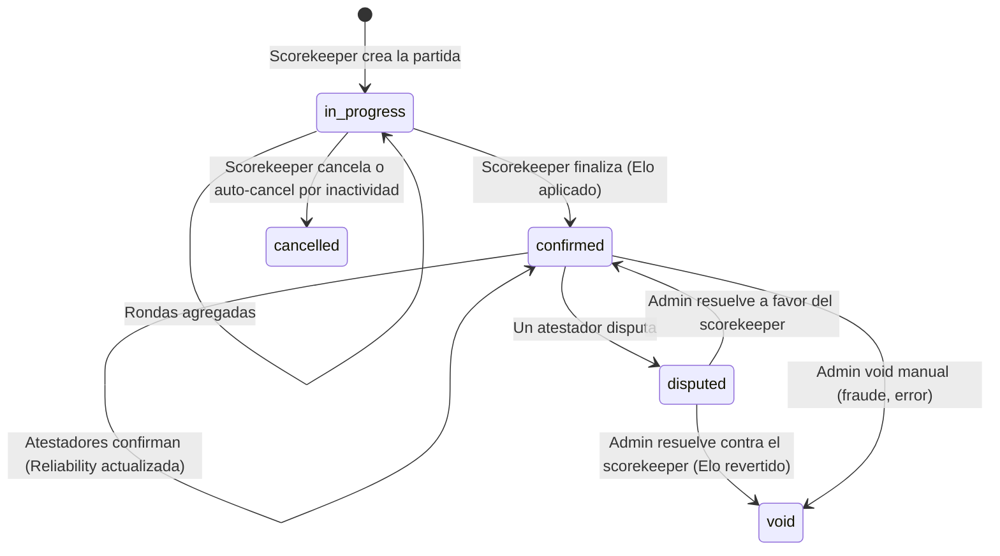
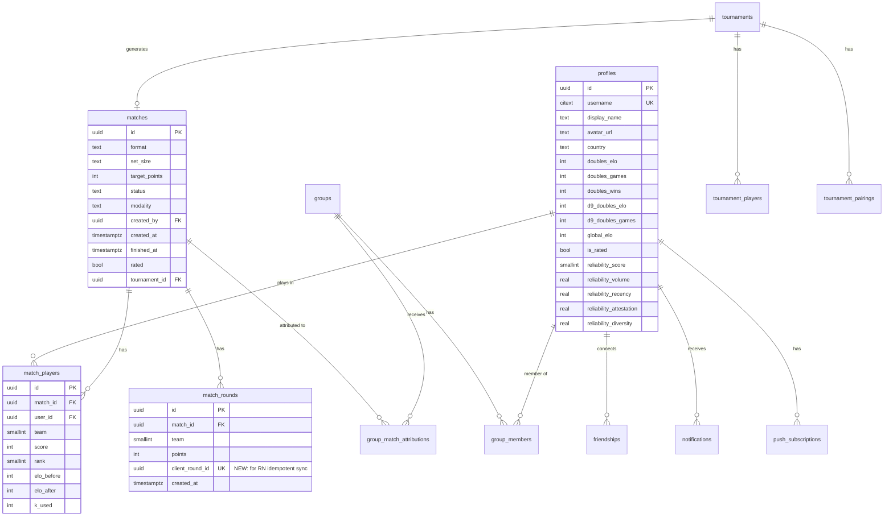
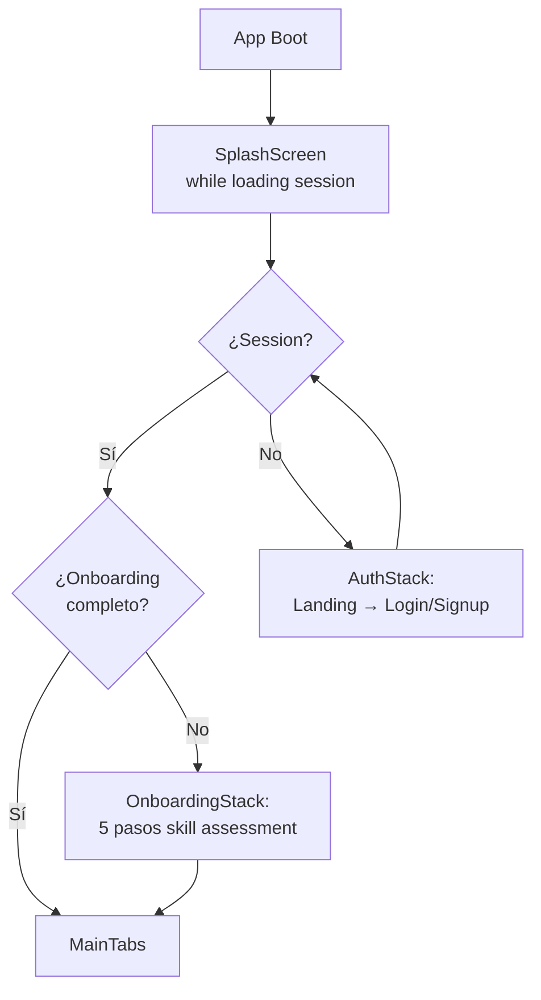
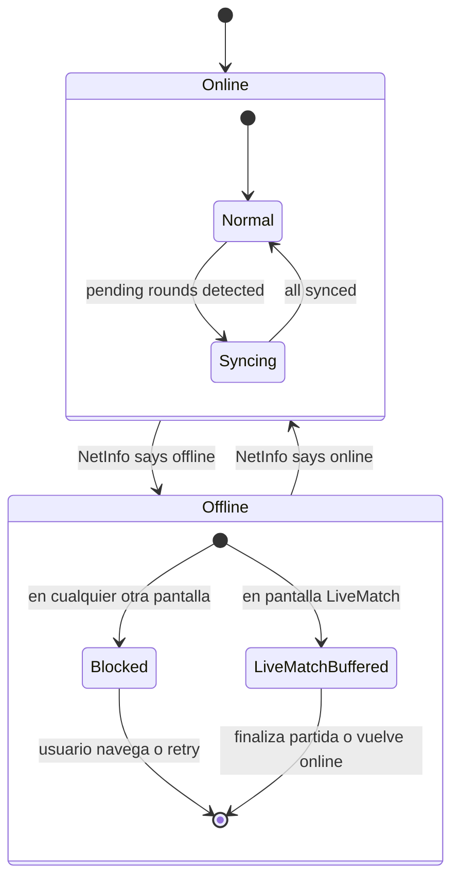

# DomiRank Mobile — Software Design System

**Versión:** 1.0
**Fecha:** 2026-08-27
**Autor:** Carlos Alberto Martínez (product owner) + entrevista dirigida
**Audiencia:** desarrollador React Native que va a construir la app móvil
**Estado:** contrato definitivo. Las decisiones aquí son las acordadas y **deben** cumplirse. Las cosas explícitamente marcadas *"decisión abierta"* al final del doc pueden discutirse.

---

## Índice

1. [Resumen ejecutivo](#1-resumen-ejecutivo)
2. [Decisiones fundamentales](#2-decisiones-fundamentales)
3. [Dominio y reglas del juego](#3-dominio-y-reglas-del-juego)
4. [Sistema de rating (Elo + MoV + Reliability)](#4-sistema-de-rating-elo--mov--reliability)
5. [Backend compartido con la PWA](#5-backend-compartido-con-la-pwa)
6. [Arquitectura de la app React Native](#6-arquitectura-de-la-app-react-native)
7. [Design System visual](#7-design-system-visual)
8. [Componentes primitivos](#8-componentes-primitivos)
9. [Navegación](#9-navegación)
10. [Pantallas y flujos (spec MVP)](#10-pantallas-y-flujos-spec-mvp)
11. [Analítica y observabilidad](#11-analítica-y-observabilidad)
12. [Testing strategy](#12-testing-strategy)
13. [Build, release y deployment](#13-build-release-y-deployment)
14. [Roadmap por fases](#14-roadmap-por-fases)
15. [Anexos: glosario, referencias, decisiones abiertas](#15-anexos)

---

## 1. Resumen ejecutivo

### ¿Qué es DomiRank?

DomiRank es una plataforma de rating competitivo de dominó para el Caribe y Latinoamérica. Los jugadores registran las partidas que juegan en la vida real (en clubes, casas de amigos, torneos), el sistema calcula un rating tipo Elo — con multiplicador de margen de victoria — y publica rankings, con verificación cruzada entre jugadores (atestación) y un **Reliability Score** que mide qué tan confiable es cada rating.

Hoy existe como una **PWA** (Progressive Web App) construida en Next.js 14 + Supabase, con usuarios reales, ratings vigentes, y ~100 migrations de base de datos. La estrategia móvil **no** es reemplazar la PWA — es agregar una **app nativa (React Native)** que consuma el mismo backend, para ofrecer la mejor experiencia posible durante el momento crítico: **cuando estás sentado en la mesa marcando puntos**.

### ¿Qué es este documento?

Es el contrato completo entre el product owner y el desarrollador React Native. Cubre:

- Todas las **decisiones de producto** ya tomadas (auth, offline, push, tabs, monetización).
- El **stack técnico** obligatorio (Expo + EAS + TypeScript + NativeWind + TanStack Query).
- El **dominio del juego** (reglas de dominó, ciclo de vida de una partida, roles).
- El **sistema de rating** completo (Elo, K-factor, buckets, Reliability Score).
- El **backend compartido** con la PWA (tablas, RLS, RPCs, triggers, edge functions).
- La **arquitectura de la app** (data layer, offline, realtime, push, deep links).
- El **design system visual** (tokens semánticos, dos paletas, tipografía, motion).
- **Componentes primitivos** y **navegación**.
- La **spec pantalla-por-pantalla** para el MVP.
- **Observabilidad, testing, release**.

Está escrito para que un dev pueda tomarlo y ponerse a construir sin tener que ir a preguntar a cada rato. Todo lo que no está aquí, **está en el código de la PWA**, cuyas referencias se enumeran en la Sección 15.

### Roadmap alto nivel

| Fase | Duración | Contenido |
|---|---|---|
| **1 — MVP** | ~6 semanas | Auth, onboarding, dashboard, crear partida, live scoring (con offline), atestación, leaderboard, amigos, perfil, notificaciones push, settings básicos |
| **2 — Comunidad** | ~4–6 semanas post-launch | Grupos (unir/crear/ver leaderboard), Torneos read-only (join, ver standings, ver próxima ronda), Reliability Score UI completa, cards de compartir (match result, achievements), digest semanal |
| **3 — Depth** | 3+ meses post-launch | Player Pro suscripción vía RevenueCat (si prueba demanda), creación de torneos in-app con wizard móvil-friendly, features avanzadas (head-to-head, gráficos de rating over time) |

### Estado del contrato

- Backend: **compartido** con la PWA (Supabase existente).
- Plataformas: **iOS + Android** desde día uno, Android-first para el orden de release.
- Stack: **Expo SDK (managed) + EAS Build + EAS Update + TypeScript strict**.
- Monetización: **cero en la app**. Sin ads jamás. Sin IAP. Club Pro se cobra vía Stripe en la web. Player Pro subscription reservado para Fase 3+.
- Alcance: **player-facing solamente**. Admin (`/admin`), gestión de organizaciones (`/admin/org/...`) y TV display (`/t/[slug]`) **se quedan en la PWA**.

---

## 2. Decisiones fundamentales

Cada decisión aquí es cerrada. Fueron discutidas y acordadas durante la sesión de grilling que originó este doc. Se enumeran para que futuras discusiones no las reabran sin justificación explícita.

### 2.1 Backend compartido, no forkeado

- La RN app consume el **mismo proyecto Supabase** que la PWA (misma URL, misma DB, mismos RLS policies, misma auth).
- Un solo `distinctId` de usuario cruza ambos clientes (`profiles.id` = `auth.users.id`).
- **Único cambio de schema requerido:** una migration nueva que agrega `client_round_id uuid unique` a `match_rounds` (para idempotencia del sync offline). La PWA sigue funcionando sin enviarlo (columna nullable).
- La RN app **no** debe crear tablas propias en el schema `public`. Si necesita metadata mobile-only (ej: `push_platform`), va en columnas nuevas de tablas existentes o en un schema `mobile_` separado.

### 2.2 Scope: player-facing only

- **Sí van en la app:** signup/login, onboarding, dashboard, crear/marcar/finalizar partidas, atestar, leaderboard, amigos, perfil, notificaciones, settings, grupos (Fase 2), torneos read-only (Fase 2).
- **NO van en la app:** panel admin de disputas, gestión de organizaciones/Club Pro, TV display de torneos, páginas estáticas (¿Cómo funciona?, FAQ, términos, privacidad — estas se linkean a la web desde Settings).
- Si más adelante hace falta un modo "organizador móvil" (ej: iniciar ronda desde el teléfono), es Fase 3+ y se especifica en otro doc.

### 2.3 Stack técnico

| Capa | Herramienta | Motivo |
|---|---|---|
| Framework | **Expo SDK (managed workflow)** | Un solo toolchain, EAS builds, OTA updates, Supabase JS compatible out of the box |
| Lenguaje | **TypeScript strict** | Paridad con la PWA, seguridad de tipos en el data layer |
| Build/deploy | **EAS Build + EAS Update + EAS Submit** | Elimina la fricción de Xcode/Gradle/certificados |
| Styling | **NativeWind** (Tailwind for RN) | Misma sintaxis y tokens que la PWA, curva cero |
| Navegación | **React Navigation v7 (native stack + bottom tabs)** | Gestures nativos, mejor performance, comunidad grande |
| Server state | **TanStack Query (React Query) v5** | Cache, dedupe, refetch on focus, mutaciones optimistas |
| Persistencia de cache | **`@tanstack/query-async-storage-persister` + MMKV** | Cold start instantáneo |
| Client state | **Zustand** (2 stores: `useAuthStore`, `useLiveMatchStore`) | Sin boilerplate, no re-renders innecesarios |
| Storage local | **MMKV** (`react-native-mmkv`) | ~30x más rápido que AsyncStorage, sync |
| Storage seguro | **`expo-secure-store`** | Keychain iOS / Keystore Android |
| Push notif | **`expo-notifications` + Expo Push Service** | APNs + FCM abstraídos |
| Realtime | **`@supabase/supabase-js` realtime channels** | Ya usado en la PWA |
| Haptics | **`expo-haptics`** | Sensación nativa |
| Analytics | **`posthog-react-native`** | Mismo proyecto PostHog que la PWA |
| Crashes/perf | **`@sentry/react-native`** | Nativo + JS, source maps por EAS |
| Iconografía | **`lucide-react-native`** | Set consistente y ligero |
| Motion | **`react-native-reanimated` v3** | Ejecuta en el hilo de UI |
| Bottom sheets | **`@gorhom/bottom-sheet`** | Estándar del ecosistema |
| Image | **`expo-image`** | Cache automático, mejores placeholders |
| Testing unit | **Jest** | Estándar del ecosistema RN |
| Testing E2E | **Maestro** | Configuración YAML simple, funciona con Expo dev builds |

**Explícitamente prohibido en esta base de código:**
- Redux / Redux Toolkit
- AsyncStorage como cache primario (usar MMKV)
- Cualquier SDK de ads (AdMob, Meta Audience, Unity Ads, etc.)
- Cualquier SDK de IAP directo (usar RevenueCat cuando llegue Fase 3)
- Emojis en identificadores de código (permitidos en texto de UI a discreción del diseñador)

### 2.4 Plataformas y orden de release

- **iOS + Android desde día uno**. Un solo codebase.
- **Android primero al lanzamiento**: mayor base instalada en el mercado (VE/DR/Cuba/PR ~85-90% Android), review más rápida, beta más fácil (APK link + Play internal testing).
- iOS sigue en la misma sprint de release (~1 semana después máximo).

### 2.5 Auth methods

Tres métodos, ni uno más, ni uno menos:
1. **Email + password** (con reset password vía Supabase magic link).
2. **Google Sign-In** (Android + iOS).
3. **Sign in with Apple** (iOS) — mandatorio por App Store rule 4.8 si ofreces Google Sign-In en iOS.

Explícitamente **no** en MVP: magic link en la app, SMS OTP, WhatsApp OTP.

### 2.6 Offline: modo "buffered online"

El único momento en que se soporta trabajar sin señal es **durante la partida en curso**. En detalle:

- **Sin señal + creando partida:** bloqueado.
- **Sin señal + marcando puntos en partida ya iniciada:** funciona. Rondas se buffean en MMKV. Se sincronizan cuando vuelve la señal.
- **Sin señal + finalizando partida:** el finalize se difiere; se aplica al recuperar señal.
- **Sin señal + atestando, viendo ranking, agregando amigos, etc.:** bloqueado con retry.
- Ver Sección 6.7 para el modelo detallado.

### 2.7 Monetización: **cero en la app**

- Cero ads (política permanente, no reconsiderar en Fase 2).
- Cero IAP.
- Club Pro es B2B, se cobra vía Stripe en el panel web `/admin/org/[slug]/billing` — nunca toca la app.
- Player Pro suscripción es Fase 3+ vía RevenueCat, solo si Fase 2 muestra demanda clara.

### 2.8 Idioma de la app

- **Español** como único idioma en MVP.
- Los textos se centralizan desde el principio en un módulo `src/i18n/es.ts` para permitir traducción futura sin refactor. No se implementa `i18next` en MVP — se usa un objeto plano tipado.
- Etiquetas técnicas de UI (bucket names, tier names) se mantienen tal cual (Calibrando, En desarrollo, Confiable, Muy confiable, Provisional, Learning, Stable, Elite, Legend).

### 2.9 Light + Dark mode

- Tres modos: **Claro / Oscuro / Automático** (default Automático — sigue al sistema).
- Preferencia persistida en MMKV, key `theme_preference`.
- Tokens semánticos (Sección 7) permiten el switch sin refactor.

---

## 3. Dominio y reglas del juego

Esta sección define el vocabulario que usa el código y la UI. Es imperativo respetarlo.

### 3.1 Vocabulario canónico

| Término | Definición | Uso en código |
|---|---|---|
| **Partida** (match) | Un juego completo de dominó desde el arranque hasta que un equipo llega a target_points | `matches` table, `Match` type |
| **Ronda** (round / hand) | Una mano dentro de una partida — puntos sumados por un equipo tras una jugada | `match_rounds` table, `MatchRound` type |
| **Modalidad** | Reglas culturales del dominó (Venezolano, Dominicano, Cubano, Puertorriqueño, Custom) | `matches.modality`, enum `Modality` |
| **Set** | El conjunto de fichas: `d6` (28 fichas, doble-6) o `d9` (55 fichas, doble-9) | `matches.set_size` |
| **Formato** | `doubles` (parejas 2v2) — único formato soportado en 2026+ | `matches.format` |
| **Target points** | Puntuación que gana la partida (default 100, rango 50–500) | `matches.target_points` |
| **Scorekeeper** | El jugador que crea la partida y marca los puntos. Único con permiso RLS de escribir en `match_rounds` | `matches.created_by` |
| **Atestador** | Cualquier jugador de la partida que no es scorekeeper. Debe confirmar o disputar el resultado en 72h | Roles derivados de `match_players` |
| **Atestación** | Acto de confirmar (o disputar) el resultado de una partida ajena. Vinculado al Reliability Score | Server action `attestMatch` |
| **Capicúa** | Ganar cerrando la partida con una ficha que empata ambas puntas. Es metadata en 2026, no aplica rating bonus (planeado v2) | `matches.capicua_bonus` |
| **Tranca** | Situación donde nadie puede jugar y se cuentan puntos en mano. No validado por reglas del sistema (aún) | Metadata, no encoded |
| **Bucket** | Categoría de rating por combinación set + formato: `d6_doubles`, `d9_doubles` (`d6_singles`, `d9_singles` son legacy) | `profiles.doubles_elo`, etc. |
| **Elo global** | Promedio ponderado de los buckets con `games > 0` | `profiles.global_elo` (mantenido por triggers) |
| **NR** | "Not Rated" — jugador con menos de 5 partidas confirmadas total. UI muestra badge "NR" en vez de rating | `profiles.is_rated` (columna generated) |
| **Reliability Score** | 0–100 mide qué tan confiable es el rating (volumen, recencia, atestación, diversidad) | `profiles.reliability_score` |
| **Tier** | Rango del jugador basado en Elo: Provisional / Learning / Stable / Elite / Legend | Derivado en `src/lib/rating.ts` |
| **Grupo** | Comunidad persistente con membresía explícita, leaderboard propio, roles admin/co_admin/member | `groups` table (Fase 2) |
| **Torneo** | Evento con formato estructurado (Swiss, round robin, etc.) y standings propios | `tournaments` table (Fase 2 read-only) |

### 3.2 Reglas de dominó encoded (versión 2026, MVP)

La app **no arbitra** las reglas de dominó. El scorekeeper es la fuente de verdad de cuántos puntos suma cada mano. Lo que sí encoded:

- **Formato único**: parejas 2v2. Cuatro jugadores por partida, dos equipos de dos.
- **Sets soportados**: `d6` (default) y `d9`. Buckets de rating separados. Un jugador puede tener ratings independientes en cada uno.
- **Target points**: configurable por partida, rango 50–500, default 100. Primer equipo en alcanzar o superar el target gana.
- **Modalidad**: metadata, no afecta reglas ni rating buckets. Se guarda para estadísticas y para que el jugador ubique el contexto ("jugué 30 partidas dominicano").
- **Capicúa**: metadata booleana por partida (`capicua_bonus`). No aplica bonus de Elo en 2026. Reservado para v2.
- **Tranca**: no modelada en la DB. Es un concepto en la mesa que se resuelve marcando la ronda como cerrada; el scorekeeper simplemente marca los puntos que quedaron en mano.

**Lo que NO valida la app** (por diseño):
- No verifica que las sumas de puntos por ronda sean válidas según el set (podría ser >55 en d9 acumulado por bug de scorekeeper, se detecta como anomalía a posteriori).
- No enforcea que los equipos sean estables entre rondas (siempre lo son: teams se definen al inicio y no cambian).
- No detecta jugadas ilegales (no ve las fichas).

Esto es intencional: el sistema es un **registrador confiable**, no un árbitro. La confiabilidad viene de la atestación cruzada.

### 3.3 Ciclo de vida de una partida



**Notas del estado `confirmed`:**
- El Elo se aplica **al finalizar**, no al atestar. La atestación afecta el **Reliability Score**, no el rating.
- Si un match cae en `disputed`, el Elo aplicado **permanece** hasta que un admin resuelva. Si void, se revierte.

### 3.4 Roles y permisos

| Rol | Puede | RLS enforcement |
|---|---|---|
| **Scorekeeper** de un match | Crear match, insertar rondas, finalizar, cancelar mientras `in_progress` | `matches.created_by = auth.uid()` |
| **Jugador** del match (no scorekeeper) | Ver partida completa, atestar (confirmar/disputar) en las 72h posteriores al finalize | `match_players.user_id = auth.uid()` |
| **Admin de grupo** | Invitar/remover miembros, cambiar settings, archivar grupo | `group_members.role IN ('admin', 'co_admin')` |
| **Admin de sistema** | Resolver disputas, void manual, backfill | Check en app contra lista hardcoded de UUIDs (pendiente de RBAC formal) |

### 3.5 Modalidades — solo metadata

Las 5 modalidades (`ven`, `dom`, `cub`, `pri`, `custom`) son **tags descriptivos**. No cambian:
- Cálculo de Elo (mismo K, misma fórmula).
- Bucket de rating (los buckets son solo por set + formato).
- Reglas encoded (target_points, capicúa bonus, etc.).

Sirven para:
- Preferencias del jugador (auto-seleccionar modalidad en la creación).
- Estadísticas ("jugué 30 partidas cubano, 12 puertorriqueño").
- Compartir contexto entre jugadores.

En la app, aparecen como:
- **Chip** en la card de partida (ver `<Chip variant="modality">`).
- **Selector** en el flujo de crear partida (con "no volver a preguntar, siempre usar X" en Settings).

---

## 4. Sistema de rating (Elo + MoV + Reliability)

Esta sección resume `docs/RATING_SYSTEM.md` desde la perspectiva del cliente móvil. El **cálculo mismo del rating vive en el backend** (server action `applyMatchRating` + RPC `apply_match_rating`), la app nunca lo calcula. La app **muestra** el rating y **simula visualmente** deltas post-partida.

### 4.1 Fórmula (referencia)

```
team_elo  = avg(partners)                                    // team = 2 jugadores
expected  = 1 / (1 + 10^((opp_elo - my_elo) / 400))          // fórmula Elo estándar
scoreDiff = |winner_score - loser_score|
MOVM      = log10(scoreDiff + 1) * (2.2 / (eloGap * 0.001 + 2.2))
delta     = round(K * MOVM * (actual - expected))            // actual = 1 (won) o 0 (lost)
```

El multiplicador `MOVM` (Margin of Victory Multiplier) magnifica partidas apretadas y aplasta blowouts. `eloGap` es la diferencia entre los equipos (para castigar wins esperados vs. premiar upsets).

### 4.2 K-factor por tier

| Tier | Condición | K |
|---|---|---|
| Provisional | `games < 10` en ese bucket | 40 |
| Learning | `elo < 1500` | 28 |
| Stable | `1500 ≤ elo < 1900` | 24 |
| Elite | `1900 ≤ elo < 2050` | 18 |
| Legend | `elo ≥ 2050` | 12 |

**Elo inicial:** 1500 en cada bucket. **Display range:** Elo 1000 = 1.0 en pantalla, Elo 2200 = 20.0 en pantalla (lineal). Fórmula:

```ts
displayRating = 1 + ((elo - 1000) / 1200) * 19
```

Clampeado a `[1.0, 20.0]`. La app nunca muestra el Elo raw al usuario — siempre el display 1–20 con un decimal.

### 4.3 Cuatro buckets por jugador

| Bucket | Set | Formato | Columnas en `profiles` |
|---|---|---|---|
| `d6_singles` | Doble-6 | Singles (legacy) | `singles_elo`, `singles_games`, ... |
| `d6_doubles` | Doble-6 | Parejas | `doubles_elo`, `doubles_games`, ... |
| `d9_singles` | Doble-9 | Singles (legacy) | `d9_singles_elo`, `d9_singles_games`, ... |
| `d9_doubles` | Doble-9 | Parejas | `d9_doubles_elo`, `d9_doubles_games`, ... |

`singles` es legacy (el formato fue eliminado en 2026); la app **no** ofrece crear partidas singles y **no** muestra buckets singles a menos que el jugador tenga games > 0 ahí. En ese caso, se muestra como "legacy" con nota.

**Global Elo:** promedio ponderado por games de los buckets con actividad. Mantenido por triggers SQL. Es el número que se muestra en el leaderboard global.

### 4.4 NR (Not Rated)

Un jugador con **menos de 5 partidas totales confirmadas** es NR. La columna `profiles.is_rated` (`BOOLEAN GENERATED ALWAYS`) marca esto. La UI:

- **RatingBadge**: sustituye el número por un badge ámbar "NR".
- **Dashboard hero**: muestra "NR" grande + subtexto "Calibrando" + progress bar "n/5 partidas".
- **Perfil**: muestra "NR" en el hero y una card `<NROnboardingCard>` explicando qué hace ganar el rating.
- **Leaderboard**: los NR **no aparecen** en el leaderboard público. Se filtra `is_rated = true`.

### 4.5 Reliability Score (0–100)

Métrica ortogonal al Elo que responde: **"¿qué tan confiable es este rating?"**

Fórmula (calculada en SQL, la app la lee):

```
score = min(100, round(
  35 * volume
  + 25 * recency
  + 25 * attestation
  + 15 * diversity
))
```

| Factor | Peso | Definición | Meta = 1.0 |
|---|---|---|---|
| `volume` | 35% | `min(1, attested_matches / 30)` | 30 partidas confirmadas |
| `recency` | 25% | `min(1, matches_last_60d / 10)` | 10 partidas en últimos 60d |
| `attestation` | 25% | `attested / total_non_cancelled` | 100% de partidas atestadas |
| `diversity` | 15% | `min(1, distinct_opponents / 15)` | 15 oponentes distintos |

**4 buckets visuales:**

| Score | Bucket | Color (dark) | Color (light) |
|---|---|---|---|
| 0–29 | Calibrando | gris | gris denso |
| 30–59 | En desarrollo | ámbar | ámbar denso |
| 60–89 | Confiable | verde suave | verde denso |
| 90–100 | Muy confiable | verde brillante | verde bosque |

**En la app (MVP):**
- El score aparece en el perfil del usuario (hero) como badge junto al rating.
- **Fase 2:** dedicated screen "Cómo mejorar tu Reliability" con los 4 factores + coaching.

### 4.6 Aplicación de rating (backend, no cliente)

**El cliente móvil no calcula ratings.** Al finalizar una partida, la app llama a un server action (o directamente al RPC) que:

1. Lee el match, sus rounds y los profiles de los 4 jugadores.
2. Calcula ranks (el equipo con mayor puntaje acumulado = rank 1).
3. Corre el motor de Elo (`src/lib/rating.ts` en el backend).
4. Escribe los deltas atomicamente en `profiles.*_elo` y `match_players.elo_before/elo_after/k_used`.
5. Marca `matches.status = 'confirmed'`, `matches.rated_at = now()`.
6. Dispara la request de atestación a los otros jugadores (notificación + email).
7. El trigger de attribution (`trg_attribute_match_on_confirmed`) inserta rows en `group_match_attributions` si aplica.

**Simulación visual en la app:** después de finalize, la app puede mostrar animación de "tu rating subió +12" leyendo `match_players.elo_after - elo_before`. NO calcular el delta en el cliente — leerlo del server response.

---

## 5. Backend compartido con la PWA

### 5.1 Cliente Supabase

La app usa `@supabase/supabase-js` v2 exactamente como la PWA, con **una diferencia clave**: el storage de la sesión no es cookies HTTP, es MMKV (via un adaptador custom).

```ts
// src/lib/supabase.ts
import { createClient } from '@supabase/supabase-js'
import { MMKV } from 'react-native-mmkv'

const storage = new MMKV({ id: 'auth-storage' })

const mmkvStorageAdapter = {
  getItem: (key: string) => storage.getString(key) ?? null,
  setItem: (key: string, value: string) => storage.set(key, value),
  removeItem: (key: string) => storage.delete(key),
}

export const supabase = createClient(
  process.env.EXPO_PUBLIC_SUPABASE_URL!,
  process.env.EXPO_PUBLIC_SUPABASE_ANON_KEY!,
  {
    auth: {
      storage: mmkvStorageAdapter,
      autoRefreshToken: true,
      persistSession: true,
      detectSessionInUrl: false, // RN no tiene URL fragment
    },
    realtime: {
      params: { eventsPerSecond: 10 },
    },
  }
)
```

### 5.2 Modelo de datos — tablas clave para la app



### 5.3 Tablas usadas por la RN app

| Tabla | Uso desde la app | Escritura permitida |
|---|---|---|
| `profiles` | Read perfil propio + ajenos | Update solo el propio, columnas whitelisted (display_name, avatar_url, country, bio) |
| `matches` | Read propios + ajenos | Insert como scorekeeper; update status (finalize/cancel) solo si created_by |
| `match_players` | Read | Insert solo cuando se crea el match (RLS via created_by del match) |
| `match_rounds` | Read | Insert solo el scorekeeper. **Enviar siempre `client_round_id`** para idempotencia. |
| `friendships` | Read + insert (send request) + update (accept/reject) | Insert donde requester = auth.uid(), update donde recipient = auth.uid() |
| `notifications` | Read propios + mark as read | Update solo `read_at` de las propias |
| `groups` | Read grupos donde soy member | Insert nuevos (Fase 2); update solo si admin |
| `group_members` | Read los de mis grupos | Insert por invitación (Fase 2), update leave |
| `tournaments` | Read | (Fase 2) Insert vía wizard móvil |
| `tournament_players` | Read | Insert al unirse |
| `tournament_pairings` | Read | Solo lectura desde la app |
| `push_subscriptions` | Insert/upsert al obtener Expo Push Token; delete al logout | Escritura solo el owner |
| `user_preferences` | Read + update | Solo owner |

### 5.4 RLS: lo que la app debe respetar

- **Nunca** intentar bypasear RLS con el service role key desde el cliente. La app **solo** usa el `anon key`.
- Todas las mutaciones pasan el JWT del usuario (Supabase JS lo hace automático).
- Si una mutation falla con 401/403, es un bug de la app (intentando algo no permitido) — no hacer retry ciego, mostrar error y loguear a Sentry.

### 5.5 RPCs que la app llama

| RPC | Firma | Uso |
|---|---|---|
| `apply_match_rating(p_match_id uuid, p_payload jsonb)` | Aplica Elo + marca confirmed | Llamado desde el finalize server action (o directamente si el flujo va cliente → RPC) |
| `void_match(p_match_id uuid, p_reason text)` | Void manual (admin) | No usado desde la app player-facing |
| `update_player_reliability(p_user_id uuid)` | Recalcula reliability para un user | No usado desde la app (backend triggers lo llaman) |
| `join_group_by_code(p_code text)` | Une al usuario a un grupo por invitation_code | Fase 2, desde `JoinGroupSheet` |
| `join_tournament_by_code(p_code text)` | Une al usuario a un torneo por invitation_code | Fase 2 |
| `attest_match(p_match_id uuid, p_action text)` | Confirma o disputa una partida (`action = 'confirm' \| 'dispute'`) | Desde `AttestationScreen` |

### 5.6 Edge functions relevantes

- `supabase/functions/send-push-notification` — dispatcher de push. **Extender** para aceptar tokens de Expo Push además de web push subscriptions. Ver Sección 5.9.
- `supabase/functions/generate-tournament-round` — no lo llama la app (solo el admin panel).

### 5.7 Triggers y cron jobs relevantes

- `trg_attribute_match_on_confirmed` — al pasar match a `confirmed`, auto-atribuye al grupo del scorekeeper si aplica. La app no interactúa; solo lee `group_match_attributions` en el Group Leaderboard.
- `trg_reliability_on_match_status` — al cambiar status, recalcula reliability de los 4 jugadores. La app lee el `reliability_score` actualizado en la próxima query.
- Cron diario `/api/cron/recompute-reliability` (03:30 UTC) — safety net. La app no lo llama.
- Cron `/api/cron/auto-confirm` — cierra atestaciones vencidas (72h). La app no lo llama.

### 5.8 Migration nueva requerida

**Único cambio de schema para soportar la RN app:**

```sql
-- supabase/migrations/0100_add_client_round_id_to_match_rounds.sql
begin;

alter table public.match_rounds
  add column client_round_id uuid;

create unique index concurrently idx_match_rounds_client_round_id
  on public.match_rounds (client_round_id)
  where client_round_id is not null;

comment on column public.match_rounds.client_round_id is
  'Client-generated UUID for idempotent insert from mobile app offline sync. NULL for rows created before mobile app launch.';

commit;
```

**Efecto sobre la PWA:** ninguno. La columna es nullable, la PWA sigue insertando sin ella.

**Efecto sobre la RN app:** cada insert de round envía un UUID generado localmente. Si el sync worker retentea, el `on conflict do nothing` (o `on conflict (client_round_id) do nothing`) previene duplicados.

### 5.9 Extensión de `send-push-notification`

La edge function actual acepta web push subscriptions. Hay que ampliarla para aceptar **Expo Push Tokens** también. Diseño:

- Tabla `push_subscriptions` (existente o nueva) con columnas: `user_id`, `platform` (`web | ios | android`), `token`, `created_at`, `last_used_at`.
- La app hace upsert de su Expo Push Token al obtener permiso.
- La edge function, al recibir un evento de push, consulta todas las subs del user y dispatches:
  - Si `platform = 'web'` → web push existente.
  - Si `platform in ('ios', 'android')` → HTTPS POST a `https://exp.host/--/api/v2/push/send` con el token de Expo.
- Payload común: `{ title, body, data: { url, type, ...contextIds } }`.

### 5.10 Env vars que la app necesita

```
EXPO_PUBLIC_SUPABASE_URL=<https://xxx.supabase.co>
EXPO_PUBLIC_SUPABASE_ANON_KEY=<eyJhbGci...>
EXPO_PUBLIC_POSTHOG_API_KEY=<phc_...>
EXPO_PUBLIC_POSTHOG_HOST=https://us.i.posthog.com
EXPO_PUBLIC_SENTRY_DSN=<https://xxx@sentry.io/xxx>
EXPO_PUBLIC_APP_ENV=<development | preview | production>
```

Se cargan vía `app.config.ts` desde `.env` local + EAS Secrets en producción. Nunca commitear `.env`.

---

## 6. Arquitectura de la app React Native

### 6.1 Estructura de directorios

```
domirank-mobile/
├── app.config.ts
├── eas.json
├── package.json
├── tsconfig.json
├── tailwind.config.ts
├── metro.config.js
├── babel.config.js
├── app/                        # expo-router (opcional) o src/screens/ si React Nav puro
├── src/
│   ├── api/                    # wrappers de Supabase + TanStack Query hooks
│   │   ├── auth.ts
│   │   ├── matches.ts
│   │   ├── profiles.ts
│   │   ├── notifications.ts
│   │   ├── groups.ts
│   │   └── tournaments.ts
│   ├── components/             # componentes primitivos y compuestos
│   │   ├── primitives/         # Button, Card, Chip, etc.
│   │   ├── match/
│   │   ├── leaderboard/
│   │   ├── profile/
│   │   └── notifications/
│   ├── screens/                # pantallas top-level
│   │   ├── auth/
│   │   ├── onboarding/
│   │   ├── home/
│   │   ├── match/
│   │   ├── leaderboard/
│   │   ├── friends/
│   │   ├── profile/
│   │   └── settings/
│   ├── navigation/             # React Navigation configs
│   │   ├── RootNavigator.tsx
│   │   ├── AuthStack.tsx
│   │   ├── OnboardingStack.tsx
│   │   ├── MainTabs.tsx
│   │   ├── linking.ts
│   │   └── types.ts
│   ├── stores/                 # Zustand stores
│   │   ├── useAuthStore.ts
│   │   └── useLiveMatchStore.ts
│   ├── lib/                    # lógica pura
│   │   ├── supabase.ts
│   │   ├── mmkv.ts
│   │   ├── rating-display.ts   # solo helpers de display, NO cálculo
│   │   ├── reliability-display.ts
│   │   ├── net.ts              # network state helpers
│   │   ├── analytics.ts        # wrapper de PostHog
│   │   ├── errors.ts
│   │   └── format.ts
│   ├── i18n/
│   │   └── es.ts
│   ├── theme/
│   │   ├── tokens.ts           # tokens semánticos
│   │   ├── palettes.ts         # dark + light
│   │   └── ThemeProvider.tsx
│   ├── hooks/
│   │   ├── useTheme.ts
│   │   ├── useNetworkState.ts
│   │   ├── useAppState.ts
│   │   ├── useRealtimeChannel.ts
│   │   └── useMatchSyncWorker.ts
│   ├── workers/                # background workers
│   │   └── matchSyncWorker.ts
│   └── types/
│       └── supabase.ts         # generado con supabase-cli gen types
├── assets/
│   ├── icons/
│   ├── fonts/                  # solo si se cargan fuentes custom (no en MVP)
│   ├── splash-light.png
│   ├── splash-dark.png
│   ├── icon.png                # app icon
│   └── adaptive-icon.png       # Android
└── __tests__/
    ├── setup.ts
    └── unit/
```

### 6.2 Capa de datos: TanStack Query + Zustand

**Convención de queryKeys** (obligatoria):

```ts
// src/api/queryKeys.ts
export const queryKeys = {
  auth: {
    session: ['auth', 'session'] as const,
  },
  profile: {
    all: ['profile'] as const,
    detail: (userId: string) => ['profile', userId] as const,
    byUsername: (username: string) => ['profile', 'username', username] as const,
  },
  match: {
    all: ['match'] as const,
    detail: (matchId: string) => ['match', matchId] as const,
    activeForUser: (userId: string) => ['match', 'active', userId] as const,
    recent: (userId: string, limit: number) => ['match', 'recent', userId, limit] as const,
  },
  leaderboard: {
    all: ['leaderboard'] as const,
    bucket: (bucket: string, country?: string) => ['leaderboard', bucket, country ?? 'all'] as const,
  },
  friends: {
    list: (userId: string) => ['friends', userId] as const,
    requests: (userId: string) => ['friends', 'requests', userId] as const,
  },
  notifications: {
    list: (userId: string) => ['notifications', userId] as const,
    unreadCount: (userId: string) => ['notifications', 'unreadCount', userId] as const,
  },
  groups: {
    myGroups: (userId: string) => ['groups', 'my', userId] as const,
    detail: (groupId: string) => ['groups', groupId] as const,
    leaderboard: (groupId: string) => ['groups', groupId, 'leaderboard'] as const,
  },
  tournaments: {
    active: (userId: string) => ['tournaments', 'active', userId] as const,
    detail: (tournamentId: string) => ['tournaments', tournamentId] as const,
  },
} as const
```

**QueryClient config:**

```ts
export const queryClient = new QueryClient({
  defaultOptions: {
    queries: {
      staleTime: 30_000,             // 30s
      gcTime: 24 * 60 * 60 * 1000,   // 24h
      retry: 2,
      retryDelay: (attempt) => Math.min(1000 * 2 ** attempt, 30_000),
      refetchOnWindowFocus: false,   // reemplazado por refetchOnAppFocus custom
      refetchOnReconnect: true,
    },
    mutations: {
      retry: 1,
    },
  },
})

// Persistencia
const persister = createAsyncStoragePersister({
  storage: mmkvStorage,               // wrapper de MMKV con interfaz async
  key: 'DOMIRANK_QUERY_CACHE_V1',
  throttleTime: 1000,
})

persistQueryClient({
  queryClient,
  persister,
  maxAge: 24 * 60 * 60 * 1000,       // 24h
  buster: '__CACHE_VERSION__',       // bump para invalidar todo el cache
})
```

**Refetch on app focus:**

```ts
// hooks/useAppState.ts
export function useAppFocusRefetch() {
  const queryClient = useQueryClient()
  useEffect(() => {
    const sub = AppState.addEventListener('change', (state) => {
      if (state === 'active') queryClient.invalidateQueries()
    })
    return () => sub.remove()
  }, [queryClient])
}
```

**Mutaciones con optimistic UI (patrón):**

```ts
export function useAttestMatch(matchId: string) {
  const queryClient = useQueryClient()
  return useMutation({
    mutationFn: (action: 'confirm' | 'dispute') =>
      supabase.rpc('attest_match', { p_match_id: matchId, p_action: action }),
    onMutate: async (action) => {
      await queryClient.cancelQueries({ queryKey: queryKeys.match.detail(matchId) })
      const previous = queryClient.getQueryData(queryKeys.match.detail(matchId))
      queryClient.setQueryData(queryKeys.match.detail(matchId), (old: any) => ({
        ...old,
        attestation_state: action === 'confirm' ? 'confirmed' : 'disputed',
      }))
      return { previous }
    },
    onError: (err, action, ctx) => {
      queryClient.setQueryData(queryKeys.match.detail(matchId), ctx?.previous)
      toast.error('No se pudo procesar. Reintenta.')
    },
    onSettled: () => {
      queryClient.invalidateQueries({ queryKey: queryKeys.match.detail(matchId) })
      queryClient.invalidateQueries({ queryKey: queryKeys.profile.all })
    },
  })
}
```

### 6.3 Zustand stores

Solo dos stores. Cualquier necesidad adicional debe justificarse.

**`useAuthStore`:**

```ts
type AuthState = {
  user: User | null
  session: Session | null
  status: 'loading' | 'authenticated' | 'unauthenticated'
  signIn: (email: string, password: string) => Promise<void>
  signInWithGoogle: () => Promise<void>
  signInWithApple: () => Promise<void>
  signUp: (email: string, password: string, displayName: string, dob: string) => Promise<void>
  signOut: () => Promise<void>
  refreshSession: () => Promise<void>
}

export const useAuthStore = create<AuthState>((set, get) => ({
  user: null,
  session: null,
  status: 'loading',
  signIn: async (email, password) => { /* supabase.auth.signInWithPassword */ },
  // ...
}))

// Inicializado en el root
supabase.auth.onAuthStateChange((_event, session) => {
  useAuthStore.setState({
    session,
    user: session?.user ?? null,
    status: session ? 'authenticated' : 'unauthenticated',
  })
})
```

**`useLiveMatchStore`:**

```ts
type PendingRound = {
  clientRoundId: string          // UUID generado localmente
  matchId: string
  team: 1 | 2
  points: number
  createdAt: number              // timestamp local
  syncedAt: number | null        // null = pendiente
}

type LiveMatchState = {
  matchId: string | null
  activeTeam: 1 | 2
  scoreA: number                 // calculado a partir de rondas locales + servidor
  scoreB: number
  pendingRounds: PendingRound[]  // no sincronizadas
  isOffline: boolean
  isFinalizePending: boolean     // finalize disparado sin conexión
  addRound: (team: 1 | 2, points: number) => void
  setActiveTeam: (team: 1 | 2) => void
  markRoundSynced: (clientRoundId: string) => void
  requestFinalize: () => void
  clear: () => void
}

// Persistido en MMKV via zustand middleware persist
export const useLiveMatchStore = create<LiveMatchState>()(
  persist(
    (set, get) => ({ /* impl */ }),
    { name: 'live-match', storage: createJSONStorage(() => mmkvStorage) }
  )
)
```

### 6.4 Auth flow — implementación



- **Landing screen**: hero + botones "Iniciar sesión" y "Crear cuenta".
- **Login**: email + password + "Iniciar con Google" + (iOS) "Iniciar con Apple" + link "¿Olvidaste tu contraseña?".
- **Signup**: email + password (min 8 chars, feedback en vivo) + display_name + DOB (13+ check).
- **Reset password**: email → Supabase magic link → deep link `/auth/reset?token=...` → nueva password.

**Google Sign-In con Expo:**

```ts
import * as AuthSession from 'expo-auth-session'
import * as Google from 'expo-auth-session/providers/google'

const [request, response, promptAsync] = Google.useAuthRequest({
  iosClientId: process.env.EXPO_PUBLIC_GOOGLE_IOS_CLIENT_ID,
  androidClientId: process.env.EXPO_PUBLIC_GOOGLE_ANDROID_CLIENT_ID,
  scopes: ['openid', 'profile', 'email'],
})

useEffect(() => {
  if (response?.type === 'success' && response.authentication) {
    supabase.auth.signInWithIdToken({
      provider: 'google',
      token: response.authentication.idToken!,
    })
  }
}, [response])
```

**Sign in with Apple con Expo (solo iOS):**

```ts
import * as AppleAuthentication from 'expo-apple-authentication'

const credential = await AppleAuthentication.signInAsync({
  requestedScopes: [
    AppleAuthentication.AppleAuthenticationScope.FULL_NAME,
    AppleAuthentication.AppleAuthenticationScope.EMAIL,
  ],
})

await supabase.auth.signInWithIdToken({
  provider: 'apple',
  token: credential.identityToken!,
})
```

**Sesión persistida en MMKV** (ver 5.1). Al abrir la app, se restaura instantáneamente. `autoRefreshToken` la mantiene válida.

### 6.5 Onboarding

5 pasos secuenciales (skill assessment). El backend ya tiene el flujo y las tablas. La RN app lo reimplementa 1:1 con:

- Stack sin bottom tab bar (fullscreen).
- Progress bar arriba (`Paso n de 5`).
- Cada paso: pregunta + opciones tap. Nunca free text.
- Al completar: `profiles.onboarding_completed_at = now()`. La app pasa a `MainTabs`.
- Se puede **omitir** el onboarding y hacerlo después desde Settings.
- Analytics: `user_completed_onboarding` con `steps_completed`.

### 6.6 Estado de red

`useNetworkState` hook usando `@react-native-community/netinfo`:

```ts
export function useNetworkState() {
  const [state, setState] = useState<NetInfoState | null>(null)
  useEffect(() => {
    const unsub = NetInfo.addEventListener(setState)
    NetInfo.fetch().then(setState)
    return () => unsub()
  }, [])
  const isOnline = state?.isConnected && state?.isInternetReachable
  return { state, isOnline: !!isOnline, isOffline: !isOnline }
}
```

Se expone globalmente en `useLiveMatchStore.isOffline` y se muestra en la UI cuando aplique.

### 6.7 Offline mode — modelo completo

**Principio guía:** el momento único en que se permite trabajar sin señal es **durante la partida en curso**. Nada más.

**Estados y transiciones:**



**Comportamiento por pantalla:**

| Pantalla | Sin señal → comportamiento |
|---|---|
| Landing/Login/Signup | Botón deshabilitado con banner "Sin conexión" |
| Dashboard | Muestra data cacheada con timestamp "actualizado hace 2h" + banner sutil "sin conexión" |
| Nueva partida | Bloqueado. Modal: "Necesitas conexión para crear partida. Reintentar." |
| Live match | **Funciona 100%.** Chip persistente arriba: "Sin conexión · guardando localmente". Rondas se buffean. |
| Match detail | Data cacheada; atestación bloqueada con retry |
| Leaderboard | Snapshot cacheado + banner |
| Amigos | Snapshot cacheado + banner |
| Perfil | Snapshot cacheado + banner |
| Settings | Se puede leer, cambios que solo tocan MMKV (theme) funcionan; cambios que tocan Supabase (nombre) muestran retry |

**El sync worker** (`workers/matchSyncWorker.ts`):

```ts
// pseudo-código
let backoffMs = 1000
let running = false

async function tick() {
  if (running) return
  if (!isOnline()) { schedule(30_000); return }

  running = true
  try {
    const pending = useLiveMatchStore.getState().pendingRounds
      .filter((r) => r.syncedAt === null)

    for (const round of pending) {
      const { error } = await supabase.from('match_rounds').insert({
        match_id: round.matchId,
        team: round.team,
        points: round.points,
        client_round_id: round.clientRoundId,
      }).select('id').single()

      if (!error || error.code === '23505' /* unique violation, ya existía */) {
        useLiveMatchStore.getState().markRoundSynced(round.clientRoundId)
      } else {
        throw error
      }
    }

    // Si hay finalize pendiente, ejecutarlo tras flushear rondas
    if (useLiveMatchStore.getState().isFinalizePending) {
      await finalizeMatchOnServer(useLiveMatchStore.getState().matchId!)
      useLiveMatchStore.getState().clear()
    }

    backoffMs = 1000
  } catch (e) {
    Sentry.captureException(e)
    backoffMs = Math.min(backoffMs * 2, 60_000)
  } finally {
    running = false
    schedule(backoffMs)
  }
}

// Se dispara: al montar App, al cambiar network state a online, al agregar una round
```

**Reanudar partida al abrir la app:**

- Al montar el root, se checa `useLiveMatchStore.matchId`.
- Si hay match activo:
  - Banner sticky arriba del tab bar: "⏱ Partida en curso vs. Juan, Pedro, Luis · toca para reanudar".
  - Tap → navega a `LiveMatchScreen`.

**Persistencia de datos para offline:**

- Cache de matches activos: se prefetchan al entrar al dashboard.
- El match detail se guarda enteramente antes de entrar a `LiveMatchScreen` (garantía de poder marcar sin nueva query).
- El TanStack Query cache persiste 24h en MMKV → puedes ver todo lo que viste antes, incluso sin señal.

### 6.8 Realtime — 3 canales

Regla: **un canal por pantalla**, se cierra al hacer unmount. **Se pausan al ir a background**, se reconectan al foreground.

**Canal 1: Notifications (foreground global)**

```ts
// hooks/useNotificationsRealtime.ts
export function useNotificationsRealtime() {
  const userId = useAuthStore((s) => s.user?.id)
  const queryClient = useQueryClient()
  const appState = useAppState()

  useEffect(() => {
    if (!userId || appState !== 'active') return

    const channel = supabase
      .channel(`notifications:${userId}`)
      .on(
        'postgres_changes',
        {
          event: 'INSERT',
          schema: 'public',
          table: 'notifications',
          filter: `user_id=eq.${userId}`,
        },
        (payload) => {
          queryClient.invalidateQueries({
            queryKey: queryKeys.notifications.list(userId),
          })
          queryClient.invalidateQueries({
            queryKey: queryKeys.notifications.unreadCount(userId),
          })
          // toast in-app
          toast.info(payload.new.title, { onPress: () => navigate(payload.new.url) })
        }
      )
      .subscribe()

    return () => {
      supabase.removeChannel(channel)
    }
  }, [userId, appState, queryClient])
}
```

**Canal 2: MatchDetail (activo solo en la pantalla)**

Mismo patrón, filtrado por `match_id`, subscrito a cambios de `matches` (status) y `match_players` (elo_after).

**Canal 3: TournamentDetail (activo solo en la pantalla, Fase 2)**

Filtrado por `tournament_id`, subscrito a cambios de `tournament_pairings` y `tournament_players`.

### 6.9 Push notifications

**Setup Expo:**

```ts
import * as Notifications from 'expo-notifications'

Notifications.setNotificationHandler({
  handleNotification: async () => ({
    shouldShowAlert: false,  // en foreground, mostramos toast in-app en su lugar
    shouldPlaySound: false,
    shouldSetBadge: true,
  }),
})

async function registerForPushNotifications() {
  const { status: existing } = await Notifications.getPermissionsAsync()
  if (existing !== 'granted') {
    const { status } = await Notifications.requestPermissionsAsync({
      ios: { allowAlert: true, allowBadge: true, allowSound: true, provideAppNotificationSettings: true },
    })
    if (status !== 'granted') return null
  }
  const { data: token } = await Notifications.getExpoPushTokenAsync({
    projectId: Constants.expoConfig?.extra?.eas?.projectId,
  })
  return token
}
```

**Upsert del token:**

```ts
// después de obtener token
await supabase.from('push_subscriptions').upsert({
  user_id: userId,
  platform: Platform.OS,  // 'ios' | 'android'
  token: expoPushToken,
  last_used_at: new Date().toISOString(),
}, { onConflict: 'user_id,platform,token' })
```

**Los 5 eventos MVP y sus deep links:**

| Evento | Título | Cuerpo | Deep link |
|---|---|---|---|
| Atestación pedida | Confirma tu partida | vs. {oponentes} · {resultado} | `/matches/[id]/attestation` |
| Partida atestada + Elo | ¡Rating actualizado! | +{delta} en {bucket} | `/matches/[id]` |
| Invitación a grupo | Nueva invitación a grupo | {inviter} te invitó a {group_name} | `/groups/[id]` |
| Solicitud de amistad | {name} quiere ser tu amigo | Toca para responder | `/friends` |
| Próxima ronda de torneo | Ronda {n} lista | vs. {pair} · Mesa {board} | `/tournaments/[id]` |

**Estrategia de permiso iOS**:
- Primer launch: NO pedimos permiso. Silencio (o provisional auth para pushes silenciosos que aparecen en Notification Center sin banner).
- **Después de que el usuario atesta su primera partida** → prompt con contexto: "Activa las notificaciones para no perderte las próximas invitaciones a confirmar partidas."

**Categorías/canales (Android):**

```ts
await Notifications.setNotificationChannelAsync('matches', {
  name: 'Partidas',
  importance: Notifications.AndroidImportance.HIGH,
  sound: 'default',
})
await Notifications.setNotificationChannelAsync('social', {
  name: 'Social',
  importance: Notifications.AndroidImportance.DEFAULT,
})
await Notifications.setNotificationChannelAsync('tournaments', {
  name: 'Torneos',
  importance: Notifications.AndroidImportance.HIGH,
})
```

**In-app center:**

- Pantalla `NotificationsScreen` con lista paginada por `created_at desc`.
- Pull-to-refresh.
- Al abrir la pantalla → mark all as read (`update notifications set read_at = now() where user_id = auth.uid() and read_at is null`).
- Badge en el bell icon (Home top-right) usa `queryKeys.notifications.unreadCount`.

### 6.10 Deep links y universal links

**Config Expo (`app.config.ts`):**

```ts
export default {
  expo: {
    scheme: 'domirank',
    ios: {
      associatedDomains: ['applinks:domirank.app'],
      bundleIdentifier: 'app.domirank.mobile',
    },
    android: {
      package: 'app.domirank.mobile',
      intentFilters: [
        {
          action: 'VIEW',
          autoVerify: true,
          data: [{ scheme: 'https', host: 'domirank.app', pathPrefix: '/' }],
          category: ['BROWSABLE', 'DEFAULT'],
        },
      ],
    },
  },
}
```

**Archivos que hay que hostear en `https://domirank.app`:**

- `/.well-known/apple-app-site-association` (Content-Type: `application/json`)
- `/.well-known/assetlinks.json`

Ambos son JSON estáticos que se sirven desde el Next.js config o directamente en Vercel edge config.

**React Navigation linking config:**

```ts
// navigation/linking.ts
export const linking: LinkingOptions<RootStackParamList> = {
  prefixes: ['domirank://', 'https://domirank.app'],
  config: {
    initialRouteName: 'Main',
    screens: {
      Main: {
        screens: {
          HomeTab: 'home',
          RankingTab: 'leaderboard',
          FriendsTab: 'friends',
          ProfileTab: 'profile',
        },
      },
      MatchDetail: 'matches/:matchId',
      Attestation: 'matches/:matchId/attestation',
      OtherProfile: 'profile/:username',
      GroupDetail: 'groups/:groupId',
      JoinGroup: 'groups/join/:code',
      TournamentDetail: 'tournaments/:tournamentId',
      JoinTournament: 'tournaments/join/:code',
      Notifications: 'notifications',
    },
  },
  async getInitialURL() {
    const url = await Linking.getInitialURL()
    if (url) return url
    const response = await Notifications.getLastNotificationResponseAsync()
    return response?.notification.request.content.data.url as string | undefined
  },
  subscribe(listener) {
    const linkingSub = Linking.addEventListener('url', ({ url }) => listener(url))
    const notifSub = Notifications.addNotificationResponseReceivedListener((r) => {
      const url = r.notification.request.content.data.url as string | undefined
      if (url) listener(url)
    })
    return () => {
      linkingSub.remove()
      notifSub.remove()
    }
  },
}
```

**Auth gating de deep links:**

Si el usuario no está autenticado y llega vía deep link:
- Se preserva el URL destino en `useAuthStore.pendingDeepLink`.
- Se navega a Login.
- Al autenticar exitosamente, se navega al pending URL.

### 6.11 Share flows (Modo A: imagen + link universal)

Componente `<ShareCard>` reutilizable con variantes:

- `leaderboard-group` — snapshot del leaderboard de grupo
- `leaderboard-tournament` — snapshot del torneo
- `match-result` — resultado post-finalize
- `achievement` — hito desbloqueado (Fase 2)

**Implementación:**

```ts
import ViewShot, { captureRef } from 'react-native-view-shot'
import * as Sharing from 'expo-sharing'

async function shareLeaderboard(groupId: string) {
  const uri = await captureRef(hiddenViewShotRef, {
    format: 'png',
    quality: 0.95,
    result: 'tmpfile',
  })
  await Sharing.shareAsync(uri, {
    mimeType: 'image/png',
    dialogTitle: 'Compartir leaderboard',
    UTI: 'public.png',
  })
  analytics.capture('share_leaderboard', { type: 'group', group_id: groupId })
}
```

**Layout de las cards:**
- Fondo con branding DomiRank (logo + gradient sutil de la paleta activa).
- Contenido central: top 5 del leaderboard con avatars, ratings, wins/losses.
- Footer: "Descarga DomiRank · domirank.app".
- Watermark timestamp: "27 Ago 2026".
- Aspect ratio 4:5 (formato óptimo para stories de WhatsApp/Instagram).

---

## 7. Design System visual

### 7.1 Tokens semánticos

Todo componente usa **tokens semánticos**, jamás colores literales. Los tokens se definen en `src/theme/tokens.ts`:

```ts
export type ColorTokens = {
  bg: {
    canvas: string
    card: string
    elevated: string
    subtle: string
    inverse: string
  }
  text: {
    primary: string
    secondary: string
    muted: string
    inverse: string
    onBrand: string
  }
  border: {
    subtle: string
    default: string
    strong: string
  }
  brand: {
    primary: string
    primaryHover: string
    primaryActive: string
  }
  team: {
    a: string
    aBg: string
    b: string
    bBg: string
  }
  status: {
    success: string
    successBg: string
    warning: string
    warningBg: string
    danger: string
    dangerBg: string
    info: string
    infoBg: string
  }
  rating: {
    calibrating: string
    developing: string
    reliable: string
    veryReliable: string
  }
  tier: {
    provisional: string
    learning: string
    stable: string
    elite: string
    legend: string
  }
}
```

### 7.2 Paletas: dark + light

```ts
// src/theme/palettes.ts
export const darkPalette: ColorTokens = {
  bg: {
    canvas: '#0a1020',
    card: '#111827',
    elevated: '#1f2937',
    subtle: '#0f172a',
    inverse: '#f9fafb',
  },
  text: {
    primary: '#f9fafb',
    secondary: '#d1d5db',
    muted: '#9ca3af',
    inverse: '#111827',
    onBrand: '#0a1020',
  },
  border: {
    subtle: '#1f2937',
    default: '#374151',
    strong: '#4b5563',
  },
  brand: {
    primary: '#10b981',
    primaryHover: '#059669',
    primaryActive: '#047857',
  },
  team: {
    a: '#60a5fa',
    aBg: '#1e3a8a',
    b: '#f87171',
    bBg: '#7f1d1d',
  },
  status: {
    success: '#34d399',
    successBg: '#064e3b',
    warning: '#fbbf24',
    warningBg: '#78350f',
    danger: '#f87171',
    dangerBg: '#7f1d1d',
    info: '#60a5fa',
    infoBg: '#1e3a8a',
  },
  rating: {
    calibrating: '#9ca3af',
    developing: '#fbbf24',
    reliable: '#34d399',
    veryReliable: '#10b981',
  },
  tier: {
    provisional: '#9ca3af',
    learning: '#60a5fa',
    stable: '#34d399',
    elite: '#a78bfa',
    legend: '#fbbf24',
  },
}

export const lightPalette: ColorTokens = {
  bg: {
    canvas: '#faf9f7',
    card: '#ffffff',
    elevated: '#ffffff',
    subtle: '#f3f4f6',
    inverse: '#111827',
  },
  text: {
    primary: '#111827',
    secondary: '#4b5563',
    muted: '#6b7280',
    inverse: '#f9fafb',
    onBrand: '#ffffff',
  },
  border: {
    subtle: '#f3f4f6',
    default: '#e5e7eb',
    strong: '#d1d5db',
  },
  brand: {
    primary: '#059669',
    primaryHover: '#047857',
    primaryActive: '#065f46',
  },
  team: {
    a: '#2563eb',
    aBg: '#dbeafe',
    b: '#dc2626',
    bBg: '#fee2e2',
  },
  status: {
    success: '#059669',
    successBg: '#d1fae5',
    warning: '#d97706',
    warningBg: '#fef3c7',
    danger: '#dc2626',
    dangerBg: '#fee2e2',
    info: '#2563eb',
    infoBg: '#dbeafe',
  },
  rating: {
    calibrating: '#6b7280',
    developing: '#d97706',
    reliable: '#059669',
    veryReliable: '#047857',
  },
  tier: {
    provisional: '#6b7280',
    learning: '#2563eb',
    stable: '#059669',
    elite: '#7c3aed',
    legend: '#d97706',
  },
}
```

### 7.3 ThemeProvider

```tsx
type ThemeMode = 'light' | 'dark' | 'system'

export const ThemeProvider: FC<{ children: ReactNode }> = ({ children }) => {
  const systemScheme = useColorScheme()
  const [mode, setMode] = usePersistedState<ThemeMode>('theme_preference', 'system')
  const activeScheme = mode === 'system' ? systemScheme ?? 'dark' : mode

  const palette = activeScheme === 'light' ? lightPalette : darkPalette

  const value = useMemo(() => ({ mode, setMode, activeScheme, palette }), [mode, activeScheme])

  return (
    <ThemeContext.Provider value={value}>
      <StatusBar style={activeScheme === 'light' ? 'dark' : 'light'} />
      {children}
    </ThemeContext.Provider>
  )
}

export const useTheme = () => {
  const ctx = useContext(ThemeContext)
  if (!ctx) throw new Error('useTheme fuera de ThemeProvider')
  return ctx
}
```

### 7.4 Tipografía

**Sin fuentes custom en MVP.** Se usan:

- **iOS:** SF Pro (system default).
- **Android:** Roboto (system default).

**Escala:**

| Nombre | Tamaño | Line height | Weight | Uso |
|---|---|---|---|---|
| `display` | 40 | 48 | 700 | Rating hero en Dashboard/Perfil |
| `h1` | 28 | 36 | 700 | Títulos principales |
| `h2` | 22 | 30 | 600 | Sub-secciones |
| `h3` | 18 | 26 | 600 | Cards headers |
| `body` | 16 | 24 | 400 | Texto general |
| `bodyStrong` | 16 | 24 | 600 | Énfasis en body |
| `small` | 14 | 20 | 400 | Metadata secundaria |
| `caption` | 12 | 16 | 400 | Timestamps, hints |
| `micro` | 10 | 14 | 500 | Chips super pequeños |
| `numpad` | 44 | 48 | 700 | Solo en el numpad del live match |

### 7.5 Espaciado

Sistema base 4px:

| Token | px |
|---|---|
| `xs` | 4 |
| `sm` | 8 |
| `md` | 12 |
| `lg` | 16 |
| `xl` | 20 |
| `2xl` | 24 |
| `3xl` | 32 |
| `4xl` | 40 |
| `5xl` | 48 |

### 7.6 Bordes y radios

| Token | px | Uso |
|---|---|---|
| `radius.none` | 0 | — |
| `radius.sm` | 6 | Chips pequeños |
| `radius.md` | 10 | Cards estándar, inputs |
| `radius.lg` | 14 | Cards grandes, bottom sheets |
| `radius.xl` | 20 | Modales |
| `radius.full` | 9999 | Avatars, botones circulares |

### 7.7 Elevación por modo

**Dark:** casi no se usa shadow (no se ve). Jerarquía se logra con `bg.card` vs `bg.elevated` + `border.subtle`.

**Light:** shadow es la jerarquía principal. Tres niveles:

```ts
export const shadows = {
  light: {
    sm: { shadowColor: '#000', shadowOffset: { width: 0, height: 1 }, shadowOpacity: 0.05, shadowRadius: 2, elevation: 1 },
    md: { shadowColor: '#000', shadowOffset: { width: 0, height: 2 }, shadowOpacity: 0.08, shadowRadius: 6, elevation: 3 },
    lg: { shadowColor: '#000', shadowOffset: { width: 0, height: 8 }, shadowOpacity: 0.12, shadowRadius: 16, elevation: 8 },
  },
  dark: {
    sm: {}, md: {}, lg: {},  // vacío — usar border en su lugar
  },
}
```

### 7.8 Iconografía

**Librería:** `lucide-react-native`. Set consistente, minimalista, escalable, con weight configurable.

**Tamaños estándar:** 16, 20, 24, 32.

**Color:** siempre vía prop `color={palette.text.primary}` — nunca hardcoded.

### 7.9 Motion

**Librería:** `react-native-reanimated` v3.

**Principios:**
- Duraciones cortas: 150ms (micro), 250ms (default), 400ms (grande).
- Easing: `Easing.out(Easing.cubic)` para entradas, `Easing.in(Easing.cubic)` para salidas.
- **No** animations infinitas ni decorativas que consuman batería.
- Animations críticas para feedback: score bump en live match, delta de Elo post-finalize, ripple en tap.

**Haptics** (`expo-haptics`):

| Momento | Haptic |
|---|---|
| Tap en numpad | `impactAsync(Light)` |
| Sumar puntos exitoso | `impactAsync(Medium)` |
| Cambio de tab | `selectionAsync()` |
| Finalize partida | `notificationAsync(Success)` |
| Ganaste! | `notificationAsync(Success)` + delay 200ms + `impactAsync(Heavy)` |
| Error/reject | `notificationAsync(Error)` |
| Abrir modal | `impactAsync(Light)` |

---

## 8. Componentes primitivos

Toda la UI se compone de estos primitivos. **No** duplicar comportamiento en pantallas — si un patrón se repite, se sube al primitivo.

### 8.1 `<Screen>`

Wrapper base de toda pantalla top-level.

```tsx
type ScreenProps = {
  children: ReactNode
  scroll?: boolean
  padded?: boolean
  edges?: ('top' | 'bottom' | 'left' | 'right')[]
  header?: ReactNode
  footer?: ReactNode
  refreshing?: boolean
  onRefresh?: () => void
  loading?: boolean
  error?: Error | null
}
```

Maneja SafeArea, StatusBar, pull-to-refresh, loading state, error state.

### 8.2 `<Button>`

```tsx
type ButtonProps = {
  variant?: 'primary' | 'secondary' | 'ghost' | 'danger'
  size?: 'sm' | 'md' | 'lg'
  iconLeft?: IconName
  iconRight?: IconName
  loading?: boolean
  disabled?: boolean
  onPress: () => void
  children: string
  fullWidth?: boolean
  haptic?: 'light' | 'medium' | 'heavy' | false  // default 'light'
}
```

- `primary`: `bg.brand.primary`, texto `text.onBrand`, shadow en light.
- `secondary`: `bg.card`, borde `border.default`, texto `text.primary`.
- `ghost`: transparente, texto `text.primary`, sin borde.
- `danger`: `bg.status.danger`, texto blanco.

Tamaños:
- `sm`: altura 32, padding 12, texto `small`.
- `md`: altura 44, padding 16, texto `body`.
- `lg`: altura 52, padding 20, texto `bodyStrong`.

### 8.3 `<Card>`

```tsx
type CardProps = {
  children: ReactNode
  onPress?: () => void       // si presente, TouchableOpacity con ripple
  variant?: 'default' | 'elevated' | 'subtle'
  padding?: keyof typeof spacing  // default 'lg'
}
```

### 8.4 `<Chip>` (unificado, reemplaza los 9 de la PWA)

```tsx
type ChipProps = {
  variant: 'rating' | 'reliability' | 'tier' | 'rank' | 'streak' | 'day-winner' | 'modality' | 'status' | 'neutral'
  size?: 'sm' | 'md' | 'lg'
  tone?: 'neutral' | 'success' | 'warning' | 'danger' | 'info'
  iconLeft?: IconName
  children: string
}
```

Ejemplos:
- `<Chip variant="rating" size="md">15.3</Chip>` — badge de rating numérico.
- `<Chip variant="reliability" size="sm">Confiable</Chip>` — color según score.
- `<Chip variant="tier" size="md">Elite</Chip>` — color según tier.
- `<Chip variant="modality">Dominicano</Chip>` — modalidad de la partida.
- `<Chip variant="status" tone="warning">Disputada</Chip>` — estado de la partida.

### 8.5 `<Avatar>`

```tsx
type AvatarProps = {
  uri?: string | null
  displayName: string       // para generar iniciales fallback
  size?: 24 | 32 | 40 | 56 | 80
  tier?: TierName           // dibuja un anillo del color del tier
  showTier?: boolean
  onPress?: () => void
}
```

Usa `expo-image` con placeholder blur + fallback a iniciales sobre `bg.subtle`.

### 8.6 `<RatingBadge>`

```tsx
type RatingBadgeProps = {
  rating: number | null      // display 1-20
  games: number              // para determinar NR
  size?: 'sm' | 'md' | 'lg'
  showTier?: boolean         // muestra chip de tier al lado
}
```

Si `games < 5`: renderiza pill "NR" ámbar en vez del número.

### 8.7 `<Numpad>`

Solo usado en `LiveMatchScreen`. Grid 3×4 (0-9 + backspace + confirmar):

```
┌─────┬─────┬─────┐
│  1  │  2  │  3  │
├─────┼─────┼─────┤
│  4  │  5  │  6  │
├─────┼─────┼─────┤
│  7  │  8  │  9  │
├─────┼─────┼─────┤
│  ⌫  │  0  │  ✓  │
└─────┴─────┴─────┘
```

Props:

```tsx
type NumpadProps = {
  value: string              // buffer actual (ej: "35")
  onKeyPress: (key: string) => void
  onConfirm: () => void
  onBackspace: () => void
  disabled?: boolean
  maxDigits?: number         // default 3
}
```

Cada tap dispara `Haptics.impactAsync(Light)`. Confirmar dispara `Medium`.

### 8.8 `<ScoreBoard>`

Display de puntuación de las dos equipos durante live match.

```tsx
type ScoreBoardProps = {
  scoreA: number
  scoreB: number
  activeTeam: 1 | 2
  targetPoints: number
  onTogglTeam: () => void
  teamAPlayers: Profile[]
  teamBPlayers: Profile[]
}
```

Layout: dos columnas grandes, la activa con borde `brand.primary` y ligero glow. Player names debajo, score gigante centrado. Progress bar por equipo hacia `targetPoints`.

### 8.9 `<PlayerCell>`

Row para listas (amigos, matches, leaderboard).

```tsx
type PlayerCellProps = {
  profile: Profile
  right?: ReactNode           // rating, botón, etc.
  onPress?: () => void
  showRating?: boolean
  showCountry?: boolean
  compact?: boolean
}
```

### 8.10 Estados globales: `<EmptyState>`, `<ErrorState>`, `<LoadingState>`

```tsx
type EmptyStateProps = {
  icon?: IconName
  title: string
  description?: string
  action?: { label: string; onPress: () => void }
}

type ErrorStateProps = {
  error: Error | string
  onRetry?: () => void
}

type LoadingStateProps = {
  variant?: 'skeleton' | 'spinner'
  skeletonRows?: number       // solo si variant='skeleton'
}
```

**Regla:** toda pantalla con datos remotos **debe** manejar los 4 estados: loading, empty, error, success. Nunca dejar UI en blanco.

### 8.11 `<BottomSheet>`

Wrapper sobre `@gorhom/bottom-sheet`.

```tsx
type BottomSheetProps = {
  visible: boolean
  onClose: () => void
  snapPoints?: (string | number)[]  // default ['50%', '85%']
  children: ReactNode
  enableDynamicSizing?: boolean
}
```

### 8.12 `<Toast>`

```tsx
toast.info(message, options?)
toast.success(message, options?)
toast.warning(message, options?)
toast.error(message, options?)

type ToastOptions = {
  duration?: number         // default 3000
  action?: { label: string; onPress: () => void }
  onPress?: () => void
}
```

Se rendea globalmente vía `<ToastRoot>` en el root. Se apila (max 3 visibles).

### 8.13 `<ShareCard>`

Ver Sección 6.11.

### 8.14 `<ReliabilityBadge>`

```tsx
type ReliabilityBadgeProps = {
  score: number | null       // 0-100 o null
  showLabel?: boolean        // "Confiable", "Muy confiable"...
  size?: 'sm' | 'md' | 'lg'
  onPress?: () => void       // Fase 2: abre "Cómo mejorar tu reliability"
}
```

### 8.15 `<CountryFlag>`

```tsx
type CountryFlagProps = {
  countryCode: string        // ISO 3166-1 alpha-2
  size?: number              // default 16
}
```

Se pintan como emoji (SF Pro / Roboto los renderizan bien).

---

## 9. Navegación

### 9.1 Estructura general

```mermaid
flowchart TD
    Root[RootNavigator]
    Root --> AuthStack[AuthStack<br/>si sin session]
    Root --> OnboardingStack[OnboardingStack<br/>si onboarding incompleto]
    Root --> MainTabs[MainTabs<br/>usuario listo]

    AuthStack --> Landing
    AuthStack --> Login
    AuthStack --> Signup
    AuthStack --> ResetPassword

    OnboardingStack --> Step1[Paso 1: País]
    OnboardingStack --> Step2[Paso 2: Skill VE]
    OnboardingStack --> Step3[Paso 3: Skill DO]
    OnboardingStack --> Step4[Paso 4: Skill CU]
    OnboardingStack --> Step5[Paso 5: Preferencias]

    MainTabs --> HomeTab
    MainTabs --> RankingTab
    MainTabs --> CreateMatchCTA[⊕ modal / bottom sheet]
    MainTabs --> FriendsTab
    MainTabs --> ProfileTab

    HomeTab --> HomeScreen
    HomeTab --> NotificationsScreen
    HomeTab --> MatchDetail
    HomeTab --> Attestation
    HomeTab --> LiveMatch

    RankingTab --> LeaderboardScreen
    RankingTab --> OtherProfile

    FriendsTab --> FriendsList
    FriendsTab --> AddFriend
    FriendsTab --> OtherProfile

    ProfileTab --> OwnProfile
    ProfileTab --> Settings
    ProfileTab --> EditProfile
    ProfileTab --> MatchHistory
```



### 9.2 Bottom tab bar

```
┌──────────────────────────────────────────────────┐
│                                          🔔      │
│                                                  │
│                                                  │
│                                                  │
│               [ Screen content ]                 │
│                                                  │
│                                                  │
│                                                  │
├──────────────────────────────────────────────────┤
│   🏠     🏆     ⊕     👥     👤                  │
│  Home  Ranking       Amigos  Perfil              │
└──────────────────────────────────────────────────┘
```

**Especificaciones:**

- Altura: 56 + safe area bottom.
- Fondo: `bg.canvas` con blur (iOS `BlurView`, Android `bg.card` con opacity).
- Divisor superior: 1px `border.subtle`.
- Ícono activo: 24px, `brand.primary`. Ícono inactivo: 24px, `text.muted`.
- Label: 10px, `caption`, `brand.primary` cuando activo.
- CTA central `⊕`: 56×56, elevado 12px sobre la línea, `bg.brand.primary`, ícono blanco 28px. Al tap → abre `<BottomSheet>` "Nueva partida".
- Badge en Home: si `unread_notifications > 0`. Punto rojo pequeño arriba-derecha del ícono.

### 9.3 Sticky live-match banner

Cuando `useLiveMatchStore.matchId !== null`:

```
┌──────────────────────────────────────────────────┐
│  ⏱ Partida en curso vs Juan, Pedro, Luis        │
│    Equipo A: 45 · Equipo B: 30       →           │
├──────────────────────────────────────────────────┤
│  [ Tab bar debajo ]                              │
└──────────────────────────────────────────────────┘
```

- Aparece flotando **arriba del tab bar**, ancho completo, altura 56.
- Fondo `bg.brand.primary`, texto `text.onBrand`.
- Tap → navega a `LiveMatchScreen`.
- Persiste hasta que se finalice o cancele el match.
- Se oculta **dentro** del propio `LiveMatchScreen` (redundante).

### 9.4 Evolución en Fase 2

- Tab "Amigos" (posición 4) se **renombra a "Comunidad"** con ícono `Users`.
- Contenido de la tab pasa a ser sub-tabs segmentados:
  ```
  ┌────────────────────────────────────┐
  │  Grupos │ Torneos │ Amigos         │
  └────────────────────────────────────┘
  ```
- Default sub-tab: "Grupos".
- Los deep links de `/friends` siguen funcionando (llegan a Comunidad → sub-tab Amigos).

### 9.5 Modal "Nueva partida" (bottom sheet)

Al tap del ⊕ central se abre un bottom sheet:

```
┌──────────────────────────────────────────────────┐
│  Nueva partida                              ✕    │
├──────────────────────────────────────────────────┤
│                                                  │
│  🔍 Buscar jugadores…                            │
│                                                  │
│  Recientes                                       │
│  [Juan]  [Pedro]  [Luis]  [Ana]                  │
│                                                  │
│  ─────────────────────────────                   │
│                                                  │
│  Equipo A                    Equipo B            │
│  [tú]      + agregar         [+] [+]             │
│                                                  │
│  ─────────────────────────────                   │
│                                                  │
│  Set:   [d6]  d9                                 │
│  Objetivo: [100]                                 │
│  Modalidad: [Dominicano]  cambiar                │
│                                                  │
│  ─────────────────────────────                   │
│                                                  │
│  [        Iniciar partida         ]              │
└──────────────────────────────────────────────────┘
```

- Snap points: 85%, 50% (con búsqueda), 100% en teclado.
- El jugador que abre el sheet es el scorekeeper automático (equipo A).
- Búsqueda de jugadores: instantánea (debounced 300ms) contra `profiles` por `username` o `display_name`.
- Chips de "Recientes": los últimos 4 co-jugadores del usuario (usando `match_players` join).
- Si el usuario tiene una "modalidad default" en preferencias, se rellena automáticamente.
- Botón "Iniciar partida" deshabilitado hasta tener 4 jugadores + config completa.
- Al iniciar: crea el match en Supabase, cierra el sheet, navega a `LiveMatchScreen`.
- **Requiere señal**. Sin conexión, botón deshabilitado con mensaje "Necesitas conexión para crear partida".

---

## 10. Pantallas y flujos (spec MVP)

Cada pantalla se documenta con: propósito, layout, estados, interacciones, data queries/mutaciones, eventos analytics, deep links, y notas de accesibilidad.

### 10.1 Landing

**Propósito:** primer contacto con la app antes de sesión.

**Layout:**
- Fondo full-bleed con gradient sutil de la paleta activa.
- Logo DomiRank centrado arriba.
- Titular: "El rating oficial del dominó del Caribe."
- Subtítulo: "Registra tus partidas. Sube en el ranking."
- Botones apilados: `<Button variant="primary">Iniciar sesión</Button>` y `<Button variant="secondary">Crear cuenta</Button>`.
- Link pequeño: "¿Cómo funciona?" → abre browser a domirank.app/como-funciona.

**Estados:** solo success.

**Analytics:** `app_opened` (mide primera visita).

### 10.2 Signup

**Layout:**
- Header con back button + "Crear cuenta".
- Campos: email, password (con toggle mostrar/ocultar), display_name (obligatorio, min 2 chars), fecha de nacimiento (date picker nativo, min 13 años).
- Feedback en vivo en password: badge verde/rojo con requisitos ("mín. 8 caracteres").
- Checkbox: "Acepto los términos y política de privacidad" (con links al PWA).
- Botón "Crear cuenta" deshabilitado hasta que todo valide.
- Divider "o continúa con".
- Botones: "Continuar con Google", (iOS) "Continuar con Apple".
- Link inferior: "¿Ya tienes cuenta? Iniciar sesión".

**Interacciones:**
- Al crear cuenta con email: `supabase.auth.signUp({ email, password, options: { data: { display_name, dob } } })`. Se dispara email de confirmación.
- Al confirmar email → deep link `/auth/callback` → app navega al onboarding.
- Google / Apple → id_token → `signInWithIdToken` → crea profile via trigger → onboarding.

**Estados:** loading (spinner en botón), error (`ErrorState` inline con retry).

**Analytics:** `user_signed_up` con `{ method: 'email' | 'google' | 'apple' }`.

### 10.3 Login

**Layout:**
- Email, password.
- Botón "Iniciar sesión".
- Link "¿Olvidaste tu contraseña?".
- Divider + botones Google / Apple (iOS).
- Link "Crear cuenta".

**Interacciones:**
- Rate limit: si 5 intentos fallidos en 5min, mostrar "Demasiados intentos, intenta más tarde" (viene del backend).

**Analytics:** `user_signed_in` con method.

### 10.4 Reset password

**Layout:**
- Solo email + botón "Enviar enlace".
- Confirmación: "Revisa tu correo. Si el email está registrado, recibirás un enlace en breve." (nota: no confirma existencia del email, por seguridad).

**Interacción:**
- Deep link `/auth/reset?token=xxx` → pantalla nueva password → login automático.

### 10.5 Onboarding (5 pasos)

Ver Sección 6.5. Cinco pantallas del mismo stack, cada una con progreso `n/5` arriba, botón "Siguiente" abajo, botón "Saltar" a la derecha del header.

**Pasos:**
1. **País**: chips de países (Venezuela, Rep. Dominicana, Cuba, Puerto Rico, Colombia, México, Otro).
2. **Skill Venezolano**: "¿Cómo juegas el dominó venezolano?" opciones "Nunca / A veces / Con frecuencia / Soy experto".
3. **Skill Dominicano**: idem.
4. **Skill Cubano**: idem.
5. **Preferencias iniciales**: default modality + toggle "no volver a preguntar" + activar notificaciones (link a permiso).

Al completar: `profiles.country = ...`, `profiles.onboarding_completed_at = now()`, `user_preferences.default_modality = ...`. Navega a Main.

**Analytics:** `user_completed_onboarding` con `steps_completed`, `country`, `default_modality`.

### 10.6 Home (Dashboard)

**Propósito:** hub central. Muestra próxima partida, actividad reciente, torneos activos.

**Layout (top-to-bottom):**

```
┌──────────────────────────────────────────────────┐
│  Hola, Carlos                          🔔 (3)    │
│                                                  │
│  ┌─────────────────────────────┐                 │
│  │  Rating (d6 doubles)        │                 │
│  │  ┌─────┐                    │                 │
│  │  │ 15.3│  Elite             │                 │
│  │  └─────┘  38 partidas       │                 │
│  │  Reliability: Confiable     │                 │
│  └─────────────────────────────┘                 │
│                                                  │
│  Próxima partida                                 │
│  (banner "reanudar" si hay activa)               │
│                                                  │
│  ⚡ Actividad reciente                           │
│  ┌───────────────────────────┐                   │
│  │ Ganaste vs Juan, Pedro  ● │                   │
│  │ ayer · +12 en d6 doubles  │                   │
│  ├───────────────────────────┤                   │
│  │ Confirma tu partida vs Ana│                   │
│  │ hace 3h · pendiente atest │                   │
│  └───────────────────────────┘                   │
│                                                  │
│  🏆 En tus grupos (Fase 2)                       │
│                                                  │
│  🎯 Torneo activo (Fase 2)                       │
└──────────────────────────────────────────────────┘
```

**Elementos:**
- Header con saludo (`Hola, {display_name.split(' ')[0]}`) + bell icon con badge.
- Rating hero card grande con rating principal + tier + reliability.
- Si el usuario es NR: rating card muestra "NR" grande + progress "n/5 partidas confirmadas" + `<NROnboardingCard>` debajo.
- Si hay partida activa: banner "Reanudar partida" prominente.
- Sección "Actividad reciente": últimas 5 acciones (partidas propias, atestaciones pendientes, invitations).
- Cada row tap → deep link a la pantalla correspondiente.

**Estados:**
- Loading: skeleton hero + skeleton rows.
- Empty (usuario nuevo sin partidas): "Aún no juegas ninguna partida. Crea tu primera → botón CTA a Nueva partida".
- Error: `<ErrorState>` con retry global.

**Data queries:**
- `queryKeys.profile.detail(userId)` — perfil propio.
- `queryKeys.match.recent(userId, 5)` — últimas 5 partidas.
- `queryKeys.notifications.unreadCount(userId)` — badge.

**Pull-to-refresh** → invalida todas las anteriores.

**Analytics:** `screen_view` con `screen: 'home'`.

### 10.7 Notifications

**Propósito:** centro de notificaciones in-app (canal 2 de los dos canales de notif).

**Layout:**
- Header con back + "Notificaciones" + botón "Marcar todo como leído".
- Lista paginada de notificaciones (más nueva arriba).
- Cada row: icon del tipo + título + subtítulo + timestamp relativo + punto rojo si no leída.
- Tap → deep link.

**Data:**
- `queryKeys.notifications.list(userId)` — paginación por cursor.
- Al montar: mutation `markAllRead`.

**Estados:**
- Empty: "No tienes notificaciones aún." con ilustración sutil.

**Realtime:** el canal `notifications:{userId}` invalida esta query al llegar una nueva.

### 10.8 Nueva partida (bottom sheet)

Ver Sección 9.5.

**Analytics:** `match_created` con `{ format: 'doubles', modality, set_size, target_points, tournament_id: null }`.

### 10.9 Live match

**Propósito:** marcar puntos ronda por ronda hasta que un equipo alcance `target_points`.

**Layout:**

```
┌──────────────────────────────────────────────────┐
│  ✕                              [○ Sin conexión] │
│  Ronda 4                                         │
├──────────────────────────────────────────────────┤
│                                                  │
│       Equipo A            Equipo B               │
│    ┌──────────┐         ┌──────────┐             │
│    │  Juan    │         │  Pedro   │             │
│    │  Carlos  │         │  Luis    │             │
│    └──────────┘         └──────────┘             │
│                                                  │
│       [ 45 ]              [ 30 ]                 │
│     ▓▓▓▓▓░░░              ▓▓▓░░░░                │
│                                                  │
├──────────────────────────────────────────────────┤
│  ┌─ Sumando a: Equipo A ─────────────┐           │
│  │  [Cambiar equipo]                 │           │
│  └───────────────────────────────────┘           │
│                                                  │
│         Buffer: 35                               │
│                                                  │
│    ┌──────┬──────┬──────┐                        │
│    │  1   │  2   │  3   │                        │
│    ├──────┼──────┼──────┤                        │
│    │  4   │  5   │  6   │                        │
│    ├──────┼──────┼──────┤                        │
│    │  7   │  8   │  9   │                        │
│    ├──────┼──────┼──────┤                        │
│    │  ⌫   │  0   │  ✓   │                        │
│    └──────┴──────┴──────┘                        │
│                                                  │
│  [        Finalizar partida         ]            │
└──────────────────────────────────────────────────┘
```

**Interacciones:**
- Tap en dígito → suma al buffer.
- Backspace → borra último dígito del buffer.
- ✓ → confirma la ronda (agrega a equipo activo por `<value>` puntos), limpia buffer, toast "+35 · Equipo A".
- "Cambiar equipo" → toggle equipo activo.
- Al llegar `score >= target_points` → botón "Finalizar" pasa a `variant="primary"` grande y pulsa suave.
- Finalizar → confirm dialog "¿Terminar la partida?" → server call → `MatchDetailScreen` con banner de resultado + Elo delta.

**Offline behavior:** ver Sección 6.7.
- Chip top-right: "Sin conexión" cuando aplique.
- Cada ✓ agrega a `useLiveMatchStore.pendingRounds` con `clientRoundId` UUID nuevo.
- El sync worker fondo intenta enviar. Al confirmar el servidor, marca `syncedAt`.

**Cancelar partida:**
- ✕ arriba → confirm "¿Cancelar la partida? Los puntos hasta ahora se perderán." → `matches.status = 'cancelled'`.

**Estados:**
- Empty (0 rondas): scoreboard en 0, botón "Finalizar" oculto.
- Error de sync: chip amarillo "Reintentando sync…".
- Kill de app + retorno: banner "Reanudar partida" en Home → tap → live match con buffer restaurado.

**Data:**
- Query: `queryKeys.match.detail(matchId)` para info base + players.
- Mutation: `insertRound` (con `clientRoundId`), `finalizeMatch`, `cancelMatch`.

**Analytics:**
- `match_finalized` con `{ match_id, winner_team, rounds_count, duration_min, was_offline_at_finalize }`.
- `offline_rounds_buffered` con `{ count }`.
- `offline_sync_completed` con `{ rounds_synced, queue_duration_ms }`.

**Haptics:**
- Cada dígito: `Light`.
- ✓: `Medium`.
- Cambiar equipo: `selectionAsync`.
- Finalizar: `Success` + delay + `Heavy`.

### 10.10 Match detail

**Propósito:** ver una partida cerrada, atestarla si aplica.

**Layout:**

```
┌──────────────────────────────────────────────────┐
│  ←                                        Share  │
│  Partida del 27 Ago                              │
├──────────────────────────────────────────────────┤
│  Ganador: Equipo A                    [+12 Elo]  │
│  Confirmada · d6 doubles · Dominicano            │
│                                                  │
│   Equipo A · 100    vs    Equipo B · 72          │
│    Juan (15.3 → 15.5)       Pedro (12.1 → 12.0)  │
│    Carlos (11.2 → 11.4)     Luis (10.8 → 10.7)   │
│                                                  │
│  ⚠ Pendiente tu atestación                       │
│  ┌─────────────────────────────────────┐         │
│  │                                     │         │
│  │  Confirma o disputa el resultado    │         │
│  │  Tienes hasta el 30 Ago             │         │
│  │                                     │         │
│  │  [ Confirmar ]      [ Disputar ]    │         │
│  └─────────────────────────────────────┘         │
│                                                  │
│  Rondas                                          │
│  ├ R1  Equipo A · 35                             │
│  ├ R2  Equipo B · 40                             │
│  ├ R3  Equipo A · 30                             │
│  └ R4  Equipo A · 35                             │
│                                                  │
│  Detalles                                        │
│  Objetivo: 100 puntos                            │
│  Duración: 22 min                                │
│  Anotó: Juan                                     │
└──────────────────────────────────────────────────┘
```

**Interacciones:**
- Botón "Share" → `<ShareCard variant="match-result">` → share sheet.
- "Confirmar" → mutation `attestMatch({ action: 'confirm' })` → optimistic update → toast success.
- "Disputar" → confirm dialog "¿Estás seguro de disputar? Un admin revisará." → mutation con `action: 'dispute'` → banner "En disputa, admin revisará".
- Cada player row tap → `OtherProfile` de ese jugador.

**Estados:**
- Loading: skeleton.
- Error: `<ErrorState>`.
- Match cancelado: sin secciones de rondas ni atestación, mensaje "Partida cancelada".
- Match disputado: banner amarillo "En disputa. Un admin la está revisando."
- Match void: banner rojo "Partida anulada por admin (razón: ...)".

**Realtime:** canal `matches:{matchId}` — invalida query al llegar cambio.

**Analytics:**
- `match_attested` con `{ match_id, action, delay_hours: now - matches.rated_at }`.
- `share_match_result` con `{ won }`.

### 10.11 Attestation (dedicated screen)

**Propósito:** cuando el deep link `#attestation` se abre desde push/email, se navega a esta pantalla directa (o auto-scroll dentro de MatchDetail).

**Implementación recomendada:** *no* pantalla separada; se resuelve como MatchDetail con la sección de atestación en foco (scroll automático al llegar por deep link con `?focus=attestation`).

### 10.12 Leaderboard

**Layout:**

```
┌──────────────────────────────────────────────────┐
│  Ranking                                         │
├──────────────────────────────────────────────────┤
│  ┌─────────────────────────────────────┐         │
│  │ d6 doubles │ d9 doubles │ Global    │         │
│  └─────────────────────────────────────┘         │
│                                                  │
│  País:  [ Todos ]  Venezuela  Dominicana  Cuba   │
│                                                  │
│  ─────────────────────────────────────           │
│                                                  │
│  #1  🇻🇪 Juan Pérez           18.4  Elite        │
│  #2  🇩🇴 Ana García          17.9  Elite         │
│  #3  🇻🇪 Carlos M            16.8  Elite         │
│  ...                                             │
│                                                  │
│  Tu posición                                     │
│  #47  🇻🇪 Tú                 15.3  Elite         │
└──────────────────────────────────────────────────┘
```

**Interacciones:**
- Segmented control arriba: filtro de bucket (d6 doubles / d9 doubles / Global).
- Chips de país (scrollable horizontal).
- Rows tap → `OtherProfile`.
- Pull-to-refresh.
- Fondo: sticky "Tu posición" al final si no estás en top 20.

**Data:**
- `queryKeys.leaderboard.bucket(bucket, country)`.

**Estados:** loading, empty (raro), error.

**Compartir:** botón `Share` arriba → `<ShareCard variant="leaderboard-global">`.

**Analytics:** `screen_view`, `share_leaderboard`.

### 10.13 Amigos (MVP)

**Layout:**

```
┌──────────────────────────────────────────────────┐
│  Amigos                              [+ Agregar] │
├──────────────────────────────────────────────────┤
│  🔍 Buscar…                                      │
│                                                  │
│  Solicitudes pendientes (2)                      │
│  ├ Ana        [ Aceptar ] [ Rechazar ]           │
│  └ Pedro      [ Aceptar ] [ Rechazar ]           │
│                                                  │
│  Amigos (12)                                     │
│  ├ Juan · 15.3 · 🇻🇪                             │
│  ├ Carlos · 14.8 · 🇩🇴                           │
│  └ ...                                           │
└──────────────────────────────────────────────────┘
```

**Interacciones:**
- "+Agregar" → sheet con search de usuarios por `username`/`display_name`.
- Enviar solicitud → mutation → optimistic.
- Aceptar → mutation → row se mueve a "Amigos".
- Row tap → `OtherProfile`.

**Analytics:** `friend_request_sent`, `friend_request_accepted`, `friend_removed`.

### 10.14 Perfil propio

**Layout:**

```
┌──────────────────────────────────────────────────┐
│                                          ⚙        │
│                                                  │
│         ┌──────┐                                 │
│         │      │  (avatar 80)                    │
│         └──────┘                                 │
│         Carlos M                                 │
│         @carlos_m · 🇻🇪                          │
│                                                  │
│         [ Editar perfil ]                        │
│                                                  │
│  ─── Ratings ───                                 │
│  d6 doubles     15.3   Elite                     │
│  d9 doubles      —     NR                        │
│  Global         15.3                             │
│                                                  │
│  Reliability                                     │
│  ┌──────────────────────────────┐                │
│  │ Confiable · 72%              │                │
│  │ ▓▓▓▓▓▓▓░░░                    │                │
│  │ [ Cómo mejorar → ]           │  (Fase 2)      │
│  └──────────────────────────────┘                │
│                                                  │
│  ─── Estadísticas ───                            │
│  Partidas jugadas       38                       │
│  Wins                   22                       │
│  Winrate               58%                       │
│                                                  │
│  ─── Últimas partidas ───                        │
│  [ Ver todo (38) → ]                             │
│                                                  │
│  W · ayer · vs Juan, Pedro · +12                 │
│  L · 2 días · vs Ana, Luis · -8                  │
│  W · 3 días · vs Carlos, Pedro · +9              │
└──────────────────────────────────────────────────┘
```

**Elementos:**
- Botón ⚙ arriba → Settings.
- Avatar grande, editable en `EditProfile`.
- Rating hero con desglose por bucket.
- Reliability card (Fase 2 con detail button).
- Stats resumidas.
- Últimas 5 partidas + link a full history.

**Data:** `profile.detail`, `match.recent(userId, 5)`.

**Analytics:** `screen_view`.

### 10.15 Otro perfil

Mismo layout que Perfil propio pero:
- Sin ⚙ ni "Editar perfil".
- Botón principal: `[ Agregar amigo ]` (o `Amigos ✓` si ya lo es, con opción de quitar).
- Botón secundario: `[ Retar a partida ]` (Fase 2 — pre-fill de Nueva partida con este usuario).

**Analytics:** `screen_view` con `{ target_user_id }`.

### 10.16 Editar perfil

**Layout:**
- Avatar (tap → picker `expo-image-picker` → crop → upload a `avatars` bucket).
- Display name (input).
- Username (input, validación async contra `profiles.username`).
- Bio (textarea, max 200 chars).
- País (selector).
- Botón "Guardar cambios" → mutation → toast success.

### 10.17 Match history

Lista full paginada de partidas del usuario. Filtros: bucket, fecha, resultado.

### 10.18 Settings

```
┌──────────────────────────────────────────────────┐
│  ← Ajustes                                       │
├──────────────────────────────────────────────────┤
│                                                  │
│  Perfil                                          │
│    Editar perfil                       >         │
│    Cambiar contraseña                  >         │
│                                                  │
│  Preferencias de juego                           │
│    Modalidad por defecto      Dominicano >       │
│    Saltar paso de modalidad   [ toggle ]         │
│                                                  │
│  Notificaciones                                  │
│    Partidas                    [ toggle ]        │
│    Social                      [ toggle ]        │
│    Torneos                     [ toggle ]        │
│    Abrir ajustes del sistema           >         │
│                                                  │
│  Apariencia                                      │
│    Tema        Automático · Claro · Oscuro       │
│                                                  │
│  Privacidad                                      │
│    Analítica                   [ toggle ]        │
│    Session replay              [ toggle ]        │
│    Política de privacidad              >  (web)  │
│                                                  │
│  Sobre DomiRank                                  │
│    ¿Cómo funciona?                     >  (web)  │
│    FAQ                                 >  (web)  │
│    Términos                            >  (web)  │
│    Versión         1.0.0 (build 42)              │
│                                                  │
│  ─────────────────────────                       │
│                                                  │
│    [ Cerrar sesión ]                             │
│    [ Eliminar cuenta ]                           │
└──────────────────────────────────────────────────┘
```

**Interacciones:**
- Toggles de notifications actualizan `user_preferences` + llaman a `Notifications.setNotificationChannelAsync(..., { importance: 'none' })` en Android para silenciar canal.
- "Abrir ajustes del sistema" → `Linking.openSettings()`.
- Tema: 3-way toggle → `useTheme().setMode`.
- Analítica off → `posthog.optOut()`. Session replay off → `posthog.stopSessionRecording()`.
- Links "> (web)" → `Linking.openURL('https://domirank.app/como-funciona')` etc.
- Cerrar sesión → confirm → `supabase.auth.signOut()` → limpia MMKV (excepto `theme_preference`) → navega a AuthStack.
- Eliminar cuenta → confirm doble → RPC `delete_account` → mismo flujo que sign out.

---

## 11. Analítica y observabilidad

### 11.1 PostHog

**Inicialización:**

```ts
import PostHog from 'posthog-react-native'

const posthog = new PostHog(process.env.EXPO_PUBLIC_POSTHOG_API_KEY!, {
  host: process.env.EXPO_PUBLIC_POSTHOG_HOST,
  captureAppLifecycleEvents: true,
  sessionRecording: {
    maskAllTextInputs: true,
    maskAllImages: false,
  },
  flushAt: 20,
  flushInterval: 30_000,
})

// Al login
posthog.identify(userId, {
  email: user.email,
  country: profile.country,
  is_rated: profile.is_rated,
  platform: Platform.OS,
})

// Al logout
posthog.reset()
```

**Wrapper para agregar `platform` automáticamente:**

```ts
// src/lib/analytics.ts
export const analytics = {
  capture: (event: string, props?: Record<string, any>) => {
    posthog.capture(event, {
      platform: Platform.OS,
      app_version: Constants.expoConfig?.version,
      ...props,
    })
  },
  screen: (name: string, props?: Record<string, any>) => {
    posthog.screen(name, { platform: Platform.OS, ...props })
  },
}
```

### 11.2 Eventos completos

**Reusados desde la PWA:**

| Evento | Props |
|---|---|
| `user_signed_up` | `method: 'email' \| 'google' \| 'apple'` |
| `user_signed_in` | `method: ...` |
| `user_completed_onboarding` | `steps_completed`, `country`, `default_modality` |
| `match_created` | `format: 'doubles'`, `modality`, `set_size`, `target_points`, `tournament_id` |
| `match_finalized` | `match_id`, `winner_team`, `rounds_count`, `duration_min`, `was_offline_at_finalize` |
| `match_attested` | `match_id`, `action: 'confirm' \| 'dispute'`, `delay_hours` |
| `friend_request_sent` | `target_user_id` |
| `friend_request_accepted` | `requester_user_id` |
| `modality_preference_set` | `modality`, `skip_prompt` |
| `modality_override_used` | `original_modality`, `override_modality` |
| `modality_step_skipped` | `modality` |

**Mobile-only:**

| Evento | Props |
|---|---|
| `app_opened` | `cold_start_ms`, `from_background: bool` |
| `app_backgrounded` | `session_duration_s` |
| `app_foregrounded` | `background_duration_s` |
| `push_permission_prompted` | — |
| `push_permission_granted` | `os: 'ios' \| 'android'` |
| `push_permission_denied` | `os` |
| `push_notification_received` | `type`, `foreground: bool` |
| `push_notification_opened` | `type`, `delay_since_received_ms` |
| `deep_link_opened` | `path`, `from: 'push' \| 'external' \| 'internal'` |
| `offline_mode_entered` | — |
| `offline_mode_exited` | `duration_s` |
| `offline_rounds_buffered` | `count`, `match_id` |
| `offline_sync_completed` | `rounds_synced`, `queue_duration_ms` |
| `offline_sync_failed` | `error_message`, `retry_count` |
| `share_leaderboard` | `type: 'group' \| 'tournament' \| 'global'` |
| `share_match_result` | `won: bool` |
| `share_achievement` | `achievement_id` (Fase 2) |
| `theme_changed` | `mode: 'light' \| 'dark' \| 'system'`, `resolved_scheme` |
| `screen_view` | `screen`, `params` |

### 11.3 Sentry

**Setup:**

```ts
import * as Sentry from '@sentry/react-native'

Sentry.init({
  dsn: process.env.EXPO_PUBLIC_SENTRY_DSN,
  environment: process.env.EXPO_PUBLIC_APP_ENV,
  release: `${Constants.expoConfig?.version}+${Constants.expoConfig?.ios?.buildNumber ?? Constants.expoConfig?.android?.versionCode}`,
  tracesSampleRate: process.env.EXPO_PUBLIC_APP_ENV === 'production' ? 0.1 : 1.0,
  attachStacktrace: true,
  enableAutoSessionTracking: true,
  enableNativeCrashHandling: true,
})

// Wrap app root
export default Sentry.wrap(App)
```

**Contexto de usuario:**

```ts
useEffect(() => {
  if (user) {
    Sentry.setUser({ id: user.id, email: user.email })
  } else {
    Sentry.setUser(null)
  }
}, [user])
```

**Breadcrumbs manuales críticos:**
- Al entrar a una pantalla.
- Al iniciar un flujo (crear partida, atestar).
- Al cambiar de estado offline/online.

**Alertas configuradas (en Sentry dashboard):**
- Crash-free sessions < 99.5% → Slack canal `#alerts`.
- P95 cold start > 2.5s → Slack.
- Nuevo issue con > 10 usuarios afectados → Slack inmediato.
- Regression: issue reaparece después de estar resuelto → Slack.

### 11.4 Dashboards que la doc pide crear

Los siguientes dashboards de PostHog deben crearse antes de lanzar:

1. **Funnel Onboarding:** `app_opened` → `user_signed_up` → email confirmed → `user_completed_onboarding` → `match_created` (primera partida).
2. **Retention D1/D7/D30** segmentado por platform.
3. **Core loop:** ratio de `match_created` a `match_finalized`; ratio de `match_finalized` a `match_attested` dentro de 72h.
4. **Offline reliability:** conteos de `offline_mode_entered`, distribución de duración, tasa de `offline_sync_completed` vs `offline_sync_failed`.
5. **Push funnel:** `push_permission_prompted` → granted rate → `push_notification_received` → `push_notification_opened` rate → `deep_link_opened`.
6. **Crash rate:** desde Sentry, crash-free users/sessions por versión.

### 11.5 Privacidad

- Al primer login → sheet de consentimiento (una sola pantalla, botones "Aceptar" / "Solo lo esencial"). Persistido en `profiles.analytics_consent`.
- **Nada** que no sea `error tracking` se rastrea antes del consent.
- Nunca rastrear:
  - Contenido de rondas en tiempo real (los puntos)
  - Cuerpo de push notifications
  - Contactos del teléfono
  - Ubicación
  - Historial de navegación

---

## 12. Testing strategy

### 12.1 Unit tests (Jest)

**Cubrir:**
- Helpers de rating display (`getDisplayRating`, `isRated`, `getReliabilityBucket`).
- Helpers de format (`formatRelativeTime`, `formatElo`).
- Reducer del `useLiveMatchStore` (agregar rondas, marcar sincronizadas, calcular scores).
- Wrapper de analytics.

Target: >80% coverage en `src/lib/`.

### 12.2 Component tests (React Native Testing Library)

**Cubrir:**
- Renderizado de `<RatingBadge>` para casos NR / rated / partial buckets.
- Comportamiento del `<Numpad>`: buffer, backspace, confirm limits.
- `<Chip>` variants con snapshot mínimo.
- `<ScoreBoard>` con `activeTeam` toggle.
- Estados vacío/error/loading de pantallas clave.

### 12.3 E2E con Maestro

**Flujos MVP a cubrir:**

1. **Happy signup + onboarding + primera partida:** signup email → confirmar → completar 5 pasos → crear partida con 3 amigos mock → finalize → ver rating.
2. **Login existing user:** login con password → dashboard visible → tap notificación → match detail.
3. **Atestación:** deep link a partida → tap "Confirmar" → toast → volver a home.
4. **Offline mid-match:** iniciar partida online → activar airplane mode → marcar 3 rondas → desactivar → verificar sync completo.
5. **Cambio de tema:** Settings → tema Claro → validar palette cambia sin restart.

**Ubicación:** `e2e/*.yaml`. Se corren en EAS Build con Maestro Cloud (o local con emulator).

### 12.4 QA manual checklist por release

Documento vivo `docs/RELEASE_QA_CHECKLIST.md` con:

- [ ] Signup + email confirm funciona en iOS y Android.
- [ ] Google sign-in funciona en Android.
- [ ] Sign in with Apple funciona en iOS.
- [ ] Deep links desde WhatsApp abren la app.
- [ ] Push notifications llegan y abren en la pantalla correcta.
- [ ] Live match funciona en airplane mode.
- [ ] Tema Automático respeta system.
- [ ] Cambiar de tab bar mantiene stack state.
- [ ] Rotar el teléfono no rompe layout (o portrait-locked si aplica).
- [ ] Notch/Dynamic Island respetados.
- [ ] Android back gesture navega correctamente.
- [ ] Compartir leaderboard funciona en WhatsApp.

---

## 13. Build, release y deployment

### 13.1 EAS Build

**Perfiles (`eas.json`):**

```json
{
  "cli": { "version": ">= 5.9.0" },
  "build": {
    "development": {
      "developmentClient": true,
      "distribution": "internal",
      "channel": "development",
      "env": { "EXPO_PUBLIC_APP_ENV": "development" }
    },
    "preview": {
      "distribution": "internal",
      "channel": "preview",
      "ios": { "simulator": false },
      "env": { "EXPO_PUBLIC_APP_ENV": "preview" }
    },
    "production": {
      "channel": "production",
      "env": { "EXPO_PUBLIC_APP_ENV": "production" },
      "autoIncrement": true
    }
  },
  "submit": {
    "production": {
      "ios": { "appleId": "<owner>", "ascAppId": "<>", "appleTeamId": "<>" },
      "android": { "serviceAccountKeyPath": "./service-account.json", "track": "internal" }
    }
  }
}
```

### 13.2 EAS Update (OTA)

- Rama `production` sirve OTA a builds en producción.
- Rama `preview` sirve OTA a la beta (TestFlight + Play internal).
- Regla: **cambios de JS/UI/tokens** → OTA. **Cambios de plugins nativos, permisos, o app.config** → nuevo build.

### 13.3 Env vars y secrets

- `.env` local (no committeado).
- EAS Secrets para valores de producción.
- `app.config.ts` lee env y expone bajo `Constants.expoConfig.extra`.

### 13.4 App Store listing

**Nombre:** DomiRank
**Subtítulo:** El rating oficial del dominó
**Categoría:** Deportes / Juegos
**Keywords:** dominó, ranking, dominoes, Elo, torneos, Caribe, Venezuela, República Dominicana, Cuba, Puerto Rico

**Screenshots (5 por device):**
1. Dashboard con rating hero
2. Live match scoring
3. Leaderboard
4. Perfil con reliability
5. Feature de compartir

**Descripción:** ~500 palabras, incluye keywords orgánicamente. El copy definitivo lo aprueba Carlos.

### 13.5 Release checklist

Por release nueva:

- [ ] Bump `version` en `app.config.ts`.
- [ ] Nota de release en `CHANGELOG.md`.
- [ ] Corridas de QA manual pasadas.
- [ ] Suite Jest + Maestro verde.
- [ ] Sentry release creado (`sentry-cli releases new ...`).
- [ ] Sourcemaps subidos.
- [ ] EAS Build production Android + iOS.
- [ ] Submit a Play internal + TestFlight.
- [ ] Beta test 48h (min 3 usuarios).
- [ ] Promote a producción.

---

## 14. Roadmap por fases

### Fase 1 — MVP (~6 semanas)

**Semana 1–2:** infra (project setup, Supabase client, auth, theme, navigation shell, tab bar).
**Semana 2–3:** data layer (TanStack Query, Zustand stores, MMKV persistence), offline sync worker, realtime hooks.
**Semana 3–4:** pantallas core (Home, Nueva partida sheet, LiveMatch, MatchDetail + atestación).
**Semana 4–5:** pantallas secundarias (Leaderboard, Amigos, Perfil propio + otro, Settings, Notifications).
**Semana 5–6:** push notifications, deep links, share flows, Sentry, PostHog integration completa.
**Semana 6:** QA manual, arreglos, primeros beta testers.

**Definition of Done Fase 1:**
- Los 5 tests E2E pasan.
- Crash-free sessions > 99% en beta 48h.
- Al menos 5 usuarios reales completaron el core loop (signup → primera partida → atestación).

### Fase 2 — Comunidad (~4–6 semanas post-launch)

- Groups: crear, unirse por code, listar mis grupos, ver leaderboard, invitar miembros.
- Tournaments read-only: listar activos, unirse por code, ver standings, ver próxima ronda (con canal realtime).
- Tab "Amigos" → "Comunidad" con sub-tabs.
- Reliability Score UI completa (screen dedicado "Cómo mejorar").
- ShareCards de match result y de achievements.
- Digest semanal (job backend + notif in-app).

### Fase 3 — Depth (3+ meses post-launch)

- Player Pro suscripción vía RevenueCat (si demanda validada).
- Creación de torneos in-app (wizard móvil).
- Head-to-head vs. otro jugador.
- Gráfico de rating over time.
- Modo espectador live match (Fase 2 evaluada).

---

## 15. Anexos

### 15.1 Glosario español ↔ inglés técnico

| Español | Inglés (código) |
|---|---|
| Partida | Match |
| Ronda | Round / Hand |
| Anotador | Scorekeeper |
| Atestación | Attestation |
| Atestador | Attester |
| Confirmación | Confirmation |
| Disputa | Dispute |
| Puntuación objetivo | Target points |
| Modalidad | Modality |
| Grupo | Group |
| Torneo | Tournament |
| Pareja | Pair / Team (2) |
| Puntaje | Score |
| Perfil | Profile |
| Configuración | Settings |

### 15.2 Referencias al código de la PWA

Rutas relevantes en `domino-app/`:

- **Motor de rating:** `src/lib/rating.ts`, `src/lib/match-rating-compute.ts`.
- **Vistas SQL:** `supabase/migrations/*_profile_ratings*.sql`, `*_match_feed*.sql`, `*_group_leaderboard*.sql`.
- **RPCs:** `apply_match_rating`, `attest_match`, `join_group_by_code`, `update_player_reliability`, `void_match`.
- **Triggers:** `handle_new_user`, `trg_attribute_match_on_confirmed`, `trg_reliability_on_match_status`.
- **Edge functions:** `supabase/functions/send-push-notification/`, `supabase/functions/generate-tournament-round/`.
- **Live match logic:** `src/lib/live-match.ts`, componente `src/components/match/LiveScoring.tsx`.
- **Match creation wizard:** `src/app/matches/new/`.
- **Attestation:** `src/app/matches/[id]/` (con `#attestation`).
- **Leaderboard:** `src/app/leaderboard/`.
- **Group system:** `src/app/groups/`.
- **User preferences:** `src/lib/preferences/`, migration `0034`.

### 15.3 Referencias a docs existentes

- `docs/RATING_SYSTEM.md` — spec canónico del sistema de rating y reliability.
- `docs/ARQUITECTURA.md` — decisiones arquitectónicas de la PWA.
- `docs/ANALYTICS_EVENTS.md` — lista completa de eventos PostHog.
- `docs/TECH_DEBT.md` — deuda técnica conocida.
- `AUDIT_UX_REPORT.md` — findings del UX audit (Aug 2026), relevantes para la RN app.

### 15.4 Decisiones abiertas (a resolver con el dev)

Estas son las cosas que **no** resolvimos en el grilling y quedan al criterio del dev + product owner cuando surjan:

1. **Emojis en push notification titles** — más engaging, pero puede leerse infantil. Recomendación: sin emojis en MVP, evaluar en Fase 2 con A/B.
2. **Splash screen exacto** — Carlos debe entregar el asset final (con versión light y dark).
3. **App icon final** — mismo, decisión de diseño.
4. **Rate limit del sync worker** — el default de 10s + exponential backoff es una estimación; hay que medir en producción y ajustar.
5. **Comportamiento del banner "Reanudar partida" tras N días** — ¿cuándo consideramos la partida "abandonada"? El backend hoy tiene el cron auto-cancel-inactive sin activar; hay que decidir si expira a 2h, 24h, o dejar indefinido.
6. **Session replay ON/OFF por default** — spec dice ON post-consent, pero puede ser aggressive; considerar OFF por default y opt-in.
7. **Notificación de partida disputada** (evento 6 de los "nice-to-have") — decidir si va en MVP o Fase 2.
8. **Enlace al TV display del torneo desde el detail** — si la partida ya está en `/t/[slug]`, mostrar botón "Ver en TV" (abre browser)? Opcional.
9. **Compartir a WhatsApp con imagen + link** — validar que WhatsApp preserve ambos. Si no, priorizar imagen sobre link.
10. **Manejo de OAuth cuando el email ya existe con otro provider** — Supabase auth tiene ambigüedad ahí; probar y documentar el comportamiento en el doc de release.

---

## Cierre

Este documento es el contrato. Cualquier desviación importante debe negociarse conmigo (Carlos) antes de implementarse. Las decisiones marcadas *"abiertas"* pueden resolverse en línea con criterio profesional del dev.

El código de la PWA es la fuente de verdad viva del backend. Cuando en duda sobre el schema, un RPC, o un trigger, **leer las migrations**. Si algo se contradice entre este doc y el código, gana el código y hay que actualizar el doc.

Bienvenido al proyecto — a construir la mejor app de dominó de la región.
